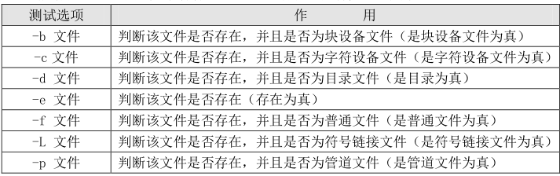
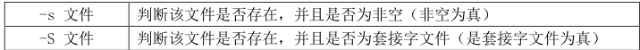
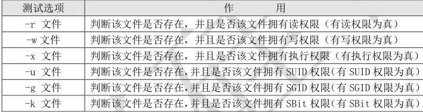
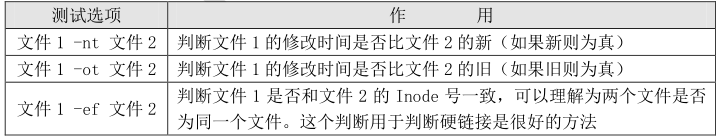
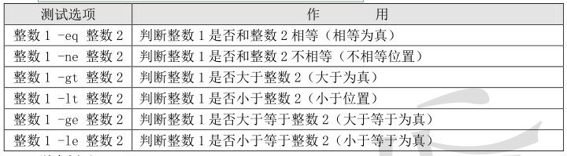
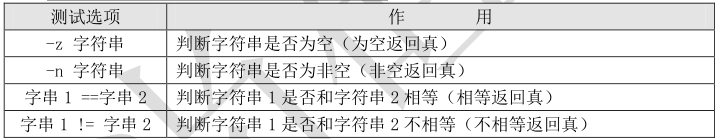
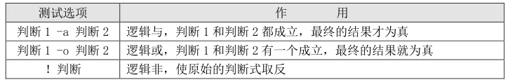

1、按照文件类型进行判断







[  - e  文件1 ]   :-e 和[  要有空格

```javascript
[root@localhost ~]# [ -e /root/sh/ ]
[root@localhost ~]# echo $?
0
#判断结果为 0，/root/sh/目录是存在的
[root@localhost ~]# [ -e /root/test ]
[root@localhost ~]# echo $?
1
#在/root/下并没有 test 文件或目录，所以“$?”的返回值为非零
```

还记得多命令顺序执行的“&&”和“||”吗？我们可以再判断一下/root/sh/是否是目录：


```javascript
[root@localhost ~]# [ -d /root/sh ] && echo "yes" || echo "no"
#第一个判断命令如果正确执行，则打印“yes”，否则打印“no”
```


# 2 按照文件权限进行判断


test 是非常完善的判断命令，还可以判断文件的权限，我们通过表 12-6 来看看：




比如：


```javascript
[root@localhost ~]# ll student.txt
-rw-r--r--. 1 root root 97 6 月 7 07:34 student.txt
[root@localhost ~]# [ -w student.txt ] && echo "yes" || echo "no"
yes
#判断文件是拥有写权限的
```


# 3 两个文件之间进行比较


通过表 12-7 来看看如何进行两个文件之间的比较：




我们一直很苦恼，到底该如何判断两个文件是否是硬链接呢？这时 test 就派上用场了：


```javascript
[root@localhost ~]# ln /root/student.txt /tmp/stu.txt
#创建个硬链接吧
[root@localhost ~]# [ /root/student.txt -ef /tmp/stu.txt ] && echo "yes" || echo "no"

yes
#用 test 测试下，果然很有用
```


# 4 两个整数之间比较


通过表 12-8 来学习下如何在两个整数之间进行比较：




举个例子：


```javascript
[root@localhost ~]# [ 23 -ge 22 ] && echo "yes" || echo "no"
yes
#判断 23 是否大于等于 22，当然是了
[root@localhost ~]# [ 23 -le 22 ] && echo "yes" || echo "no"
no
#判断 23 是否小于等于 22，当然不是了
```


# 5 字符串的判断


通过表 12-9，我们来学习下字符串的判断：




举个例子：


```javascript
[root@localhost ~]# name=sc
#给 name 变量赋值
[root@localhost ~]# [ -z "$name" ] && echo "yes" || echo "no"
no
#判断 name 变量是否为空，因为不为空，所以返回 no
再来看看如何判断两个字符串相等：
[root@localhost ~]# aa=11
[root@localhost ~]# bb=22
#给变量 aa 和变量 bb 赋值
[root@localhost ~]# [ "$aa" == "bb" ] && echo "yes" || echo "no"
no
#判断两个变量的值是否相等，明显不相等，所以返回 no

```

# 6 多重条件判断


通过表 12-10，来看看多重条件判断是什么样子的：




举个例子：


```javascript
[root@localhost ~]# aa=11
#给变量 aa 赋值
[root@localhost ~]# [ -n "$aa" -a "$aa" -gt 23 ] && echo "yes" || echo "no"
no
#判断变量 aa 是否有值，同时判断变量 aa 的是否大于 23
#因为变量 aa 的值不大于 23，所以虽然第一个判断值为真，返回的结果也是假
要想让刚刚的判断式返回真，需要给变量 aa 重新赋个大于 23 的值：
[root@localhost ~]# aa=24
[root@localhost ~]# [ -n "$aa" -a "$aa" -gt 23 ] && echo "yes" || echo "no"
yes
```

再来看看逻辑非是什么样子的：


```javascript
[root@localhost ~]# [ ! -n "$aa" ] && echo "yes" || echo "no"
no
#本来“-n”选项是变量 aa 不为空，返回值就是真。
#加入！之后，判断值就会取反，所以当变量 aa 有值时，返回值是假
```

注意：“！”和“-n”之间必须加入空格，否则会报错的。


