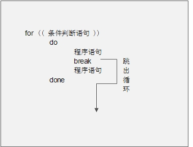
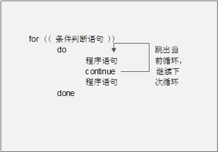

1、 break 语句


2、 continue 语句


# 1、 break 语句


再来看看特殊流程控制语句 break 的作用，当程序执行到 break 语句时，会结束整个当前循环。


而 continue 语句也是结束循环的语句，不过 continue 语句单次当前循环，而下次循环会继续。有点


晕菜吧，画个示意图解释下 break 语句，如图 12-1 所示：





图 12-1 break 示意图


举个例子：


```javascript
[root@localhost ~]# vi sh/break.sh
#!/bin/bash
#演示 break 跳出循环
# Author: shenchao （E-mail: shenchao@atguigu.com）
for (( i=1;i<=10;i=i+1 ))
#循环十次
do
if [ "$i" -eq 4 ]
#如果变量 i 的值等于 4
then
break
#退出整个循环
fi
echo $i
#输出变量 i 的值
done
```

执行下这个脚本，因为一旦变量 i 的值等于 4，整个循环都会跳出，所以应该只能循环三次：


```javascript
[root@localhost ~]# chmod 755 sh/break.sh
[root@localhost ~]# sh/break.sh
1
2
3
```


# 2、 continue 语句


再来看看 continue 语句，continue 也是结束流程控制的语句。如果在循环中，continue 语句只


会结束单次当前循环，也画个示意图来说明下 continue 语句，如图 12-2 所示：





图 12-2 continue 示意图


还是用刚刚的脚本，不过退出语句换成 continue 语句，看看会发生什么情况：


```javascript
[root@localhost ~]# vi sh/continue.sh
#!/bin/bash
#演示 continue 语句
# Author: shenchao （E-mail: shenchao@atguigu.com）

for (( i=1;i<=10;i=i+1 ))
do
if [ "$i" -eq 4 ]
then
continue
#退出语句换成 continue
fi
echo $i
done
```

运行下这个脚本：


```javascript
[root@localhost ~]# chmod 755 sh/continue.sh
#赋予执行权限
[root@localhost ~]# sh/continue.sh
1
2
3
5 少了 4 这个输出
6
7
8
9
10
```

continue 只会退出单次循环，所以并不影响后续的循环，所以只会少 4 的输出。这个例子和 break


的例子做个比较，应该可以更清楚的说明 break 和 continue 的区别。