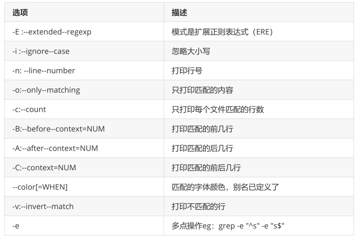
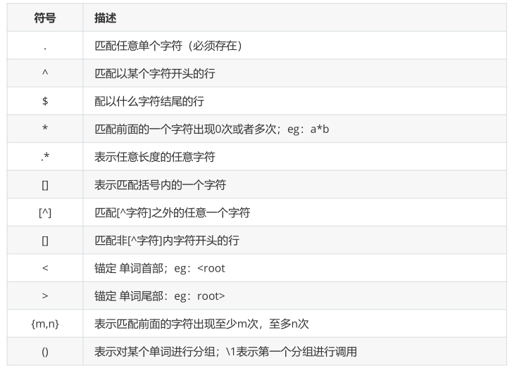
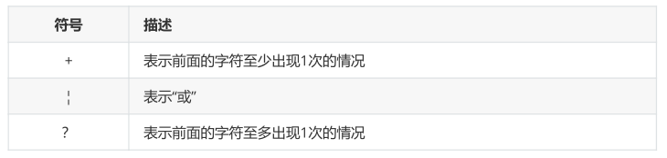

**Linux三剑客之grep**

grep作用：过滤文本内容



# **1、样本文件内容**

```
[root@localhost ~]# cat test
asdkahsduoa
aslkdsl
oiofr
sdjo
A
F
aSDD
CASDC
asdo
ca
```

# 2、实例

## 实例1：打印出所有的a无论大小写 ： -i选项

```
[root@localhost ~]# grep -i "a" test
asdkahsduoa
aslkdsl
A
aSDD
CASDC
asdo
ca
```

## 实例2：打印出所有的a无论大小写，并且显示该字符串所在的行 ： -n选项

```
[root@localhost ~]# grep -in "a" test
1:asdkahsduoa
2:aslkdsl
5:A
7:aSDD
8:CASDC
10:asdo
11:ca
```

## 实例3：仅仅打印出所有匹配的字符串： -o选项

```
[root@localhost ~]# grep -io "a" test
a
a
a
a
A
a
A
a
a
```

## 实例4：打印出匹配的字符串有多少行 -c选项

```
[root@localhost ~]# grep -ic "a" test
7
```

##  实例5：打印出字符S前面的2行 -B

```
[root@localhost ~]# grep -B 2 "S" test
A
F
aSDD
CASDC
```

## 实例6：打印出字符S后面的2行 -A

```
[root@localhost ~]# grep -A 2 "S" test
aSDD
CASDC
asdo
```

## 实例7：打印出字符S前后2行 -C

```
[root@localhost ~]# grep -C 2 "S" test
A
F
aSDD
CASDC
asdo
```

## 实例8：打印出不包含大小s的所有行 取反 -v

```
[root@localhost ~]# grep -iv "S" test
oiofr
A
F
ca
```

## grep可以从文件当中直接搜索某个关键词,也可以从标准输入里面搜索

```
[root@localhost ~]# grep root /etc/passwd
root:x:0:0:root:/root:/bin/bash
operator:x:11:0:operator:/root:/sbin/nologin
[root@localhost ~]# cat /etc/passwd | grep "root"
root:x:0:0:root:/root:/bin/bash
operator:x:11:0:operator:/root:/sbin/nologin
```

# 3、正则表达式（基于grep）

- 功能就是用来检索、替换那些符合某个模式(规则)的文本,正则表达式在每种语言中都会有;

- 正则表达式就是为了处理大量的文本或字符串而定义的一套规则和方法

- 通过定义的这些特殊符号的辅助，系统管理员就可以快速过滤，替换或输出需要的字符串

- Linux正则表达式一般以行为单位处理

## 1）基础正则表达式



## 2）扩展正则

- egrep ...

- grep -E ...

- 扩展正则支持所有基础正则；并有补充

- 扩展正则中{}和[]不用转义可以直接使用；



## 3)最常用

查看配置文件时去除所有的注释和空行

```
[root@localhost ~]# grep -Ev "^#|^$" /etc/ssh/sshd_config 
```