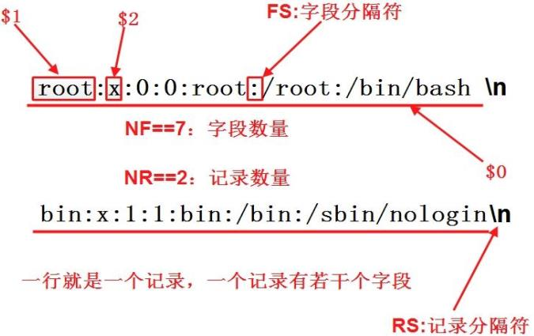
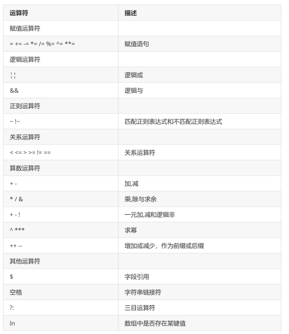
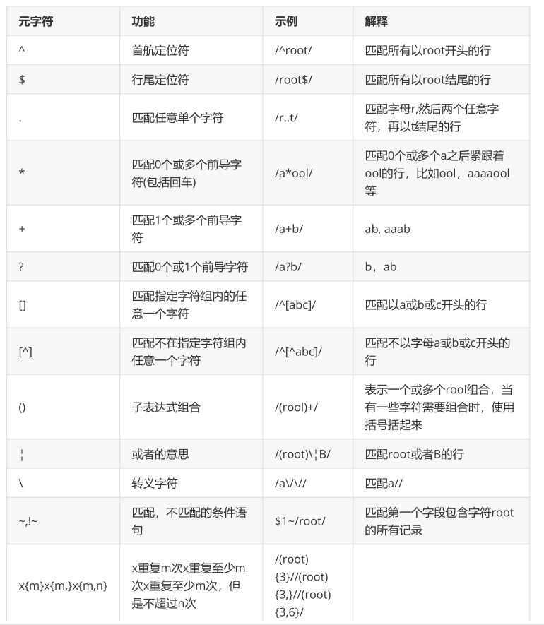
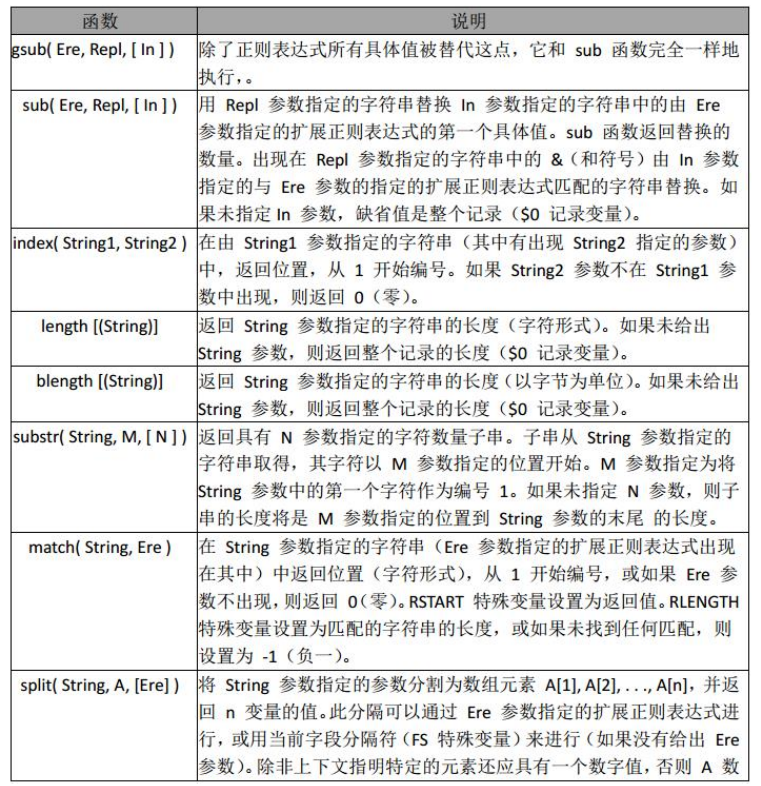
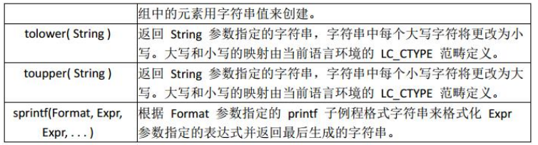

**Linux三剑客之awk**

# 1、使用方法

```
awk '{pattern + action}' {filenames} 
```

其中 pattern 表示 AWK 在数据中查找的内容，而 action 是在找到匹配内容时所执行的一系列命令。花

括号（{}）不需要在程序中始终出现，但它们用于根据特定的模式对一系列指令进行分组。 pattern就是

要表示的正则表达式，用斜杠括起来。

awk语言的最基本功能是在文件或者字符串中基于指定规则浏览和抽取信息，awk抽取信息后，才能进

行其他文本操作。完整的awk脚本通常用来格式化文本文件中的信息。

通常，awk是以文件的一行为处理单位的。awk每接收文件的一行，然后执行相应的命令，来处理文本。

# 2、awk 的原理

```
[root@localhost ~]# awk -F: '{print $0}' /etc/passwd 
```

执行 awk 时，它依次对/etc/passwd 中的每一行执行 print 命令。



```
[root@localhost ~]# awk -F":" '{print $1}' /etc/passwd
[root@localhost ~]# awk -F":" '{print $1 $3}' /etc/passwd
[root@localhost ~]# awk -F":" '{print $1" " $3}' /etc/passwd
[root@localhost ~]# awk -F":" '{print "username:"$1"\t\tuid:" $3}'
/etc/passwd
```

-F参数：指定分隔符，可指定一个或多个

print 后面做字符串的拼接

## 1）实例一：只查看test.txt文件（100行）内第20到第30行的内容（企业面试）

```
[root@localhost ~]# seq 100 > test1
[root@localhost ~]# awk '{if(NR>=20 && NR<=30) print $1}' test.txt
20
21
22
23
24
25
26
27
28
29
30
```

## 2）实例二：已知test.txt文件内容为

```
[root@localhost ~]# cat test.txt
I am aaron, my qq is 1234567
```

请从该文件中过滤出'aaron'字符串与1234567，最后输出的结果为：aaron 1234567

```
[root@localhost ~]# awk -F '[ ,]+' '{print $3" "$7}' test.txt
aaron 1234567
```

# 3、BEGIN 和 END 模块

## 实例一：统计/etc/passwd的账户人数

```
[root@localhost ~]# awk '{count++;print $0;} END{print "user count is
",count}' /etc/passwd
```

count是自定义变量。之前的action{}里都是只有一个print,其实print只是一个语句，而action{}可以有多

个语句，以;号隔开。这里没有初始化count，虽然默认是0，但是妥当的做法还是初始化为0

```
awk 'BEGIN {count=0;print "[start] user count is ",count}{count++;print $0}
END{print "[end] user count is ",count}' /etc/passwd
```

## 实例二：统计某个文件夹下的文件占用的字节数

```
[root@localhost ~]# ll | awk 'BEGIN {size=0} {size=size+$5} END{print "size
 is ",size}'
size is  1468
```

```
[root@localhost ~]# ll | awk 'BEGIN {size=0} {size=size+$5} END{print "size
is ",size/1024/1024,"M"}'
size is  0.00139999 M
```

# 4、awk运算符



awk 赋值运算符：a+=5;等价于： a=a+5;其他同类

```
[root@node-1 ~]# awk 'BEGIN{a=5;a+=5;print a}'
10
```

awk逻辑运算符：判断表达式 a>2&&b>1为真还是为假，后面的表达式同理

```auto
[root@node-1 ~]# awk 'BEGIN{a=1;b=2;print (a>2&&b>1,a=1||b>1)}'
0 1
```

awk正则运算符：

```auto
[root@node-1 ~]# awk 'BEGIN{a="100testaa";if(a~/100/) {print "OK"}}'
OK
[root@node-1 ~]# echo | awk 'BEGIN{a="100testaa"}a~/100/{print "OK"}'
OK
```

关系运算符：

如： > < 可以作为字符串比较，也可以用作数值比较，关键看操作数如果是字符串就会转换为字符串比

较。两个都为数字 才转为数值比较。字符串比较：按照ascii码顺序比较。

```auto
[root@node-1 ~]# awk 'BEGIN{a="b";print a++,++a}'
0 2
[root@node-1 ~]# awk 'BEGIN{a="20b4";print a++,++a}'
20 22
```

这里的a++ , ++a与javascript语言一样：a++是先赋值加++；++a是先++再赋值

三目运算符 ?:

```auto
[root@node-1 ~]# awk 'BEGIN{a="b";print a=="b"?"ok":"err"}'
ok
[root@node-1 ~]# awk 'BEGIN{a="b";print a=="c"?"ok":"err"}'
err
```

# 5、常用 awk 内置变量


注：内置变量很多，参阅相关资料

字段分隔符 FS

FS="\t" 一个或多个 Tab 分隔

```auto
[root@node-1 ~]# cat tab.txt
aa bb    cc
[root@node-1 ~]# awk 'BEGIN{FS="\t+"}{print $1,$2,$3}' tab.txt
aa bb cc
```

FS="[[:space:]+]" 一个或多个空白空格，默认的，匹配到不符合的就停止

```auto
[root@node-1 ~]# awk -F [[:space:]+] '{print $1,$2,$3,$4,$5}' tab.txt
aa bb  cc
[root@node-1 ~]# awk -F [[:space:]+] '{print $1,$2}' tab.txt
aa bb
```

FS="[" ":]+" 以一个或多个空格或：分隔

```auto
[root@node-1 ~]# awk -F [" ":]+ '{print $1,$2,$3}' hello.txt
root x 0
```

字段数量 NF :显示满足用:分割，并且有8个字段的

```auto
[root@node-1 ~]# awk -F ":" 'NF==8{print $0}' hello.txt
bin:x:1:1:bin:/bin:/sbin/nologin:888
```

记录数量 NR

```auto
[root@node-1 ~]# ifconfig br0 | awk -F [" ":]+ 'NR==2{print $3}'
192.168.0.241
```

RS 记录分隔符变量

将 FS 设置成"\n"告诉 awk 每个字段都占据一行。通过将 RS 设置成""，还会告诉 awk每个地址记录都由

空白行分隔。

```auto
[root@node-1 ~]# cat awk.txt
#!/bin/awk
BEGIN {
  FS="\n"
  RS=""
}
{
 print $1","$2","$3
}
[root@node-1 ~]# awk -f awk.txt recode.txt
```

在""分割符之内，符合\n分割的会被打印出来

OFS 输出字段分隔符

```auto
[root@node-1 ~]# awk 'BEGIN{FS=":";OFS="#"}{print $1,$2,$3}' hello.txt
root#x#0
bin#x#1
```

ORS 输出记录分隔符

```auto
[root@node-1 ~]# cat awk.txt
#!/bin/awk
BEGIN {
  FS="\n"
  RS=""
  ORS="\n\n"
}
{
 print $1","$2","$3
}
[root@node-1 ~]# awk -f awk.txt recode.txt
Jimmy the Weasel,100 Pleasant Drive,San Francisco,CA 123456
Big Tony,200 Incognito Ave.,Suburbia,WA 64890
```

# 6、awk正则



正则应用

规则表达式

**awk '/REG/{action} ' file ,**

进行处理

```auto
[root@node-1 ~]# awk '/root/{print$0}' /etc/passwd
root:x:0:0:root:/root:/bin/bash
operator:x:11:0:operator:/root:/sbin/nologin
[root@node-1 ~]# awk -F ":" '$5~/root/{print$0}' /etc/passwd
root:x:0:0:root:/root:/bin/bash
[root@node-1 ~]# ifconfig br0 | awk 'BEGIN{FS="[[:space:]:]+"}
NR==2{print$3}'
192.168.0.241
```

布尔表达式

awk '布尔表达式{action}' file 

```auto
[root@node-1 ~]# awk -F: '$1=="root"{print$0}' /etc/passwd
root:x:0:0:root:/root:/bin/bash
[root@node-1 ~]# awk -F: '($1=="root")&&($5=="root"){print$0}' /etc/passwd
root:x:0:0:root:/root:/bin/bash
```

# 7、awk 的 if、循环和数组

## 1）if

条件语句

awk 提供了非常好的类似于 C 语言的 if 语句。

```auto
{
  if ($1=="foo"){
  if ($2=="foo"){
   print"uno"
 }else{
   print"one"
 }
}elseif($1=="bar"){
 print "two"
}else{
 print"three"
}
}
```

使用 if 语句还可以将代码：

```auto
! /matchme/ { print $1 $3 $4 } 
```

转换成：

```auto
{
if ( $0 !~ /matchme/ ) {
print $1 $3 $4
}
}
```

## 2）while

循环结构

我们已经看到了 awk 的 while 循环结构，它等同于相应的 C 语言 while 循环。 awk 还有"do...while"循

环，它在代码块结尾处对条件求值，而不像标准 while 循环那样在开始处求值。

它类似于其它语言中的"repeat...until"循环。以下是一个示例：

do...while 示例

```auto
{
  count=1do {
   print "I get printed at least once no matter what"
 } while ( count !=1 )
}
```

与一般的 while 循环不同，由于在代码块之后对条件求值， "do...while"循环永远都至少执行一次。换句

话说，当第一次遇到普通 while 循环时，如果条件为假，将永远不执行该循环。

for 循环

awk 允许创建 for 循环，它就象 while 循环，也等同于 C 语言的 for 循环：

```auto
for ( initial assignment; comparison; increment ) {
 code block
}
```

以下是一个简短示例：

```auto
for ( x=1;x<=4;x++ ) {
 print "iteration", x
}
```

break 和 continue

此外，如同 C 语言一样， awk 提供了 break 和 continue 语句。使用这些语句可以更好地控制 awk 的

循环结构。

```auto
#!/bin/awk
BEGIN{
x=1
while(1) {
 print "iteration",x
  if ( x==10 ){
   break
 }
 x++
}
}
```

continue 语句补充了 break

```auto
x=1
while (1) {
   if ( x==4 ) {
   x++
   continue
 }
 print "iteration", x
 if ( x>20 ) {
   break
 }
 x++
}
```

continue在for中使用

```auto
#!/bin/awk
BEGIN{
for (x=1;x<=21;x++){
if (x==4){
 continue
}
 print "iteration",x
}
}
```

# 8、数组

AWK 中的数组都是关联数组,数字索引也会转变为字符串索引

```auto
#!/bin/awk
BEGIN{
 cities[1]="beijing"
 cities[2]="shanghai"
 cities["three"]="guangzhou"
 for( c in cities) {
   print cities[c]
 }
 print cities[1]
 print cities["1"]
 print cities["three"]
}
```

用 awk 中查看服务器连接状态并汇总

```auto
[root@node-1 ~]# netstat -an|awk '/^tcp/{++s[$NF]}END{for(a in s)print
a,s[a]}'
LISTEN 8
ESTABLISHED 1
```

# 9、常用字符串函数





字符串函数的应用

在 info 中查找满足正则表达式， /[0-9]+/ 用”!”替换，并且替换后的值，赋值给 info

```auto
[root@node-1 ~]# awk 'BEGIN{info="this is a test2010test!";gsub(/[0-
9]+/,"!",info);print info}'
this is a test!test!
```

如果查找到数字则匹配成功返回 ok，否则失败，返回未找到

```auto
[root@node-1 ~]# awk 'BEGIN{info="this is a test2010test!";print
index(info,"test")?"ok":"no found";}'
ok
```

从第 4 个 字符开始，截取 10 个长度字符串

```auto
[root@node-1 ~]# awk 'BEGIN{info="this is a test2010test!";print
substr(info,4,10);}'
s is a tes
```

分割 info,动态创建数组 tA,awk for …in 循环，是一个无序的循环。 并不是从数组下标1…n 开始

```auto
[root@node-1 ~]# awk 'BEGIN{info="this is a test";split(info,tA," ");print
length(tA);for(k in tA){print k,tA[k];}}'
4
4 test
1 this
2 is
3 a
```