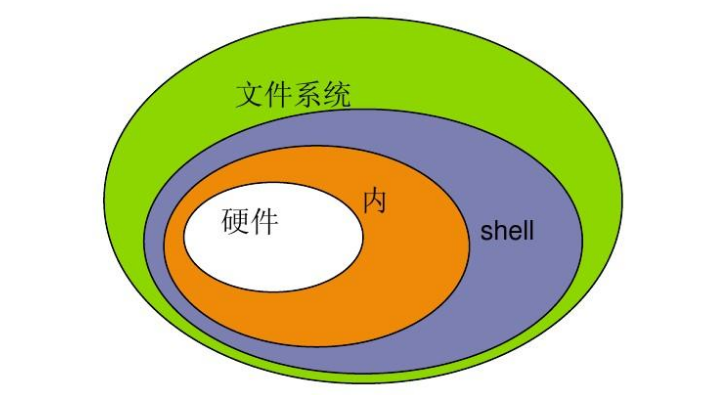
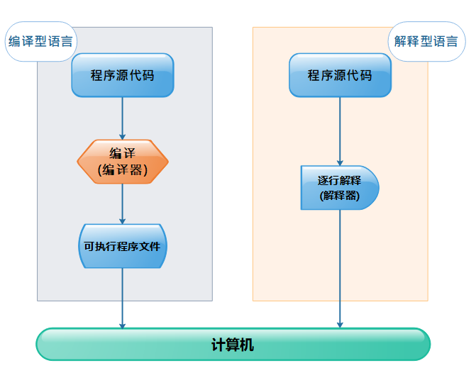

**shell脚本编程**

**简介**

- Shell 是一个用 C 语言编写的程序，它是用户使用 Linux 的桥梁。Shell 既是一种命令语言，又是一种程序设计语言。

- Shell 是指一种应用程序，这个应用程序提供了一个界面，用户通过这个界面访问操作系统内核的服务。

- Linux 的 Shell 种类众多，常见的有：

- Bourne Shell（/usr/bin/sh或/bin/sh）

- Bourne Again Shell（/bin/bash）

- C Shell（/usr/bin/csh）

- K Shell（/usr/bin/ksh）

- Shell for Root（/sbin/sh）

- 程序编程风格

- 过程式：以指令为中心，数据服务于命令

- 对象式：以数据为中心，命令服务于数据

- shell是一种过程式编程

- 过程式编程

- 顺序执行

- 循环执行

- 选择执行

- 编程语言分类

- 编译型语言

- 解释型语言（shell是一种解释型语言）

- 运行脚本

- 给予执行权限，通过具体的文件路径指定文件执行

- 直接运行解释器，将脚本作为解释器程序的参数运行

- bash退出状态码

- 范围是0-255

- 脚本中一旦遇到exit命令，脚本会立即终止，终止退出状态取决于exit命令后面的数字

- 如果未给脚本指定退出状态码，整个脚本的退出状态码取决于脚本中执行的最后一条命令的状态