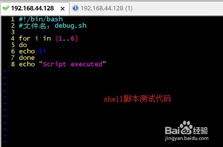
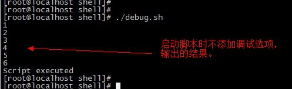
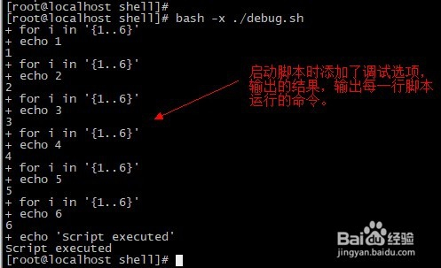
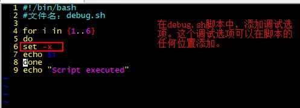
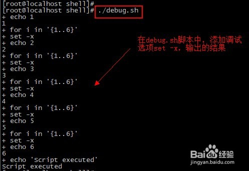

# 1、函数

- 语法

```
function FUNNAME(){
函数体
返回值
}
FUNNME #调用函数
```

- 实例1

```
#!/bin/bash
demoFun(){
echo '这是我的第一个 shell 函数!'
}
echo "-----函数开始执行-----"
demoFun
echo "-----函数执行完毕-----"
```

- 带返回值并且调用返回值

```
funWithReturn(){
echo "这个函数会对输入的两个数字进行相加运算..."
echo "输入第一个数字: "
read aNum
echo "输入第二个数字: "
read anotherNum
echo "两个数字分别为 $aNum 和 $anotherNum !"
return $(($aNum+$anotherNum))
}
funWithReturn
echo "输入的两个数字之和为 $? !"
#可以使用$?来获取返回值
```

- 函数参数

```
funWithParam(){
echo "第一个参数为 $1 !"
echo "第二个参数为 $2 !"
echo "第十个参数为 $10 !"
echo "第十个参数为 ${10} !"
echo "第十一个参数为 ${11} !"
echo "参数总数有 $# 个!"
echo "作为一个字符串输出所有参数 $* !"
}
funWithParam 1 2 3 4 5 6 7 8 9 34 73
注意，$10 不能获取第十个参数，获取第十个参数需要${10}。当n>=10时，需要使用${n}来获取参数
```

# 2、调试脚本

```
-x : 在执行时显示参数和命令；
+x：禁止调试
-v：当命令行进行读取时显示输入；
+v：禁止打印输入。
n：检测脚本中的语法错误
```










