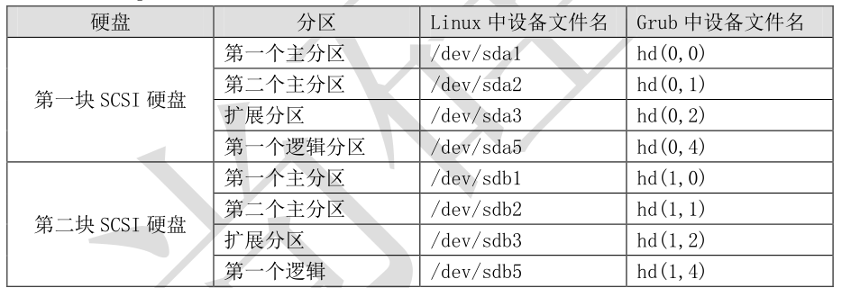

# 1、/boot/grub  目录

## 1）grub 的作用有以下几个：

- 第一是加载操作系统的内核；

- 第二是拥有一个可以让用户选择的菜单，
来选择到底启动哪个系统；

- 第三还可以调用其他的启动引导程序，来实现多系统引导。


grub 的配置文件主要是放置在/boot/grub/目录中的，我们来看看这个目录下到底有哪些文件吧：


```javascript
[root@localhost ~]# cd /boot/grub/
[root@localhost grub]# ll -h
总用量 274K
-rw-r--r--. 1 root root 63 4 月 10 21:49 device.map
	    #grub 中硬盘的设备文件名与系统的设备文件名的对应文件
-rw-r--r--. 1 root root 14K 4 月 10 21:49 e2fs_stage1_5
	#ext2/ext3 文件系统的 stage 1.5 文件
-rw-r--r--. 1 root root 13K 4 月 10 21:49 fat_stage1_5
		#FAT 文件系统的 stage 1.5 文件
-rw-r--r--. 1 root root 12K 4 月 10 21:49 ffs_stage1_5
		#FFS 文件系统的 stage 1.5 文件
-rw-------. 1 root root 737 4 月 10 21:49 grub.conf
		#grub 的配置文件
-rw-r--r--. 1 root root 12K 4 月 10 21:49 iso9660_stage1_5
	#iso9660 文件系统的 Stage 1.5 文件
-rw-r--r--. 1 root root 13K 4 月 10 21:49 jfs_stage1_5
		#jfs 文件系统的 Stage 1.5 文件
lrwxrwxrwx. 1 root root 11 4 月 10 21:49 menu.lst -> ./grub.conf
	#grub 的配置文件。和 grub.conf 是软链接，所以两个文件修改哪个都可以
-rw-r--r--. 1 root root 12K 4 月 10 21:49 minix_stage1_5
		#minix 文件系统的 Stage 1.5 文件

-rw-r--r--. 1 root root 15K 4 月 10 21:49 reiserfs_stage1_5
	#reiserfs 文件系统的 Stage 1.5 文件
-rw-r--r--. 1 root root 1.4K 11 月 15 2010 splash.xpm.gz
		#系统启动时，grub 程序的背景图像
-rw-r--r--. 1 root root 512 4 月 10 21:49 stage1
				#安装到引导扇区中的 stage1 的备份文件
-rw-r--r--. 1 root root 124K 4 月 10 21:49 stage2
				#stage2 的备份文件
-rw-r--r--. 1 root root 12K 4 月 10 21:49 ufs2_stage1_5
		#UFS 文件系统的 Stage 1.5 文件
-rw-r--r--. 1 root root 12K 4 月 10 21:49 vstafs_stage1_5
		#vstafs 文件系统的 Stage 1.5 文件
-rw-r--r--. 1 root root 14K 4 月 10 21:49 xfs_stage1_5
			#xfs 文件系统的 Stage 1.5 文件
```

其实这个目录中主要就是 grub 的配置文件和各种文件系统的 stage1.5 文件。不过 grub 的配置
文件有两个/boot/grub/grub.conf 和/boot/grub/menu.lst，这两个配置文件是软链接，所以修改哪
一个都可以，我个人更习惯为 grub.conf 这个文件。


# 2、 Grub的配置文件

## 1）在grub中分区的表示方法




# 2、grub的配置文件

```javascript
[root@localhost ~]# vi /boot/grub/grub.conf
default=0
timeout=5
splashimage=(hd0,0)/grub/splash.xpm.gz
hiddenmenu
#以上为 grub 整体设置
title CentOS (2.6.32-279.el6.i686)
root (hd0,0)
kernel /vmlinuz- - 2.6.32- - 279.el6.i686 ro
root=UUID=b9a7a1a8- - 767f- - 4a87- - 8a2b- - a535edb362c9 rd_NO_LUKS KEYBOARDTYPE=pc KEYTABLE=us
rd_NO_MD crashkernel=auto LANG=zh_CN.UTF- - 8 rd_NO_LVM rd_NO_DM rhgb quiet

# # 以上 4 4 行为一行，只是内容过多的自动换行
initrd /initramfs-2.6.32-279.el6.i686.img
```

## 1）解释

###  default=0


```javascript
默认启动第一个系统。也就是如果在等待时间结束后，用户没有选择进入哪一个系统，那么
系统会默认进入第一个系统。如果有多系统并存，那么每个系统都会有自己的 title 字段，如果想要
默认进入第二个系统，这里就可以设为 default=1。
```


###  timeout=5


```javascript
等待时间，默认是 5 秒。也就是进入系统时，如果 5 秒内用户没有按下任意键，那么系统会
进入 default 字段定义的系统。当然可以手工修改这个等待时间，如果 timeout=0 则不会等待直接进
入系统，timeout=-1 则是一直等待用户输入，而不会自动进入系统。
```


###  splashimage=(hd0,0)/grub/splash.xpm.gz


```javascript
这里是指定 grub 启动时的背景图像文件的保存位置的。记得 CentOS 6.x 启动时后台的蓝色
图像吧，就是这个文件的作用哦。不过这个文件具体在哪里啊？已经说过了 hd（0,0）代表第一个硬
盘的第一个分区，而超哥的系统安装时/boot 分区就是第一个分区，所以这个背景图像的实际位置就
是/boot/grub/splash.xpm.gz。

```


###  hiddenmenu


```javascript
隐藏菜单。启动时默认只能看到读秒，而不能看到菜单，如果想要看到菜单需要按任意键。
如果注释了这句话，那么启动时就能直接看到菜单了。

```


- 以上就是 grub 的整体设置，下面我们介绍 CentOS 系统的启动设置：

- 


###  title CentOS (2.6.32-279.el6.i686)


```javascript
title 就是标题的意思，也就是说在 title 后面写入的是什么，那么系统启动时在 grub 的启
动菜单中看到的就是什么。
```

###  root (hd0,0)


```javascript
是指启动程序的保存分区。这里要注意啊，这个 root 并不是管理员哦。在我的系统中，/boot
分区是独立划分的，而且设备文件名为/dev/sda1，所以在 grub 中，就被描述为 hd(0,0)。
```

###  kernel /vmlinuz-2.6.32-279.el6.i686 ro


```javascript
root=UUID=b9a7a1a8-767f-4a87-8a2b-a535edb362c9 rd_NO_LUKS KEYBOARDTYPE=pc
KEYTABLE=us rd_NO_MD crashkernel=auto LANG=zh_CN.UTF-8 rd_NO_LVM rd_NO_DM rhgb
quiet
     /vmlinuz-2.6.32-279.el6.i686：指定了内核文件的位置，这里的/是指/boot 分区。
     ro：启动时以只读方式挂载根文件系统，这是为了不让启动过程影响磁盘内的文件
系统。
     root=UUID=b9a7a1a8-767f-4a87-8a2b-a535edb362c9：指定根文件系统的所在位
置。这里和以前的 Linux 版本
    	不太一样了，不再是通过分区的设备文件名或卷标号
来指定，而是通过分区的 UUID 来进行指定。那么如何
     	查询分区的 UUID 号呢？方法
有很多种，最简单的办法就是查询/etc/fstab 文件，命令如下：  
                
[root@localhost ~]# cat /etc/fstab | grep "/ "
UUID=b9a7a1a8-767f-4a87-8a2b-a535edb362c9 / ext4 defaults 1 1

    	可以看到“/”分区的 UUID 和 kernel 行中的 UUID 是匹配的。注意一下，
grep 后的“/ ”，在/后是有空格的。
     rd_NO_LUKS：禁用 LUKS，LUKS 用于给磁盘加密。

     rd_NO_MD：禁用软 RAID。
     rd_NO_DM：禁用硬 RAID。
     rd_NO_LVM：禁用 LVM。以上禁用都只是在启动过程中禁用，是为了加速系统启动的。
     KEYBOARDTYPE=pc KEYTABLE=us：键盘类型。
     crashkernel=auto：自动为 crashkernel 预留内存。
     LANG=zh_CN.UTF-8：语言环境
     rhgb：（redhat graphics boot）用图片来代替启动过程中的文字信息。启动完成
之后可以使用 dmesg 命令来查看这些文字信息。
     quiet：隐藏启动信息，只显示重要信息。
```

###      initrd /initramfs-2.6.32-279.el6.i686.img：

```javascript
    指定了 initramfs 内存文件系统镜像文件
的所在位置。

```


