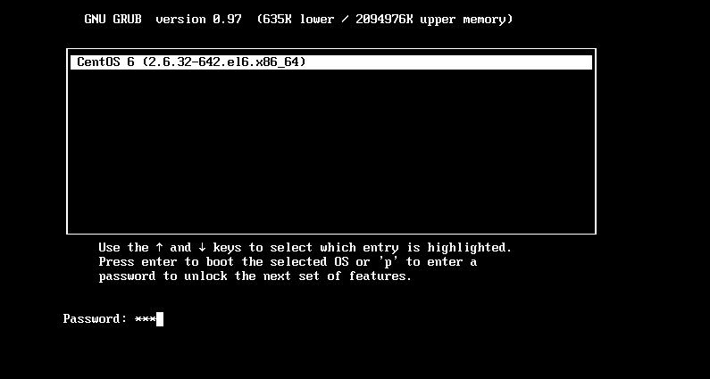
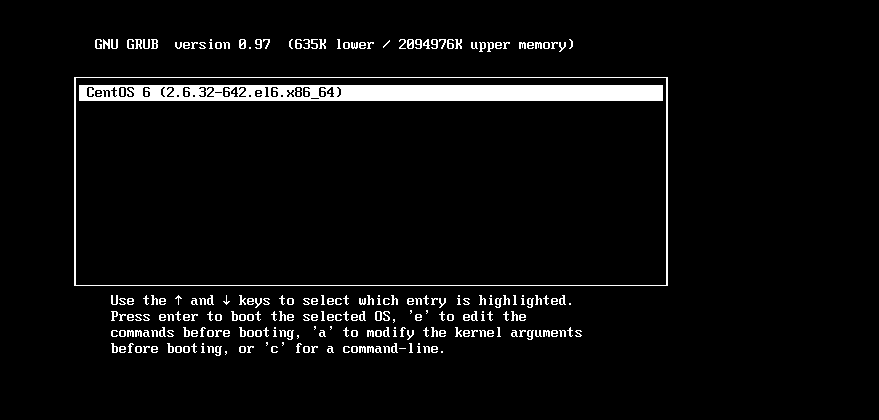
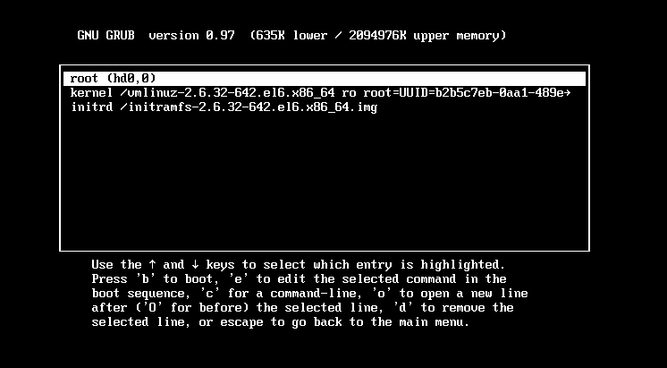

# 1、生成加密字符串：$1$Y84LB1$8tMY2PibScmuOCc8z8U35/

```javascript
[root@localhost ~]# grub-md5-crypt
Password:
Retype password:
#输入两次密码
$1$Y84LB1$8tMY2PibScmuOCc8z8U35/
#生成加密密码字串
```

这样就可以生成加密密码字串，这个字串是采用 md5 加密的，就是你的密码经 md5 编码之后的。


我们会利用这个加密密码字串来加密 grub 配置文件。


# 2、将加密字符串写入配置文件/etc/grub.config

grub 菜单整体加密:


如果只是加密单个启动菜单，grub 的编辑模式是不能锁定的，还是可以按“e”键进入编辑模式。


而且进入编辑模式后，是可以删除 password 字段的，再按“b”（boot 启动）键就可以不用密码直
接进入系统。这时就需要给 grub 菜单整体加密了，整体加密后，如果想进入 grub 编辑界面必须输入
正确的密码。加密方法其实只是把 password 字段换个位置而已，具体方法如下：


```javascript
[root@localhost ~]# vi /boot/grub/grub.conf
default=0
timeout=5
password -- md5 $1$Y84LB1$8tMY2PibScmuOCc8z8U35/
#password 选项放在整体设置处。
splashimage=(hd0,0)/grub/splash.xpm.gz
```

- 如图所示 ：原本显示是要求输入“e ”  进入修复模式，加密之后提示输入“p”进入，然后需要验证密码；




- 

- 输入密码进入：






- 但是这样加密，启动 CentOS 时，是不需要密码就能正常启动的。那我如果既需要 grub 的整体加
密，又需要系统启动时输入正确的密码。那应该怎么做呢？很简单，方法如下：

(加一个lock，但是坚决不允许这样做，知道就行）


```javascript
default=0
timeout=5
password -- md5 $1$Y84LB1$8tMY2PibSc muOCc8z8U35/
splashimage=(hd0,0)/grub/splash.xpm.gz
hiddenmenu
title CentOS (2.6.32-279.el6.i686)
lock
```


