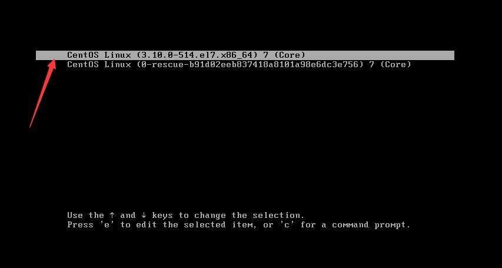
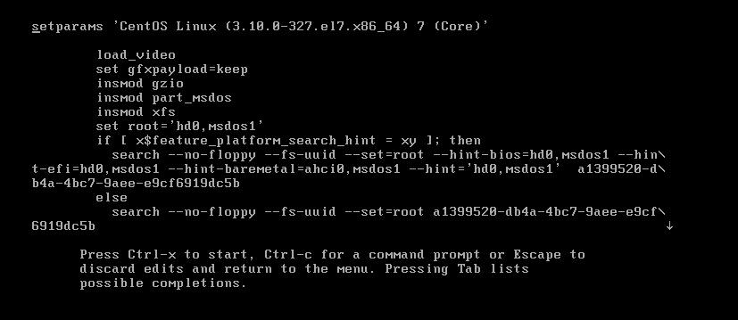
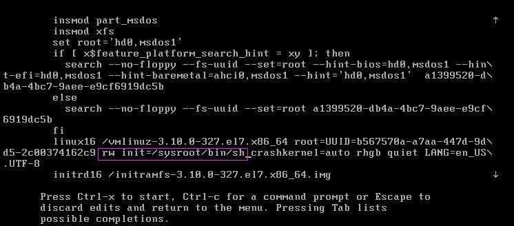
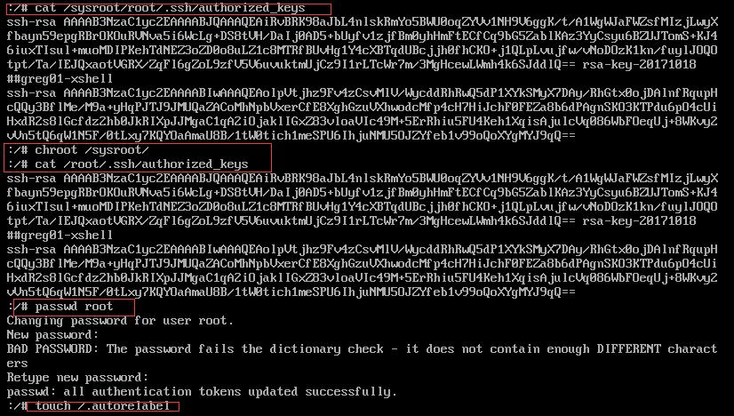

**单用户模式**

我们先来看看单用户模式是怎么使用的吧。Linux 的单用户模式有些类似 Windows 的安全模式，
只启动最少的程序用于系统修复。在单用户模式（运行级别为 1）中，Linux 引导进入根 shell，网络
被禁用，只有少数进程运行。单用户模式可以用来修改文件系统损坏、还原配置文件、移动用户数据
等。

## **一、开机时进入如下界面，（按下方向键盘，阻止系统自动继续）**



按e键出现下面界面



按方向键下，定位到最后，找到“ro”一行，ro的意思是read only，将“ro”替换成 rw init=/sysroot/bin/sh，如下图



二、按Ctrl-x 进行重启进入单用户模式

三、执行chroot /sysroot。其中chroot命令用来切换系统，/sysroot/目录就是原始系统

```javascript
:/# chroot /sysroot
:/#
```

四、如果要修改root密码

passwd是修改root密码的命令,touch /.autorelabel 执行这行命令作用是让SELinux生效，如果不执行，密码不会生效。按Ctrl+D，执行reboot重启生效。如下图

