# 1、 光盘修复模式


## 1）如何进入光盘修复模式


如何进入光盘修复模式呢？首先你需要有系统光盘，或系统修复光盘。我们这里只需要把 CentOS6.x 的第一张光盘放入光驱，然后重启系统。修改 BIOS 的启动顺序，让系统从光盘启动。就会看到如图 13-11 所示的光盘启动界面：

第一步： 选择  打开电源时进入固件（f)  这就是光盘启动

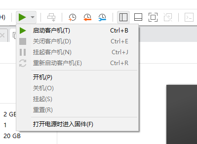


第二步：移动光标，按+ 号键  时CD-ROM Drive 排在第一位

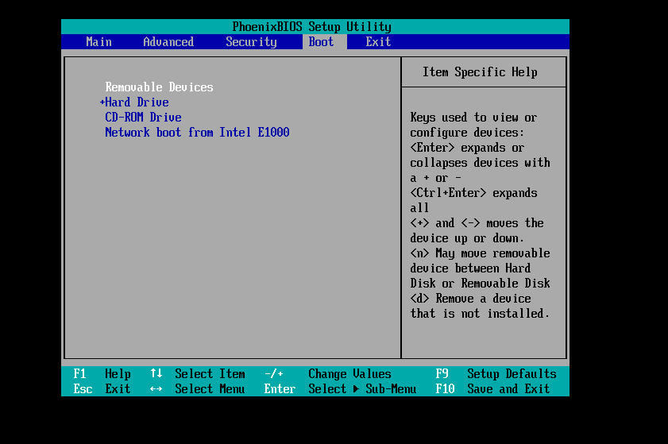


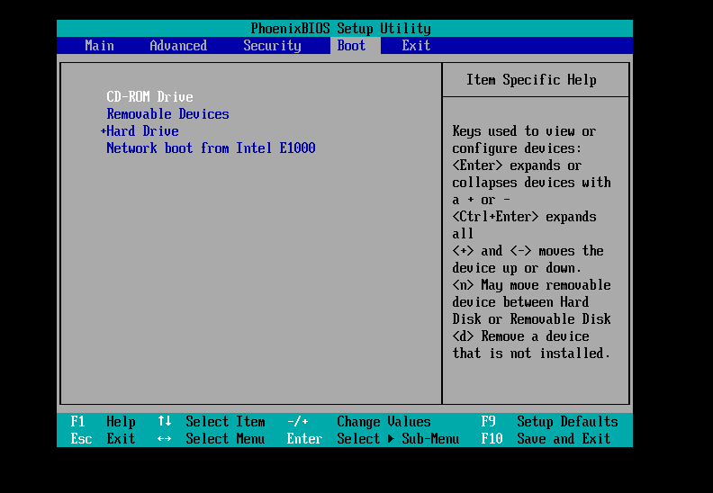


第三步：如图保存更改并退出，回车，选择Yes；


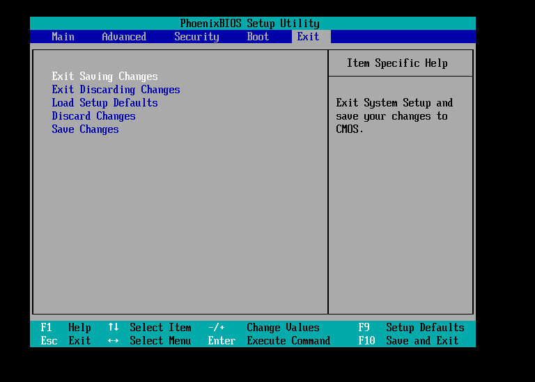


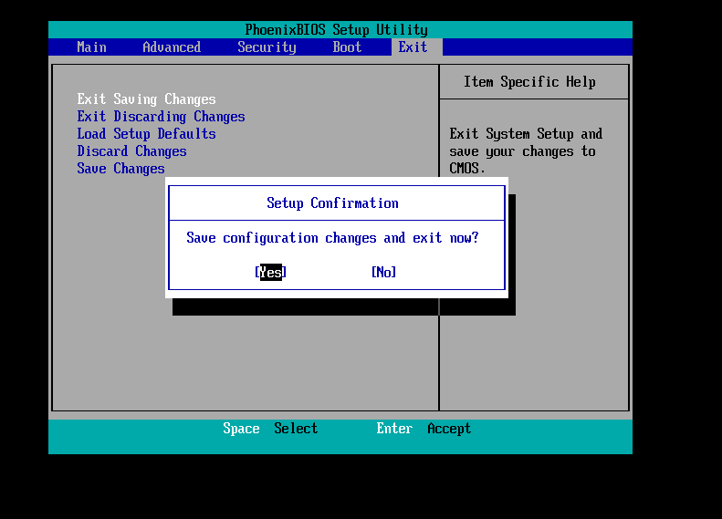


第四步：选择第三行：Rescue  installed system

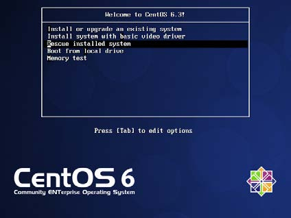


第五步：选择语言（必须选择English),键盘选择us


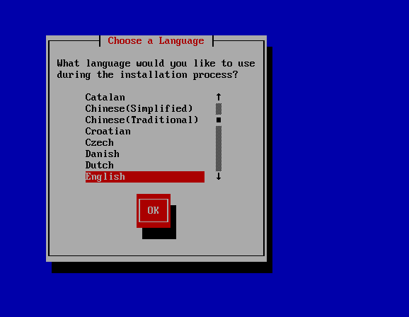


第六步：网络是否开启，选择NO；


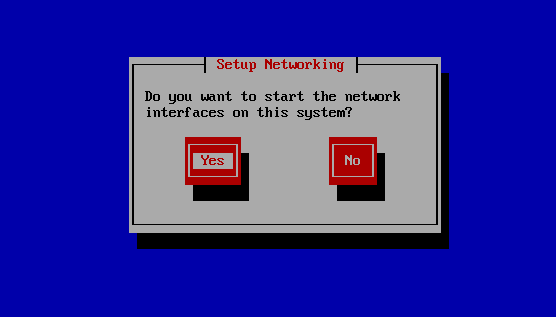

第七步：选择continue，后面选择OK


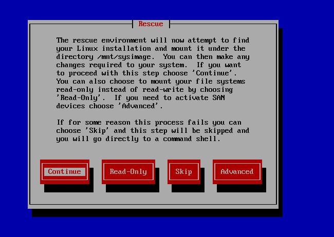


第八步：选择Shell Start shell


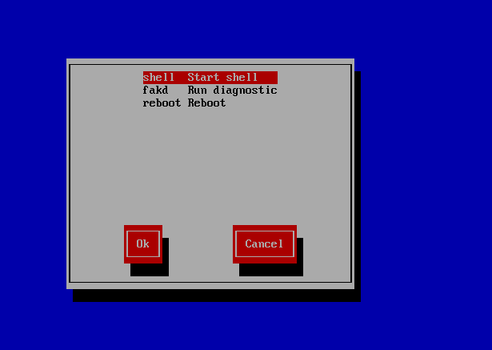


最后：如图，已经完全进入系统


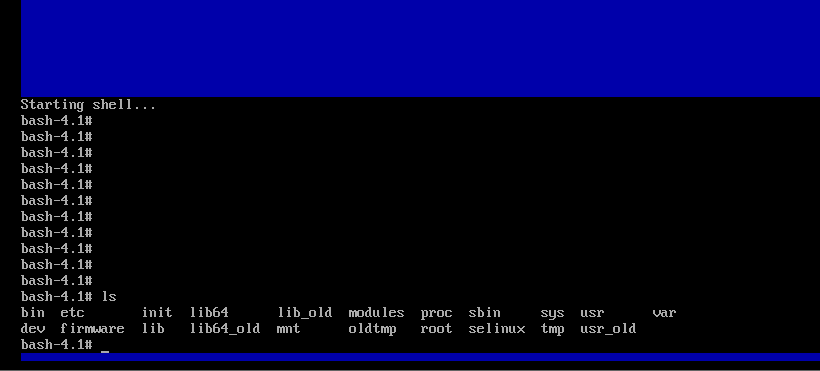

注意：在这个情况下ls 的结果并不是真正的根目录下的文件而全都是光盘模拟出来的，所以需要输入

chroot  /mnt/sysimage  切换到真正的根目录


## 2)、 光盘修复模式常见的错误修复


我们在光盘修复模式中主要可以修复什么错误呢？其实能在单用户模式中修复的错误，都能在光盘修复模式中修复。当然还可以修复一些在单用户模式下无法修复的错误，我们举几个例子。


###  重要系统文件丢失，导致系统无法启动


如果系统中的重要系统文件丢失，当然会导致系统无法正常启动。这时也可以利用光盘修复模式修复。我们假设把/etc/inittab 文件丢失了，我们通过系统启动过程知道这个文件是定义系统默认运行级别的，如果丢失了这个文件，系统当然不能正常启动，这时就需要进入光盘修复模式中了。然后需要利用 chroot 命令。命令格式如下：


```javascript
[root@localhost ~]# chroot 目录名
```

chroot 命令的作用是“change root directory”改变系统根目录的意思。也就是可以把根目录暂时移动到某个目录当中。我们是通过光盘启动的光盘修复模式，所以我们现在所在的根目录不是真正的系统根目录，而是光盘的模拟根目录。系统根目录被当成外来设备放在了/mnt/sysimage/目录中。这时就需要 chroot 命令把我们现在的所在目录移动成真正的系统根目录。命令如下：

```javascript
bash-4.1# chroot /mnt/sysimage
```

这条命令执行之后，当前的根目录就已经是真正的系统根目录了。如果系统有任何错误都可以直接修复。比如/etc/inittab 文件丢失了。这时如果我们曾经备份过系统重要文件，只需要把备份文件重新复制到/etc/目录下即可。如果没有备份的文件，就需要从 rpm 包中提取 inittab 文件，然后复制了。具体命令如下：


```javascript
bash-4.1# chroot /mnt/sysimage
#改变主目录
sh-4.1# cd /root
#进入 root 目录。因为默认进入的是/目录，如果不进入 root，一会提取的 inittab 文件会
#报错
sh-4.1# rpm -qf /etc/inittab
initscripts-9.03.31-2.el6.centos.i686
#查询下/etc/inittab 文件属于哪个包。如果系统中文件丢失不能查询，需要通过其他 Linux
#系统查询
sh-4.1# mkdir /mnt/cdrom

#建立挂载点
sh-4.1# mount /dev/sr0 /mnt/cdrom
#挂载光盘
sh-4.1# rpm2cpio /mnt/cdrom/Packages/initscripts-9.03.31-2.el6.centos.i686.rpm
| cpio -idv ./etc/inittab
#提取 inittab 文件到当前目录
sh-4.1# cp etc/inittab /etc/inittab
#复制 inittab 文件到指定位置
```

注意此命令执行时不能将文件直接恢复至/etc 目录，只能提取到当前目录下，且恢复的文件名称所在路径要写完整的绝对路径。提取文件成功后，将其复制到根分区所在的/mnt/sysimage 目录下相应位置即可。