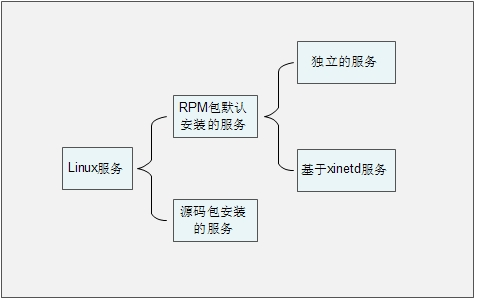

1、服务的简介和分类

1）服务的分类

 RPM 包默认安装的服务


2）查询已经安装的服务管理

2、RPM包默认的安装服务管理

1 独立服务管理


1）、 独立服务的启动管理


2）、 独立服务的自启动管理（1和2两种方法二选一）


2 基于 xinetd 服务的管理


1）、 基于 xinetd 服务的启动


2）、 基于 xientd 服务的自启动


一、RPM 包安装的服务（总结）

1 、独立的服务

1）启动

2)自启动

2、基于xineted的服务  

（ rpm -ivh xinetd-2.3.14-40.el6.x86_64.rpm rpm -ivh xinetd-2.3.14-40.el6.x86_64.rpm）

1）启动

2)自启动

# 1、服务的简介和分类

## 1）服务的分类




###  RPM 包默认安装的服务


这些服务是通过 RPM 包安装的，可以被服务管理命令识别。又分为两种子分类：


 独立的服务：

```javascript
就是独立启动的意思，这类型的服务可以自行启动，而不用依赖其他的管
理服务。不依赖其他管理服务，那么当客户端请求访问时，独立的服务响应请求更快速。
Linux 中目前大多数服务都是独立的服务，比如 apache 服务，FTP 服务，Samba 服务等。
```

 基于 xinetd 的服务：

（ rpm -ivh xinetd-2.3.14-40.el6.x86_64.rpm rpm -ivh xinetd-2.3.14-40.el6.x86_64.rpm）

```javascript
这种服务就不能独立启动了，而是要依靠管理服务来调用这种服
务。这个负责管理的服务就是 xinetd 服务，xinetd 服务是系统的超级守护进程。xinetd
服务的作用就是管理不能独立启动的服务，当有客户端请求时，先请求 xinetd 服务，
由 xinetd 服务去唤醒相对应的服务。当客户端请求结束后，被唤醒的服务会关闭并释
放资源。这样做的好处是只需要持续启动 xinetd 服务，而其他基于 xinetd 的服务只有
在需要时才启动，不会占用过的的服务器资源。但是这种服务由于在有客户端请求时才
会被唤醒，所以相应时间相对较慢。
```

 源码包安装的服务


## 2）查询已经安装的服务管理

```javascript
[root@localhost ~]# chkconfig --list [服务名]
选项：
--list：列出所有 RPM 默认安装服务的 自启动状态

root@bogon Packages]# chkconfig  --list
abrt-ccpp      	0:关闭	1:关闭	2:关闭	3:启用	4:关闭	5:启用	6:关闭
abrtd          	0:关闭	1:关闭	2:关闭	3:启用	4:关闭	5:启用	6:关闭
acpid          	0:关闭	1:关闭	2:启用	3:启用	4:启用	5:启用	6:关闭
atd            	0:关闭	1:关闭	2:关闭	3:启用	4:启用	5:启用	6:关闭
auditd         	0:关闭	1:关闭	2:启用	3:启用	4:启用	5:启用	6:关闭
autofs         	0:关闭	1:关闭	2:关闭	3:启用	4:启用	5:启用	6:关闭
blk-availability	0:关闭	1:启用	2:启用	3:启用	4:启用	5:启用	6:关闭
certmonger     	0:关闭	1:关闭	2:关闭	3:启用	4:启用	5:启用	6:关闭
cgconfig       	0:关闭	1:关闭	2:关闭	3:关闭	4:关闭	5:关闭	6:关闭
cgred          	0:关闭	1:关闭	2:关闭	3:关闭	4:关闭	5:关闭	6:关闭
cpuspeed       	0:关闭	1:启用	2:启用	3:启用	4:启用	5:启用	6:关闭
crond          	0:关闭	1:关闭	2:启用	3:启用	4:启用	5:启用	6:关闭
cups           	0:关闭	1:关闭	2:启用	3:启用	4:启用	5:启用	6:关闭
haldaemon      	0:关闭	1:关闭	2:关闭	3:启用	4:启用	5:启用	6:关闭
htcacheclean   	0:关闭	1:关闭	2:关闭	3:关闭	4:关闭	5:关闭	6:关闭
httpd          	0:关闭	1:关闭	2:关闭	3:启用	4:关闭	5:关闭	6:关闭
ip6tables      	0:关闭	1:关闭	2:启用	3:启用	4:启用	5:启用	6:关闭
iptables       	0:关闭	1:关闭	2:启用	3:启用	4:启用	5。。。。。。。。
。。。。。。
```


# 2、RPM包默认的安装服务管理

## 1 独立服务管理


### 1）、 独立服务的启动管理


-  使用/etc/init.d/目录中的启动脚本启动服务


```javascript
[root@localhost ~]# /etc/init.d/httpd start
```

-  使用 service 命令来启动独立的服务


```javascript
[root@localhost ~]# service 独立服务名 start|stop|restart|…
```

### 2）、 独立服务的自启动管理（1和2两种方法二选一）


- 1、 使用 chkconfig 服务自启动管理命令


```javascript
[root@localhost ~]# chkconfig [--level 运行级别] [独立服务名] [on|off]
#选项：
--level： 设定在哪个运行级别中开机自启动（on），或是关闭自启动（off）
[root@localhost ~]# chkconfig --level 2345 httpd on 
#或者
[root@localhost ~]# chkconfig  httpd on   #默认级别是2345
```

### 


- 2、 修改/etc/rc.d/rc.local 文件，设置服务自启动（添加 启动命令到文件中:/etc/rc.d/init.d/httpd start)


```javascript
[root@localhost ~]# vi /etc/rc.d/rc.local
#!/bin/sh
#
# This script will be executed *after* all the other init scripts.
# You can put your own initialization stuff in here if you don't
# want to do the full Sys V style init stuff.
touch /var/lock/subsys/local
/etc/rc.d/init.d/httpd start
```

- 3、 使用 ntsysv 命令管理自启动


```javascript
[root@localhost ~]# ntsysv [--level 运行级别]
选项：
--level 运行级别：可以指定设定自启动的运行级别
这个命令的操作是这样的：
 上下键：在不同服务之间移动
 空格键：选定或取消服务的自启动。就是在服务之前是否打入“*”
 tab 键：在不同项目间切换
 F1 键：显示服务的说明
```

## 2 基于 xinetd 服务的管理


### 1）、 基于 xinetd 服务的启动


我们使用 telnet 服务来举例，telnet 服务是用来进程系统远程管理的，端口时 23。不过需要注


意的是 telnet 的远程管理数据在网络当中是明文传输，非常不安全。所以我们在生产服务器上是不


建议启动 telnet 服务的，我们这里只是举例而已。在生成服务器上，远程管理使用的是 ssh 协议，


ssh 是加密的更加安全。


```javascript
[root@localhost ~]# vi /etc/xinetd.d/telnet
# default: on
# description: The telnet server serves telnet sessions; it uses \
# unencrypted username/password pairs for authentication.
service telnet 服务的名称为 telnet
```


```javascript
{
flags = REUSE 标志为 REUSE，设定 TCP/IP socket 可重用
socket_type = stream 使用 TCP 协议数据包
wait = no 允许多个连接同时连接
user = root 启动服务的用户为 root
server = /usr/sbin/in.telnetd 服务的启动程序
log_on_failure += USERID 登陆失败后，记录用户的 ID
disable = yes 服务不启动
}
```


```javascript
[root@localhost ~]# vi /etc/xinetd.d/telnet
#修改配置文件
service telnet
{
…省略部分输出…
disable = no 把 yes 改为 no
}
[root@localhost ~]# service xinetd restart
```

### 2）、 基于 xientd 服务的自启动


 使用 chkconfig 命令管理自启动


 使用 ntsysv 命令管理自启动


```javascript
[root@localhost ~]# chkconfig 服务名 on|off
#基于 xinetd 的服务，没有自己的运行级别，是依靠 xinetd 服务的运行级别。所以不用指
#定--level 选项
```


# 一、RPM 包安装的服务（总结）

## 1 、独立的服务

### 1）启动

- /etc/rc.d/init.d/httpd start  

- service  httpd start


### 2)自启动

- chkconfig  --level 2345  httpd on | off  (chkconfig httpd on  | off)

- vi  /etc/rc.local       (推荐）

- ntsysv


## 2、基于xineted的服务  

## （ rpm -ivh xinetd-2.3.14-40.el6.x86_64.rpm rpm -ivh xinetd-2.3.14-40.el6.x86_64.rpm）

（rpm -ivh  telnet-server-0.17-48.el6.x86_64.rpm  试验、 ）非常不安全


### 1）启动

-  vi  /etc/xinetd.d/telnet  

- disable=yes  改为   disable=no

- service  xinetd  restart


### 2)自启动

- chkconfig  telnet  on | off  (绝不能写级别号）

- ntsysv