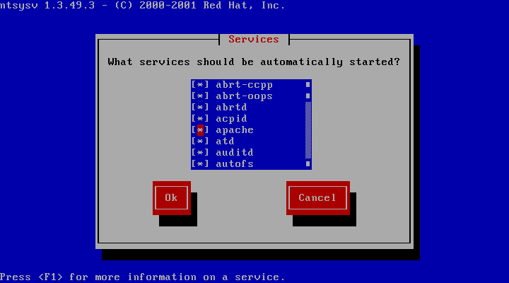
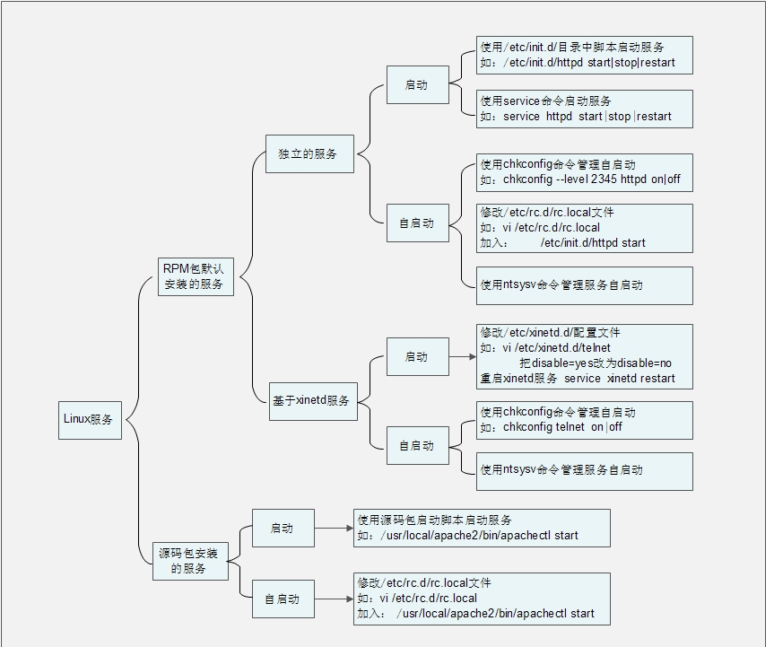

1 源码包服务的启动管理


2 源码包服务的自启动管理(向配置文件中添加启动命令）


3 让源码包服务被服务管理命令识别


1）、卸载 RPM 包的 apache 服务


2）、安装源码包的 apache 服务，并启动


3）、让源码包的 apache 服务能被 service 命令管理启动


4）、让源码包的 apache 服务能被 chkconfig 命令管理自启动


5）、让 ntsysv 命令可以管理源码包 apache


四、总结服务管理

1、启动：

2、自启动

# 1 源码包服务的启动管理


```javascript
[root@localhost ~]# /usr/local/apache2/bin/apachectl start|stop|restart|…
#源码包服务启动管理
```

# 2 源码包服务的自启动管理(向配置文件中添加启动命令）


```javascript
root@localhost ~]# vi /etc/rc.d/rc.local
#修改自启动文件
#!/bin/sh
#
# This script will be executed *after* all the other init scripts.
# You can put your own initialization stuff in here if you don't
# want to do the full Sys V style init stuff.
touch /var/lock/subsys/local
/usr/local/apache2/bin/apachectl start
```

# 3 让源码包服务被服务管理命令识别


那么我们就做个试验，看看如何把源码包安装的 apche 变为和 RPM 包安装的 apache 一样，可以


被 service、chkconfig、ntsysv 命令识别吧。试验如下：


## 1）、卸载 RPM 包的 apache 服务


```javascript
[root@localhost ~]# yum -y remove httpd
#卸载 RPM 包的 apache，避免对试验产生影响（生产服务器上慎用 yum 卸载，有可能造成服务器崩溃）。
[root@localhost ~]# service httpd start
httpd: 未被识别的服务
#因为服务被卸载，所以 service 命令不能识别 httpd 命令
```

## 2）、安装源码包的 apache 服务，并启动


```javascript
#安装源码包的 apache 服务，具体安装方法参考软件安装章节。
[root@localhost ~]# /usr/local/apache2/bin/apachectl start
[root@localhost ~]# netstat -tlun | grep 80
tcp 0 0 :::80 :::* LISTEN
#启动源码包的 apache，查看端口确定已经启动
```

## 3）、让源码包的 apache 服务能被 service 命令管理启动


```javascript
[root@localhost ~]# ln -s /usr/local/apache2/bin/apachectl /etc/init.d/apache
#service 命令其实只是在/etc /init.d/目录中查找是否有服务的启动脚本，所以我们
#只需要做个软链接把源码包的启动脚本链接到/etc/init.d/目录中，就能被 service
#命令管理了。为了大家的习惯，我把软链接文件起名为 apache，不过注意这不是 RPM 包的 apache 哦！
[root@localhost ~]# service apache restart
#虽然 RPM 包的 apache 被卸载，但是 service 命令也能够生效。
```

## 4）、让源码包的 apache 服务能被 chkconfig 命令管理自启动


```javascript
[root@localhost ~]# vi /etc/init.d/apache
#修改源码包 apache 的启动脚本（注意此文件是软链接，所以修改的还是源码包启动脚本）
#!/bin/sh
#
# chkconfig: 35 86 76
#指定 httpd 脚本可以被 chkconfig 命令管理
#格式是： chkconfig： 运行级别 启动顺序 关闭顺序
#这里我们让 apache 在 3 和 5 级别能被 chkconfig 命令管理，启动顺序是 S86，关闭顺序是 K76
#（自定顺序，不要和系统中已有的启动程序顺序冲突）
# description: source package apache
#说明，内容随意
#以上两句话必须加入，才能被 chkconfig 命令识别
…省略部分输出…
[root@localhost ~]# chkconfig --add apache
#让 chkconfig 命令能够管理源码包安装的 apache。
[root@localhost ~]# chkconfig --list | grep apache
apache 0:关闭 1:关闭 2:关闭 3:关闭 4:关闭 5:关闭 6:关闭
#很神奇吧，虽然 RPM 包的 apche 被删除了，但是 chkconfig 命令可以管理源码包 apache
#了
```

## 5）、让 ntsysv 命令可以管理源码包 apache


#ntsysv 命令其实是和 chkconfig 命令使用同样的管理机制，也就是说 ntsysv 已经可以


#进行源码包 apache 的自启动管理了。如图 14-3 所示：





图 14-3 ntsysv 识别 apache


总结下，如果想让源码包服务被 service 命令识别并管理，只要做个软链接把启动脚本链接到


/etc/init.d/目录中即可。要想让源码包服务被 chkconfig 命令识别，除了需要把服务的启动脚本链


接到/etc/init.d/目录中，还要修改这个启动脚本，在启动脚本的开头加入：


```javascript
# chkconfig: 运行级别 启动顺序 关闭
# description: 说明
```

然后需要使用“chkconfig --add 服务名”的方式把服务加入 chkconfig 命令管理中。命令格式


如下：


```javascript
[root@localhost ~]# chkconfig [选项] [服务名]
选项：
--add： 把服务加入 chkconfig 命令的管理
--del： 把服务从 chkconfig 命令的管理中删除
例：
[root@localhost ~]# chkconfig –del httpd
#把 apache 服务从 chkconfig 命令的管理中删除
```


# 四、总结服务管理





# 1、启动：

/usr/local/apache2/bin/apachectl  start | stop

# 2、自启动

vi  /etc/rc.loacl

