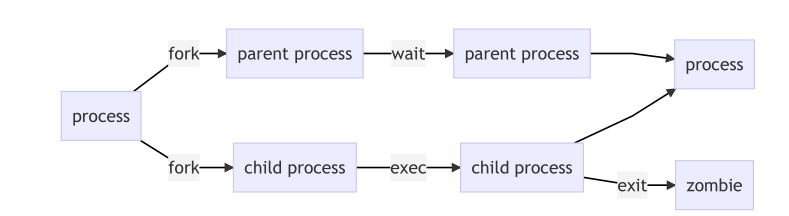
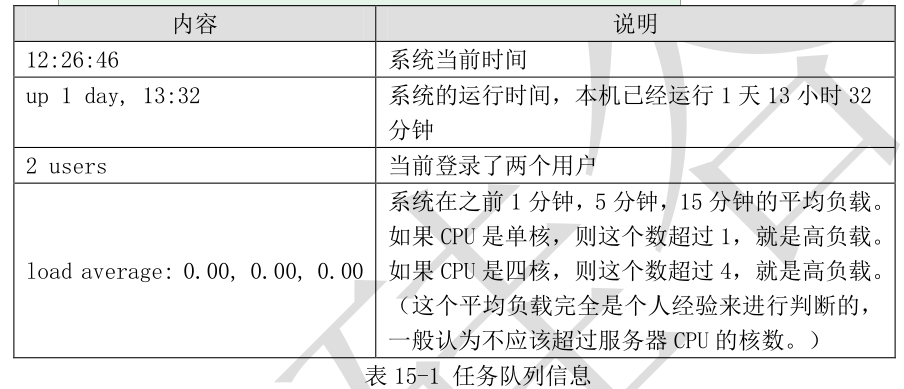
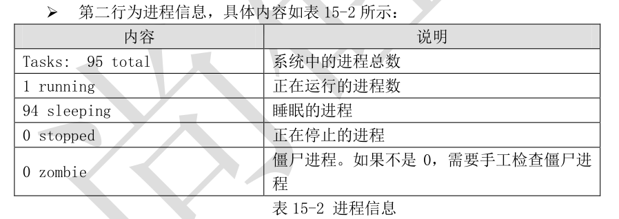
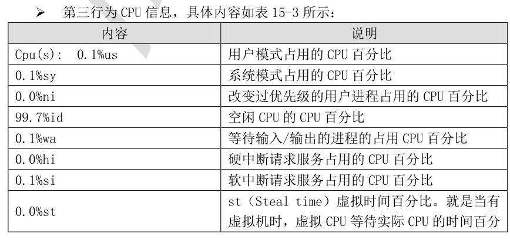
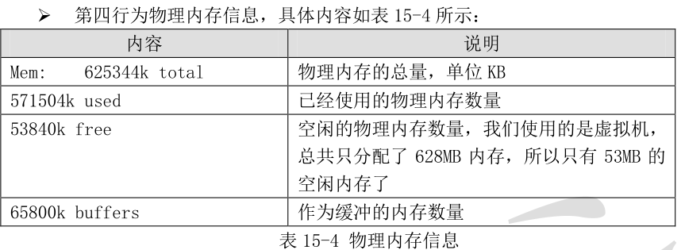
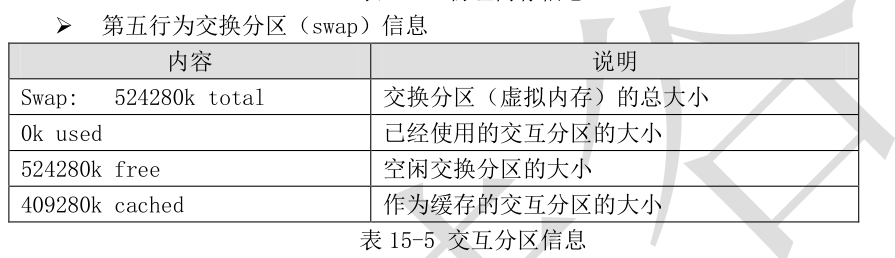
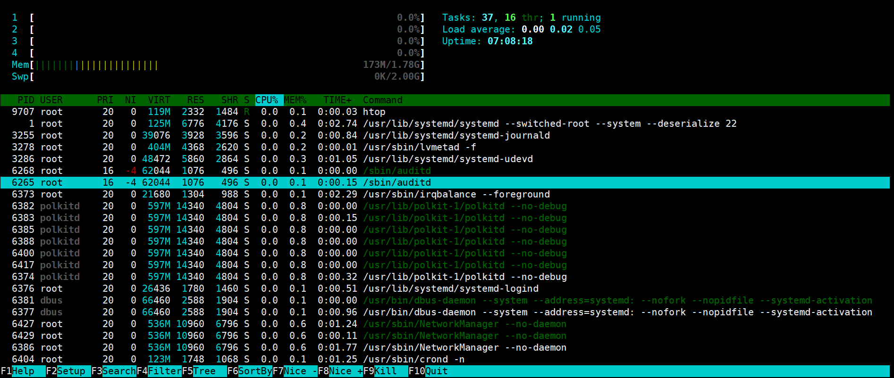

# **一、进程管理
**

# **1 进程简介
**

## **1）、什么是进程管理？
**

```javascript
   那么到底什么是进程呢？进程是正在执行的一个程序或命令，每一个进程都是一个运行的实体，
都有自己的地址空间，并占用一定的系统资源。那么什么是程序呢？程序是人使用计算机语言编写的
可以实现特定目标或解决特定问题的代码集合。这么讲很难理解，那我们换一种说法：
     程序是人使用计算机语言编写的，可以实现一定功能，并且可以执行的代码集合。
     进程是正在执行当中的程序。程序被执行时，执行人的权限和属性、以及程序的代码都会被
       加载如内存，操作系统给这个进程分配一个 ID 号，我们成为 PID（进程 ID）。
```

## **2）进程是已启动的可执行程序的运行实例，进程有以下组成部分:**

```javascript
-已分配内存的地址空间
-安全属性，包括所有权凭据和特权
-进程代码的一个或多个执行线程
-进程状态
程序：二进制文件，静态/bin/date，/usr/sbin/httpd，/usr/sbin/sshd，/usr/local/nginx/sbin/ngix
进程：是程序运行的过程，动态，有生命周期及运行状态
```

## **3)进程类型
**

**守护进程**

**前台进程**

## **4)进程的生命周期**



## **
**

父进程复制自己的地址空间(fork)创建一个新的(子)进程结构。每个新进程分配一个唯一的进程ID(PID)，


满足跟踪安全性之需。PID和父进程ID(PPID)是子进程环境的元素，任何进程都可以创建子进程，所有进


程都是第一个系统进程的后代:


```javascript
centos5/6：init
centos7： systemd
```

## **5)进程状态
**

子进程继承父进程的安全性身份、过去和当前的文件描述符、端口和资源特权、环境变量，以及程序代


码。随后，子进程可能exec自己的程序代码。通常，父进程在子进程运行期间处于睡眠(sleeping)状态。


当子进程完成时发出(exit)信息请求，在退出时，子进程已经关闭或丢弃了其资源环境，剩余的部分称之


为僵尸(zombie)。父进程在子进程退出时收到信号而被唤醒，清理剩余的结构，然后继续执行其自己的


程序代码。


## **6)进程状态
**

在多任务处理操作系统中，每个CPU(或核心)在一个时间点上只能处理一个进程。在进程运行时，它对


CPU时间和资源分配的要求会不断变化，从而为进程分配一个状态，它随着环境要求而改变。


R运行状态(runing): 表明进程要么在运行中要么在运行队列里，并不意味着进程一定在运行中。


S睡眠状态（sleeping）：意味着进程在等待事件的完成（这里的睡眠有时候也叫做可中断睡眠）


D磁盘睡眠状态

T停止状态

发送SIGCNT信号让进程继续运行。


Z僵尸状态(zombie)：通知父进程回收所有的资源


X死亡状态（dead）：这个状态只是一个返回状态，你不会在任务列表里看到这个状态。


**僵尸进程**

waitpid 来获取子进程的状态信息，那么子进程的状态描述符依然保存在系统中。


**孤儿进程**

个孤儿进程，它会被init进程接管


**参考博客**[https://blog.csdn.net/dream_1996/article/details/71001006](https://blog.csdn.net/dream_1996/article/details/71001006)

## **2）、进程管理的作用
**

### ** 判断服务器健康状态：**

```javascript
    运维工程师最主要的工作就是保证服务器安全稳定的运行。理想的状
    态是，在服务器出现问题，但是还没有造成服务器宕机或停止服务时，就人为干预解决了问
    题。进程管理最主要的工作就是判断服务器当前运行是否健康，是否需要人为干预。如果服
    务器的 CPU 占用率、内存占用率过高，就需要人为介入解决问题了。
```

### ** 查****看****系统中所有的进程：**

```javascript
    我们需要查看系统中所有正在运行的进程，通过这些进程可以判断
    系统中运行了哪些服务，是否有非法服务运行。
```

### ** 杀死进****程****：**

```javascript
    这是进程管理中最不常用的手段，当我需要停止服务时，会通过正确关闭命令来
    停止服务（如 apache 服务可以通过 service httpd stop 来关闭）。只有当正确终止进程的
    手段失效的情况下，才会考虑使用 kill 命令杀死进程（你不是杀手，不要什么进程都用 kill
    来终止，否则非常容易导致服务器崩溃）。
```

# **2 进程的查看
**

### ** ps 命令**

**Linux ps （英文全拼：process status）命令用于显示当前进程的状态，类似于 windows 的任务管理器。**

ps 命令是用来静态显示系统中进程的命令。不过这个命令有些特殊，它的部分命令的选项不能加入“-”，比如命令“ps aux”，其中“aux”是选项，但是这个选项不能加入“-”。这是因为 ps命令的部分选项需要遵守 BSD 操作系统的格式。所以 ps 命令的常用选项的组合是固定的。命令如下：

### **ps aux 查看系统所有的进程（使用的格式不一样，是BSD系统的格式）
**

```javascript
[root@localhost ~]# ps aux    #查看系统中所有进程，使用 BSD 操作系统格式
[root@localhost ~]# ps -le    #查看系统中所有进程，使用 Linux 标准命令格式。
选项：
    u：(user,用户)以用户为中心组织进程状态信息显示
    a：(Associated,联系，相关)与终端相关的进程；
    x：与终端无关的进程
    -l： 长格式显示。显示更加详细的信息
    -e： 显示所有进程，和-A 作用一致
```

```javascript
[root@server1 ~]# ps aux
USER        PID %CPU %MEM    VSZ   RSS TTY      STAT START   TIME COMMAND
root          1  0.3  0.3 193536  6608 ?        Ss   01:45   0:01 /usr/lib/systemd/systemd --switched-root --system --deserialize 22
root          2  0.0  0.0      0     0 ?        S    01:45   0:00 [kthreadd]
root          3  0.0  0.0      0     0 ?        S    01:45   0:00 [ksoftirqd/0]
root          4  0.0  0.0      0     0 ?        S    01:45   0:00 [kworker/0:0]
root          5  0.0  0.0      0     0 ?        S<   01:45   0:00 [kworker/0:0H]
root          7  0.0  0.0      0     0 ?        S    01:45   0:00 [migration/0]
root          8  0.0  0.0      0     0 ?        S    01:45   0:00 [rcu_bh]
root          9  0.0  0.0      0     0 ?        S    01:45   0:00 [rcu_sched]
root         10  0.0  0.0      0     0 ?        S<   01:45   0:00 [lru-add-drain]
root         11  0.0  0.0      0     0 ?        S    01:45   0:00 [watchdog/0]
root         12  0.0  0.0      0     0 ?        S    01:45   0:00 [watchdog/1]
```

解释下这个命令的输出：


```javascript
 USER：该进程是由哪个用户产生的；
 PID：进程的 ID 号；
 %CPU：该进程占用 CPU 资源的百分比，占用越高，进程越耗费资源；
 %MEM：该进程占用物理内存的百分比，占用越高，进程越耗费资源；
 VSZ：该进程占用虚拟内存的大小，单位 KB；
 RSS：该进程占用实际物理内存的大小，单位 KB；
 TTY：该进程是在哪个终端中运行的。其中 tty1-tty7 代表本地控制台终端（可以通过
    alt+F1-F7 键切换不同的终端），tty1-tty6 是本地的字符界面终端，tty7 是图形终端。
    pts/0-255 代表虚拟终端，一般是远程连接的终端，第一个远程连接占用的是 pts/0 终端，
    第二个远程连接占用 pts/1，依次增长。
 STAT：进程状态。常见的状态有：
     D：(deeper sleep,更深的睡眠，不可唤醒)不可被唤醒的睡眠状态，通常用于 I/O 	
     R：(running,运行中)该进程正在运行
     S：(sleep,睡眠)该进程在睡眠状态，可被唤醒(大写的S)
     T：()停止状态，可能是在后台暂停或进程在除错状态
     W：内存交互状态（从 2.6 内核开始无效）
     X：死掉的进程（应该不会出现）
     Z：(zombi,僵尸)僵尸进程。进程已经终止，但是部分程序还在内存当中。
     <：高优先级（以下状态在 BSD 格式当中出现）
     N：低优先级
     L：(lock,锁)被锁入内存
     s：包含子进程
     l：多线程（小写 L）
     +：位于后台
 START：该进程的启动时间
 TIME：该进程占用 CPU 的运算时间，注意不是系统时间
 COMMAND：产生此进程的命令名
```

### **ps -le命令**

**注意如果只写 ps -l查看上当前bash的进程**

```javascript
[root@server1 ~]# ps -le
F S   UID    PID   PPID  C PRI  NI ADDR SZ WCHAN  TTY          TIME CMD
4 S     0      1      0  0  80   0 - 48384 ep_pol ?        00:00:01 systemd
1 S     0      2      0  0  80   0 -     0 kthrea ?        00:00:00 kthreadd
1 S     0      3      2  0  80   0 -     0 smpboo ?        00:00:00 ksoftirqd/0
1 S     0      5      2  0  60 -20 -     0 worker ?        00:00:00 kworker/0:0H
1 S     0      7      2  0 -40   - -     0 smpboo ?        00:00:00 migration/0
1 S     0      8      2  0  80   0 -     0 rcu_gp ?        00:00:00 rcu_bh
1 S     0      9      2  0  80   0 -     0 rcu_gp ?        00:00:00 rcu_sched
1 S     0     10      2  0  60 -20 -     0 rescue ?        00:00:00 lru-add-drain
5 S     0     11      2  0 -40   - -     0 smpboo ?        00:00:00 watchdog/0
5 S     0     12      2  0 -40   - -     0 smpboo ?        00:00:00 watchdog/1
1 S     0     13      2  0 -40   - -     0 smpboo ?        00:00:00 migration/1
```

### **ps -ef 命令****显示所有进程信息，连同命令行**

```javascript
[root@server1 ~]# ps -ef
。。。。。。。。。。。
root       7321   7317  0 03:26 pts/0    00:00:00 -bash
root       7322   6555  0 03:26 ?        00:00:00 sshd: root@notty
root       7344   7322  0 03:26 ?        00:00:00 /usr/libexec/openssh/sftp-server
root       7376      1  0 03:27 ?        00:00:00 /usr/sbin/httpd -DFOREGROUND
apache     7377   7376  0 03:27 ?        00:00:00 /usr/sbin/httpd -DFOREGROUND
apache     7378   7376  0 03:27 ?        00:00:00 /usr/sbin/httpd -DFOREGROUND
apache     7379   7376  0 03:27 ?        00:00:00 /usr/sbin/httpd -DFOREGROUND
apache     7380   7376  0 03:27 ?        00:00:00 /usr/sbin/httpd -DFOREGROUND
apache     7381   7376  0 03:27 ?        00:00:00 /usr/sbin/httpd -DFOREGROUND
root       7382      2  0 03:30 ?        00:00:00 [kworker/0:0]
root       7385      2  0 03:35 ?        00:00:00 [kworker/0:1]
root       7420      2  0 03:39 ?        00:00:00 [kworker/0:3]
root       7422   6555  0 03:39 ?        00:00:00 sshd: root@pts/1
root       7426   7422  0 03:39 pts/1    00:00:00 -bash
root       7427   6555  0 03:39 ?        00:00:00 sshd: root@notty
root       7449   7427  0 03:39 ?        00:00:00 /usr/libexec/openssh/sftp-server
root       7460   7426  0 03:41 pts/1    00:00:00 ps -ef
```

### **ps  -l 查看当前bash的进程**

```javascript
[root@server1 ~]# ps -l
F S   UID    PID   PPID  C PRI  NI ADDR SZ WCHAN  TTY          TIME CMD
4 S     0   8063   8059  0  80   0 - 28959 do_wai pts/2    00:00:00 bash
0 R     0   8084   8063  0  80   0 - 38309 -      pts/2    00:00:00 ps
```

也来解释下这个命令的输出：

```javascript
F：进程标志，说明进程的权限，常见的标志有：
	1：进程可以复制，但是不能执行
 	4：进程使用超级用户权限
 S：进程状态。具体的状态和“ps aux”命令中 STAT 状态一致
 UID：进程是哪个 UID 用户调用运行的
 PID：进程的 ID 号
 PPID：父进程的 ID 号
 C：该进程的 CPU 使用率，单位是百分比
 PRI：进程的优先级，数值越小该进程优先级越高，越快被 CPU 执行
 NI：进程的优先级，也是数值越小越早被执行
 ADDR：该进程在内存的哪个位置
 SZ：该进程占用多大内存
 WCHAN：该进程是否运行。“-”代表正在运行
 TTY：该进程由哪个终端产生 	#tty1-tty6是本地终端登录，pts/0是网络终端
 TIME：该进程占用 CPU 的运算时间，注意不是系统时间
 CMD：产生此进程的命令名
```

### **按照CPU使用率排序：ps aux --sort %cpu |less **

```javascript
[root@xwz ~]# ps aux --sort -%cpu |less  #按照CPU使用率排序
[root@xwz ~]# ps aux --sort rss |less
[root@xwz ~]# ps aux --sort -rss |less
```

### **自定义显示字段：ps axo user.......**

```javascript
[root@xwz ~]# ps axo user,pid,ppid,%mem,%cpu,command --sort -%cpu |less
```

## **2)、 top 命令，****用于实时显示 process 的动态。(to,go to,去->动态的；p,proess,进程）****
**

```javascript
[root@localhost ~]# top [选项]
选项：
    -d: (second,秒)秒数： 指定 top 命令每隔几秒更新。默认是 3 秒
    -b： (batch:批处理)使用批处理模式输出。一般和“-n”选项合用，用于把 top 命令重定向到文件中
    -n: (NO.)次数： 指定 top 命令执行的次数。一般和“-b”选项合用
    -p： 指定 PID。只查看某个 PID 的进程
    -s： (safe,安全)使 top 在安全模式运行，避免在交互模式中出现错误
    -u 用户名： 只监听某个用户的进程
在 top 命令的交互模式当中可以执行的命令：
？或 h： 显示交互模式的帮助
P： 以 CPU 使用率排序，默认就是此项
M： 以内存的使用率排序
N： 以 PID 排序
T： 按照 CPU 的累积运算时间排序，也就是用 TIME+项排序
k： 按照 PID 号，给予某个进程一个信号。一般用于终止某个进程，信号 9
是强制终止的信号
r： 按照 PID 号，给某个进程重设优先级（Nice）值
q： 退出 top
```

我们看看 top 命令的执行结果：


```javascript
[root@localhost ~]# top
top - 12:26:46 up 1 day, 13:32, 2 users, load average: 0.00, 0.00, 0.00
Tasks: 95 total, 1 running, 94 sleeping, 0 stopped, 0 zombie
Cpu(s): 0.1%us, 0.1%sy, 0.0%ni, 99.7%id, 0.1%wa, 0.0%hi, 0.1%si, 0.0%st
Mem: 625344k total, 571504k used, 53840k free, 65800k buffers
Swap: 524280k total, 0k used, 524280k free, 409280k cached
PID USER PR NI VIRT RES SHR S %CPU %MEM TIME+ COMMAND
19002 root 20 0 2656 1068 856 R 0.3 0.2 0:01.87 top
1 root 20 0 2872 1416 1200 S 0.0 0.2 0:02.55 init
2 root 20 0 0 0 0 S 0.0 0.0 0:00.03 kthreadd
```

我们解释下命令的输出，top 命令的输出内容是动态的，默认每 3 秒刷新一次。命令的输出主要


分为两大部分：第一部分是前五行，显示的是整个系统的资源使用状况，我们就是通过这些输出判断


服务器的健康状态；第二部分从第六行开始，显示的是系统中进程的信息。

-  我们先来说明第一部分的作用：


 第一行信息为任务队列信息，具体内容如表 15-1 所示：











- 再来看 top 命令的第二部分输出，主要是系统进程信息。这部分和 ps 命令的输出比较类似，


只是如果在终端中执行 

```javascript
 PID：进程 ID
 USER：该进程所属的用户
 PR：优先级，数值越小优先级越高
 NI：优先级，数值越小优先级越高(nice值)
 VIRT：该进程使用的虚拟内存的大小，单位 KB
 RES：该进程使用的物理内存的大小，单位 KB
 SHR：共享内存大小，单位 KB
 S：进程状态
 %CPU：该进程占用 CPU 的百分比
 %MEM：该进程占用内存的百分比
 TIME+：该进程总共占用的 CPU 时间
 COMMAND：进程的命令名
```

- 接下来我们举几个 top 命令常用的实例，来继续说明下 top 命令。比如我如果只想让 top 命令查


看某一个进程，这时就可以使用“-p 选项”：


```javascript
[root@localhost ~]# top -p 15273
#只查看 PID 为 15273 的 apache 进程
```

在 top 命令的交互界面中按“q”键会退出 top 命令。也可以按“？”或“h”得到 top 命令交互


界面的帮助信息。也可以按“k”键终止某个进程，命令如下：


```javascript
[root@localhost ~]# top
top - 14:10:15 up 1 day, 15:15, 3 users, load average: 0.00, 0.00, 0.00
Tasks: 97 total, 1 running, 96 sleeping, 0 stopped, 0 zombie
Cpu(s): 0.0%us, 0.0%sy, 0.0%ni,100.0%id, 0.0%wa, 0.0%hi, 0.0%si, 0.0%st
Mem: 625344k total, 574248k used, 51096k free, 66840k buffers
Swap: 524280k total, 0k used, 524280k free, 409324k cached
PID to kill:15273  按“k”键，会提示输入要杀死进程的 PID
```

如果在操作终端执行 top 命令，并不能看到系统中所有的进程，默认看到的只是 CPU 占比靠前的


进程。如果我们想要看到所有的进程可以把 top 命令的结果重定向到文件当中即可。不过 top 命令是


持续运行的，这时就需要“-b”和“-n”选项了，具体命令如下：


```javascript
[root@localhost ~]# top -b -n 1 > /root/top.log
#让 top 命令只执行一次，让后把结果保存到 top.log 文件中。这样就能看到所有的进程了
```

## **3）htop 命令扩展****（下列方法是用于Centos7）**

**功能个和top差不多，但是这个有颜色，而且可以用鼠标点击**

```javascript
[root@server1 ~]# yum install -y epel-release.noarch
[root@server1 ~]# yum install  -y htop
[root@server1 ~]# htop
```



## **4）、 pstree 命令
**

```javascript
[root@localhost ~]# pstree [选项]
选项：
-p： 显示进程的 PID
-u： 显示进程的所属用户
```