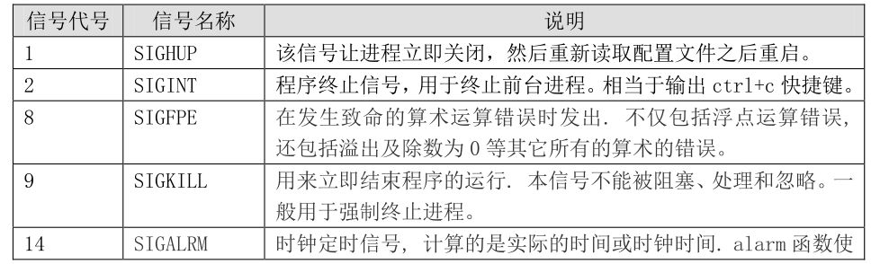
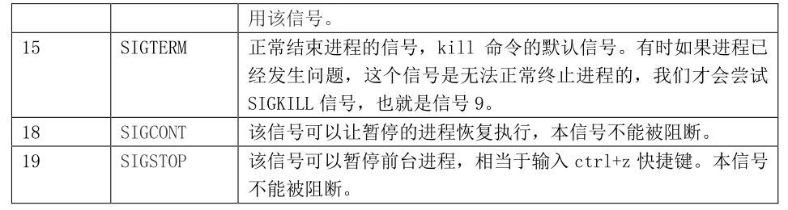

# **1、进程的管理
**

系统中可以识别的

如下：


```javascript
[root@localhost ~]# kill -l
1) SIGHUP 2) SIGINT 3) SIGQUIT 4) SIGILL 5) SIGTRAP
6) SIGABRT 7) SIGBUS 8) SIGFPE 9) SIGKILL 10) SIGUSR1
11) SIGSEGV 12) SIGUSR2 13) SIGPIPE 14) SIGALRM 15) SIGTERM
16) SIGSTKFLT 17) SIGCHLD 18) SIGCONT 19) SIGSTOP 20) SIGTSTP
21) SIGTTIN 22) SIGTTOU 23) SIGURG 24) SIGXCPU 25) SIGXFSZ
26) SIGVTALRM 27) SIGPROF 28) SIGWINCH 29) SIGIO 30) SIGPWR
31) SIGSYS 34) SIGRTMIN 35) SIGRTMIN+1 36) SIGRTMIN+2 37) SIGRTMIN+3
38) SIGRTMIN+4 39) SIGRTMIN+5 40) SIGRTMIN+6 41) SIGRTMIN+7 42) SIGRTMIN+8
43) SIGRTMIN+9 44) SIGRTMIN+10 45) SIGRTMIN+11 46) SIGRTMIN+12 47) SIGRTMIN+13
48) SIGRTMIN+14 49) SIGRTMIN+15 50) SIGRTMAX-14 51) SIGRTMAX-13 52) SIGRTMAX-12
53) SIGRTMAX-11 54) SIGRTMAX-10 55) SIGRTMAX-9 56) SIGRTMAX-8 57) SIGRTMAX-7
58) SIGRTMAX-6 59) SIGRTMAX-5 60) SIGRTMAX-4 61) SIGRTMAX-3 62) SIGRTMAX-2
63) SIGRTMAX-1 64) SIGRTMAX
```

这里我们介绍一下主要的信号，如表 15-6 所示：






## **1）、 kill 命令
**

```javascript
[root@localhost ~]# kill [信号] PID
```

### **例 2：使用“-1”信号，让进程重启
**

```javascript
[root@localhost ~]# kill -1 2246
#使用“-1（数字一）”信号，让 httpd 的主进程重启动。
```

### **例 3：使用“-19”信号，让进程暂停。
**

```javascript
[root@localhost ~]# vi test.sh
#使用 vi 命令编辑一个文件，不要退出
[root@localhost ~]# ps aux | grep "vi" | grep -v "grep"
root 2313 0.0 0.2 7116 1544 pts/1 S+ 19:20 0:00 vi test.sh
#换一个不同的终端，查看下这个这个进程的状态。进程状态是 S（休眠）和+（位于后台），
#因为是在另外一个终端运行的命令
[root@localhost ~]# kill -19 2313
#使用-19 信号，让 PID 是 2313 的进程暂停。相当于在 vi 界面按“ctrl+z”快捷键。
[root@localhost ~]# ps aux | grep "vi" | grep -v "grep"
root 2313 0.0 0.2 7116 1580 pts/1 T T 19:20 0:00 vi test.sh
#注意 2313 进程的状态，变成了 T（暂停）状态。这时我切换回 vi 的终端，发现 vi 命令已
#经暂停，又回到了命令提示符。
#不过 2313 进程就会卡在后台，如果想要恢复可以使用“kill -9 2313”强制终止进程，也
#可以利用 15.2 小节将要学习的工作管理来进行恢复。
```

## **2）、killall 命令，删除某一类的进程，而不是删除全部的进程
**

```javascript
[root@localhost ~]# killall [选项][信号] 进程名
选项：
-i： （interact,交互)交互式，询问是否要杀死某个进程
-I： (Ignore,忽略)忽略进程名的大小写
```

## **3)交互式杀死 sshd 进程(使用-i选项）
**

```javascript
[root@localhost ~]# ps aux | grep "sshd" | grep -v "grep"
root 1733 0.0 0.1 8508 1008 ? Ss 19:47 0:00 /usr/sbin/sshd
root 1735 0.1 0.5 11452 3296 ? Ss 19:47 0:00 sshd: root@pts/0
root 1758 0.1 0.5 11452 3296 ? Ss 19:47 0:00 sshd: root@pts/1
#查询系统有 3 个 sshd 进程。1733 是 sshd 服务的进程，1735 和 1758 是我的两个远程连接
#的进程。
```

```javascript
[root@localhost ~]# killall -i sshd
#交互式杀死 sshd 进程
杀死 sshd(1733) ? (y/N) n
#这个进程是 sshd 的服务进程，如果杀死，所有的 sshd 连接都不能登录。
杀死 sshd(1735) ? (y/N) n
#这是我当前登录终端，不能杀死我自己吧！
杀死 sshd(1758) ? (y/N) y
#把另外一个 sshd 登录终端踢出。
```

## **4）、pkill 命令**

## **Linux pkill 用于杀死一个进程，与 **

**kill 命令杀死指定进程 PID，需要配合 ps 使用，而 pkill 直接对进程对名字进行操作，更加方便。**

pkill 命令和 killall 命令非常类似，

```javascript
[root@localhost ~]# pkill [选项] [信号] 进程名
选项：
-t 终端号： 按照终端号踢出用户
[root@localhost ~]# pkill -9 -t pts/1
#强制杀死从 pts/1 虚拟终端登录的进程
```

## **5) w命令**

[](https://www.runoob.com/linux/linux-command-manual.html)

**w**

执行这项指令可得知目前登入系统的用户有哪些人，以及他们正在执行的程序。

单独执行 w 指令会显示所有的用户，您也可指定用户名称，仅显示某位用户的相关信息。

### **语法**

```javascript
w [-fhlsuV][用户名称]
```

**参数说明**

- -f 　开启或关闭显示用户从何处登入系统。

- -h 　不显示各栏位的标题信息列。

- -l 　使用详细格式列表，此为预设值。

- -s 　使用简洁格式列表，不显示用户登入时间，终端机阶段作业和程序所耗费的CPU时间。

- -u 　忽略执行程序的名称，以及该程序耗费CPU时间的信息。

- -V 　显示版本信息。

### **踢出远程登录用户**

```javascript
[root@xwz ~]# w
19:21:16 up 1 day,  6:26,  4 users, load average: 0.00, 0.01, 0.05
USER   TTY   FROM       LOGIN@  IDLE  JCPU  PCPU WHAT
root   :0    :0        四11  ?xdm?  2:05m  0.50s
/usr/libexec/gnome-se
root   pts/0  :0        四11  5days  1.36s  0.36s -bash
root   pts/1   192.168.222.1   18:56   4.00s  0.14s  0.02s w
centos  pts/2   192.168.222.1   19:21   3.00s  0.04s  0.04s -bash

[root@xwz ~]# pkill -u centos
[root@xwz ~]# pkill -t pts/2 # 终止pts/2上所有进程
[root@xwz ~]# pkill -9 -t pts/2 # 终止pts/2上所有进程，并结束pts/2
```

### **显示当前用户**

```javascript
[root@server1 ~]# w
 03:44:16 up  1:59,  3 users,  load average: 0.00, 0.01, 0.05
USER     TTY      FROM             LOGIN@   IDLE   JCPU   PCPU WHAT
root     tty1                      01:45   11:20   0.52s  0.52s -bash
root     pts/0    192.168.10.1     03:33    1:44   0.04s  0.04s -bash
root     pts/1    192.168.10.1     03:44    0.00s  0.02s  0.01s w
```

### **不显示登录位置**

```javascript
w -f
19:53:59 up 9:31, 4 users, load average: 0.05, 0.16, 0.15
USER   TTY    LOGIN@  IDLE  JCPU  PCPU WHAT
root   tty7   Thu12  31:43m 10:10  0.60s gnome-session
root   pts/0   17:09  2:21m 15.26s 0.15s bash
root   pts/1   18:51  0.00s 1.04s 0.14s -bash
root   pts/2   19:48  4:45  0.05s 0.05s -bash
```

### **以精简模式显示**

```javascript
w -s
19:54:37 up 9:31, 4 users, load average: 0.24, 0.19, 0.16
USER   TTY   FROM        IDLE WHAT
root   tty7   :0        31:43m gnome-session
root   pts/0  :0.0       2:22m bash
root   pts/1  192.168.1.17   0.00s -bash
root   pts/2  192.168.1.17   5:23 -bash
```

### **不显示标题**

```javascript
w -h
root   tty7   :0        Thu12  31:44m 10:10  0.60s gnome-session
root   pts/0  :0.0       17:09  2:23m 15.26s 0.15s bash
root   pts/1  192.168.1.17   18:51  0.00s 1.05s 0.14s -bash
root   pts/2  192.168.1.17   19:48  5:54  0.05s 0.05s -bash
```