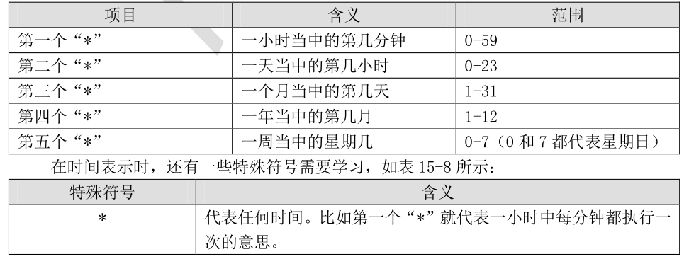
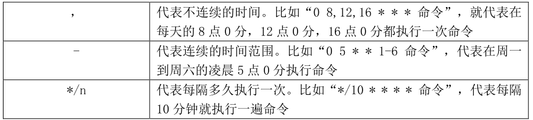
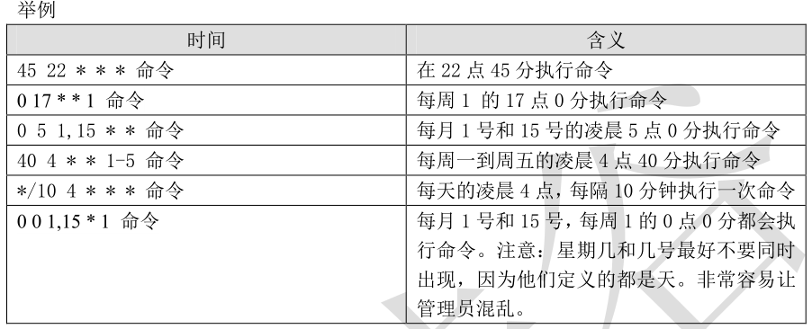

# **1、 crond 服务管理与访问控制
**

crontab 命令是需要 crond 服务支持的，crond 服务同样是独立的服务，所以启动和自启动方法


如下：


```javascript
[root@localhost ~]# service crond restart
停止 crond： [确定]
正在启动 crond： [确定]
#重启动 crond 服务
```

```javascript
[root@localhost ~]# chkconfig crond on
#设定 crond 服务为开机自启动
```

crond 服务默认是自启动的，如果服务器上有循环执行的系统定时任务，就不要关闭 crond 服务了。


crontab 命令和 at 命令类似，也是通过/etc/cron.allow 和/etc/cron.deny 文件来限制某些用户是否可以使用 crontab 命令的。而且原则也非常相似：


```javascript
 当系统中有/etc/cron.allow 文件时，只有希尔此文件的用户可以使用 crontab 命令，没有
  写入的用户不能使用 crontab 命令。同样如果有此文件，/etc/cron.deny 文件会被忽略，
  /etc/cron.allow 文件的优先级更高。
 当系统中只有/etc/cron.deny 文件时，则写入此文件的用户不能使用 crontab 命令，没有写
  入文件的用户可以使用 crontab 命令。
  这个规则基本和 at 的规则一直，同样/etc/cron.allow 文件的优先级比/etc/cron.deny 文件的
  优先级高，Linux 中默认只有/etc/cron.deny 文件。
```

# **2、 用户的 crontab 设置
**

**注意：**

**1、当使用crontab -e 编辑了一个循环任务时，这个任务的具体内容将会被保存在/var/spool/cron/用户名 这个文件中，但是不要使用vim直接编辑这个文件，可能会造成cron无法执行。**

**2、当cron每执行一次，都会被系统记录在/var/log/cron这个日志文件当中。所以可以利用这个日子文件，查看系统执行了哪些cron任务。**

每个用户都可以实现自己的 crontab 定时任务，只要是使用这个用户身份执行“crontab -e”命令即可，当然这个用户不能加入/etc/cron.deny 文件中。crontab 命令格式如下：


```javascript
[root@localhost ~]# crontab [-u username] [-e|l|r]
选项：
-e： (edit,编辑)编辑 crontab 定时任务
-l： 查询 crontab 任务
-r： 删除当前用户所有的 crontab 任务，如果有多个任务，只想删除一个，可以用“crontab -e”
-u 用户名： 修改或删除其他用户的 crontab 任务。只有 root 可用
```

```javascript
[root@localhost ~]# crontab -e
#进入 crontab 编辑界面。会打开 vim 编辑你的工作。
* * * * * 执行的任务
```







## **例子 1：让系统每隔 5 分钟，就向/tmp/test 文件中写入一行“11”，验证一下系统定时任务是否会
**

## **执行
**

```javascript
[root@localhost ~]# crontab -e
#进入编辑界面
*/5 * * * * /bin/echo ”11” >> /tmp/test
```

## **例子 2：在系统在每周二的凌晨 5 点 05 分重启一次
**

```javascript
[root@localhost ~]# crontab -e
5 5 * * 2 /sbin/shutdown -r now
```

## **例子 3：在每月的 1 号，10 号，15 号的凌晨 3 点 30 分都定时执行日志备份脚本 autobak.sh
**

```javascript
[root@localhost ~]# crontab -e
30 3 1,10,15 * * /root/sh/autobak.sh
```

```javascript
[root@localhost ~]# crontab -l    #查看 root 用户的 crontab 任务
[root@localhost ~]# crontab -r    #删除 root 用户所有的定时任务，如果只想删除某一个定时任务，
#可以“crontab -e”进入编辑模式手工删除
```

## **例子4 ：查看/var/spool/cron/用户名文件，以及日志文件**

### **1）crontab -e 编辑任务**

```javascript
[root@server1 ~]# crontab -e

*/1 * * * * /bin/echo "zhixingyici" > /dev/pts/1
```

### **2）vim /var/spool/cron/root 查看任务文件**

```javascript
[root@server1 ~]# vim /var/spool/cron/root 

*/1 * * * * /bin/echo "zhixingyici" > /dev/pts/1
```

### **3）cat /var/log/cron 查看日志文件**

```javascript
[root@server1 ~]# cat /var/log/cron
。。。。。。。。。。
Feb  6 07:03:01 server1 CROND[8541]: (root) CMD (/bin/echo "zhixingyici" > /dev/pts/1)
Feb  6 07:04:01 server1 CROND[8556]: (root) CMD (/bin/echo "zhixingyici" > /dev/pts/1)
Feb  6 07:05:01 server1 CROND[8594]: (root) CMD (/bin/echo "zhixingyici" > /dev/pts/1)
Feb  6 07:06:02 server1 CROND[8599]: (root) CMD (/bin/echo "zhixingyici" > /dev/pts/1)
Feb  6 07:07:01 server1 CROND[8605]: (root) CMD (/bin/echo "zhixingyici" > /dev/pts/1)
```

### **4）crontab -r 删除任务**

```javascript
[root@server1 ~]# crontab -r	
```

**此时再次查看/var/spool/cron/root文件时，里面的内容为空**

# **3、crontab 的注意事项
**

**在书写 crontab 定时任务时，需要注意几个注意事项，这里我们再强调下：**

```javascript
 六个选项都不能为空，必须填写。如果不确定使用“*”代表任意时间；
 crontab 定时任务，最小有效时间是分钟，最大时间范围是月。像 2018 年某时执行，3 点 30分 30 秒这样的时间都不能识别；
 在定义时间时，日期和星期最好不要在一条定时任务中出现，因为它们都是以天作为单位,非常容易让管理员混乱；
 在定时任务中，不管是直接写命令，还是在脚本中写命令，最好都是用绝对路径。有时相对路径的命令会报错。
```

# **4、 系统的 crontab 设置
**

“crontab -e”是每个用户执行的命令，也就是说不同的用户身份可以执行自己的定时任务。可是有些定时任务需要系统执行，这时我们就需要编辑/etc/crontab 这个配置文件了。当然，并不是说写入/etc/crontab 配置文件中的定时任务执行时，不需要用户身份，而是“crontab -e”命令定义定时任务时，默认用户身份是当前登录用户。而修改/etc/crontab 配置文件时，定时任务的执行着身份是可以手工指定的。这样定时任务的执行会更加灵活，修改起来也更加方便。


那我们打开这个文件看看吧：


```javascript
[root@localhost ~]# vi /etc/crontab
SHELL=/bin/bash	#标示使用哪种 shell
PATH=/sbin:/bin:/usr/sbin:/usr/bin	#指定 PATH 环境变量，crontab 是使用自己的 PATH，而不是用系统默认的，
    									所以在定时任务中出现的命令最好使用大写
MAILTO=root	#如果有报错输出，或命令结果又输出，会向 root 发信息
HOME=/			#标示主目录
# For details see man 4 crontabs
#提示大家可以去“man 4 crontabs”查看帮助
# Example of job definition:
# .---------------- minute (0 - 59)
# | .------------- hour (0 - 23)
# | | .---------- day of month (1 - 31)
# | | | .------- month (1 - 12) OR jan,feb,mar,apr ...
# | | | | .---- day of week (0 - 6) (Sunday=0 or 7) OR sun,mon,tue,wed,thu,fri,sat
# | | | | |
# * * * * * user-name command to be executed
#分 时 日 月 周 执行者身份 命令
#列出文件格式，并加入了注释
```

在 CentOS 6.x 中，/etc/crontab 这个文件也发生了变化，在 CentOS 5.x 中这个文件的内容大概是这个样子：


**# # 以下输出，是在 CentOS 5.5 当中**

```javascript
[root@sc ~]# vi /etc/crontab
SHELL=/bin/bash
PATH=/sbin:/bin:/usr/sbin:/usr/bin
MAILTO=root
HOME=/
# run-parts
01 * * * * root run-parts /etc/cron.hourly
22 4 * * 0 root run-parts /etc/cron.weekly
42 4 1 * * root run-parts /etc/cron.monthly
```

在 CentOS 5.x 版 本 中 ， /etc/crontab 文 件 会 使 用 run-parts 脚 本 执 行/etc/cron.{daily,weekly,monthly}目录中的所有文件。这个 run-parts 其实是一个 shell 脚本，保存在/usr/bin/run-parts，它的作用就是把其后面跟随的目录中的所有可执行文件依次执行。也就是说，如果我们想让某个脚本在每天都执行一次，可以不用手工去写定时任务，而只需要给这个脚本赋予执行权限，并把它放入/etc/cron.daily/目录中。这样这个脚本就会在每天的凌晨 4 点 02 分执行了。


可是在 CentOS 6.x 版本中，/etc/crontab 文件中不再有相关的段落，那么是否 run-ptars 这种定时任务执行方法不可用了呢？我们看到/etc/crontab 中有一句提示，让我们“man 4 crontabs”来查看帮助，那么我们就看看这个帮助吧！在这个帮助中，明确写明了“在旧版本的 crontab 配置文件中，是通过 run-parts 脚本来调用 cron.{daily,weekly,monthly}目录，定时执行这些目录中的脚本。在当前系统中，为了避免 cron 和 anacron 之间产生冲突，只要 anacron 已经安装，就使用 anacron来执行这些目录中的脚本。具体可以查看 anacron（8）的帮助。”。对于 anacron 的用法，我们下一个小节来介绍。


其实对我们用户来讲，我们并不需要知道这个定时任务到底是由哪个程序调用的。我们需要知道的事情是如何使用系统的 crontab 设置。这个新老版本的 CentOS 没有区别，配置方法都有两种：


-  第一种方法就是我刚刚说过的，把你需要定时执行的工作写成脚本程序，并赋予执行权限，然后直接把这个脚本复制到/etc/cron.{daily,weekly,monthly}目录中的任意一个。比如我需要让某个脚本每周执行，那么就把这个脚本复制到/etc/cron.weekly/目中中。这样这个脚本就会每周执行一次，具体的执行时间要参考 anacron 的配置。


-  第二种方法就是修改/etc/crontab 这个配置文件，自己加入自己的定时任务，不过需要注意指定脚本的执行者身份。例如：


```javascript
[root@localhost ~]# vi /etc/crontab
…省略部分输出…
* * * * * root run-parts /root/cron/
#让系统每分钟都执行一次/root/cron/目录中的脚本，脚本执行者是 root 用户。
#虽然在 CentOS 6.x 中，不是直接通过此配置文件调用/etc/cron.{daily,weekly,monthly}这些目录，
#但是 run-parts 脚本还是可以使用的。所以我完全可以参照 CentOS 5.x 的方法来写定时任务。
#使用 run-parts 脚本调用并执行/root/cron/目录中所有的可执行文件
[root@localhost ~]# mkdir cron
#建立/root/cron 目录
[root@localhost cron]# vi /root/cron/hello.sh
#/bin/bash
echo "hello" >> /root/cron/hello.log
#在/root/cron/hello.log 文件中写入 hello
[root@localhost cron]# chmod 755 hello.sh
#赋予执行权限。
#因为 hello.sh 脚本放入了/root/cron/目录，所以会每分钟执行一次。
```

只要保存/etc/crontab 文件，这个定时任务就可以执行了，当然要确定 crond 服务是运行的。
这两种方法都是可以使用的，具体看个人的习惯吧！不过要想修改/etc/crontab 文件，当然我要是 root 用户才可以，普通不能修改，只能使用用户身份的 crontab 命令。

# **4、 anacron
**

 anacron 是用来干什么的呢？我们的 Linux 服务器如果不是 24 小时开机的，那么刚好在关机的时间段之内有系统定时任务（cron）需要执行，那么这些定时任务是不会执行的。也就是说，假设我们需要在凌晨 5 点 05 分执行系统的日志备份，但是我们的 Linux 服务器不是 24 小时开机的，在晚上需要关机，白天上班之后才会再次开机。这个定时任务的执行时间我们的服务器刚好没有开机，那么这个任务就不会执行了。anacron 就是用来解决这个问题的。anacron 会使用一天，七天，一个月作为检测周期，用来判断是否有定时任务在关机之后没有执


行，如果有这样的任务，anacron 会在特定的时间重新执行这些定时任务。那么 anacron 是如何判断这 些 定 时 任 务 已 经 超 过 了 执 行 时 间 呢 ？ 在 系 统 的 /var/spool/anacron/ 目 录 中 存 在cron.{daily,weekly,monthly}文件，这些文件中都保存着 anacron 上次执行时的时间。anacron 会去读取这些文件中的时间，然后和当前时间做比较，若果两个时间的差值超过了 anacron 的指定时间差值（一般是 1 天，7 天和一个月），就说明有定时任务漏掉了没有被执行，这时 anacron 会介入而执行这个漏掉的定时任务，从而保证在关机时没有被执行的定时任务不会被漏掉。在 CentOS 6.x 中，我们使用 cronie-anacron 取代了 vixie-cron 软件包。而且在原先的 CentOS版本中/etc/ cron.{daily,weekly,monthly}这些目录中的定时任务会同时被 cron 和 anacron 调用，这 样 非 常 容 易 出 现 重 复 执 行 同 一 个 定 时 任 务 的 错 误 。 在 现 在 的 CentOS 6.x 中 ，/etc/ cron.{daily,weekly,monthly}目录中的定时任务程序只会被 anacron 调用，从而保证这些定时


任务只会在每天、每周或每月被定时执行一次，而不会重复执行。这也是我们在上一个小节中介绍的CentOS 6.x 的变化之一。


  在 CentOS 6.x 中 anacron 还有一个变化，anacron 不再是单独的服务，而变成了系统命令。也就是说我们不再可以使用“service anacron restart”命令来管理anacron服务了。而是需要使用anacron命令来管理 anacron 工作，具体命令如下：


```javascript
[root@localhost ~]# anacron [选项] [工作名]
选项：
-s： 开始 anacron 工作，依据/etc/anacrontab 文件中的设定的延迟时间执行
-n： 立即执行/etc/anacrontab 中所有的工作，忽略所有的延迟时间
-u： 更新/var/spool/anacron/cron.{daily,weekly,monthly}文件中的时间戳，但不执行任何工作
参数：
工作名： 是依据/etc/anacrontab 文件中定义的工作名
```

  在我们当前的 Linux 中，其实不需要执行任何 anacron 命令，只需要配置好/etc/anacrontab 文件，系统就会依赖这个文件中的设定来通过 anacron 执行定时任务。那么关键就是/etc/anacrontab文件的内容了，这个文件如下：


```javascript
[root@localhost ~]# vi /etc/anacrontab
# /etc/anacrontab: configuration file for anacron
# See anacron(8) and anacrontab(5) for details.
SHELL=/bin/sh
PATH=/sbin:/bin:/usr/sbin:/usr/bin
MAILTO=root
#前面的内容和/etc/crontab 类似
# the maximal random delay added to the base delay of the jobs
RANDOM_DELAY=45    #最大随机延迟。
# the jobs will be started during the following hours only
START_HOURS_RANGE=3-22    #anacron 的执行时间范围是 3:00-22:00
#period in days delay in minutes job-identifier command
1 5 cron.daily nice run-parts /etc/cron.daily
7 25 cron.weekly nice run-parts /etc/cron.weekly
@monthly 45 cron.monthly nice run-parts /etc/cron.monthly
#天数 强制延迟（分） 工作名称 实际执行的命令
#时间差超过天数时，强制延迟多少分钟之后，就执行命令
```

  这个文件中“RANDOM_DELAY”定义的是最大随机延迟，也就是说 cron.daily 任务如果超过 1 天没有执行，并不会马上执行，而是先延迟强制延迟时间之后，再延迟随机延迟时间之后再执行命令。


“START_HOURS_RANGE”定义 anacron 的执行时间范围，anacron 只会在这个时间范围之内执行。


我们用 cron.daily 工作来说明下/etc/anacrontab 的执行过程：


```javascript
 首先读取/var/spool/anacron/cron.daily 中的上一次 anacron 执行的时间；
 和当前时间比较，如果两个时间的差值超过 1 天，就执行 cron.daily 工作；
 执行这个工作只能在 03:00-22:00 之间；
 执行工作时强制延迟时间为 5 分钟，再随机延迟 0-45 分钟时间；
 使用 nice 命令指定默认优先级，使用 run-parts 脚本执行/etc/cron.daily 目录中的所有可
执行文件。
```

  大家发现了吧， /etc/ cron.{daily,weekly,monthly}中的脚本，在当前的 Linux 中是被 anacron调用的，不再依靠 cron 服务。不过 anacron 不用设置多余的配置，我们只需要把需要定时执行的脚本放入 /etc/ cron.{daily,weekly,monthly}目录当中，就会每天、每周或每月执行，而且也不再需要启动 anacron 服务了。我们如果做修改的话，只用修改/etc/anacrontab 配置文件即可。比如我更加习惯让定时任务在凌晨 03:00-05:00 执行，就可以如下修改：


```javascript
[root@localhost ~]# vi /etc/anacrontab
# /etc/anacrontab: configuration file for anacron
# See anacron(8) and anacrontab(5) for details.
SHELL=/bin/sh
PATH=/sbin:/bin:/usr/sbin:/usr/bin
MAILTO=root
# the maximal random delay added to the base delay of the jobs
RANDOM_DELAY=0
#随机延迟改为 0 分钟，不再随机延迟
# the jobs will be started during the following hours only
START_HOURS_RANGE=3-5
#执行时间范围为 03:00-05:00
#period in days delay in minutes job-identifier command
1 0 cron.daily nice run-parts /etc/cron.daily
7 0 cron.weekly nice run-parts /etc/cron.weekly
@monthly 0 cron.monthly nice run-parts /etc/cron.monthly
#强制延迟也改为 0 分钟，不再强制延迟
```

  这样我们所有放入 /etc/ cron.{daily,weekly,monthly}目录中的脚本都会在指定时间运行了，而且也不怕服务器万一关机的情况了。