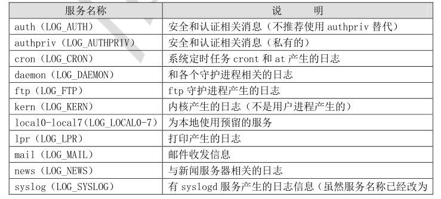
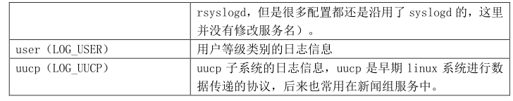
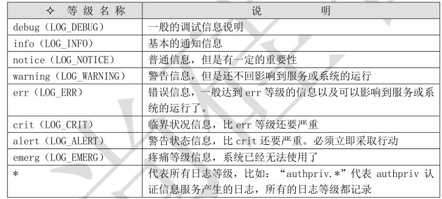

# 1 日志文件格式


只要是由日志服务 rsyslogd 记录的日志文件，他们的格式是一样的。基本日志格式包含以下四列：


```javascript
 事件产生的时间；
 发生事件的服务器的主机名；
 产生事件的服务名或程序名；
 事件的具体信息。
```

# 2 rsyslogd 服务的配置文件


## 1）、 /etc/rsyslog.conf 配置文件格式


```javascript
authpriv.* /var/log/secure
#服务名称[连接符号]日志等级 日志记录位置
#认证相关服务.所有日志等级 记录在/var/log/secure 日志中
```

###  服务名称


那么我们首先需要确定 rsyslogd 服务可以识别哪些服务的日志，也可以理解为以下这些服务委托了 rsyslogd 服务来代为管理日志。这些服务如表 16-3 所示：


服务名称 说 明








###  连接符号


日志服务连接日志等级的格式是：


```javascript
日志服务[连接符号]日志等级 日志记录位置
```

在这里连接符号可以识别为：


```javascript
 “.”代表只要比后面的等级高的（包含该等级）日志都记录下来。比如：“cron.info”
  代表 cron 服务产生的日志，只要日志等级大于等于 info 级别，就记录
 “.=”代表只记录所需等级的日志，其他等级的都不记录。比如：“*.=emerg”代表任
  何日志服务产生的日志，只要等级是 emerg 等级就记录。这种用法及少见，了解就好
 “.!”代表不等于，也就是除了该等级的日志外，其他等级的日志都记录。
```

- 


###  日志等级




### 


表 16-4 日志等级


日志等级这里还可以识别“none”，如果日志等级是 none，就说明忽略这个日志服务，该服务的


所有日志都不再记录。


###  日志记录位置


日志记录位置就是当前日志输出到哪个日志文件中保存，当然也可以把日志输出到打印机打印，


或者输出到远程日志服务器上（当然日志服务器要允许接收才行）。日志的记录位置也是固定的，我


们来学习下：


```javascript
 日志文件的绝对路径。这是最常见的日志保存方法，如“/var/log/secure”就是保存
  系统验证和授权信息日志的。
 系统设备文件。如“/dev/lp0”代表第一台打印机，如果日志保存位置是打印机设备的
  话，当有日志时就会在打印机打印（不太符合可持续发展战略哦-_-!）。
 转发给远程主机。因为可以选择使用 TCP 协议和 UDP 协议传输日志信息，所以有两种发
  
送格式。如使用“@192.168.0.210:514”，就会把日志内容使用 UDP 协议发送到
  192.168.0.210 的 UDP 514 端口上；如果使用“@@192.168.0.210:514”就会把日志内容
  使用 TCP 协议发送到 192.168.0.210 的 TCP 514 端口上，其中 514 是日志服务默认端口。
  当然只要 192.168.0.210 同意接收此日志，就可以把日志内容保存在日志服务器上。
 用户名。如“root”，就会把日志发送给 root 用户，当然 root 要在在线，否则就收不
  到日志信息了。发送日志给用户时，可以使用“*”代表发送给所有在线用户，如“mail.*”
  就会把 mail 服务产生的所有级别的日志发送给所有在线用户。如果需要把日志发送
  给多个在线用户，用户名之间用“，”分隔。
```

忽略或丢弃日志。如果接受日志的对象是“~”，代表这个日志不会记录，而被直接丢弃。如“local3.*


~”代表忽略 local3 服务类型所有的日志都不记录。


---

# 3、 定义自己的日志


```javascript
[root@localhost ~]# vi /etc/rsyslog.conf
#写入一下一句话
*.crit /var/log/alert.log
#把所有服务的“临界点”以上的错误都保存在/var/log/alert.log 日志中
[root@localhost ~]# service rsyslog restart
关闭系统日志记录器： [确定]
启动系统日志记录器： [确定]
#重启 rsyslog 服务
[root@localhost ~]# ll /var/log/alert.log

-rw-------. 1 root root 0 6 月 5 10:33 /var/log/alert.log
# alert.log 日志就生成了
```

