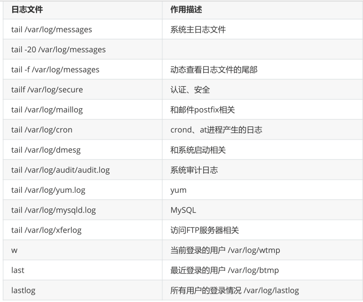
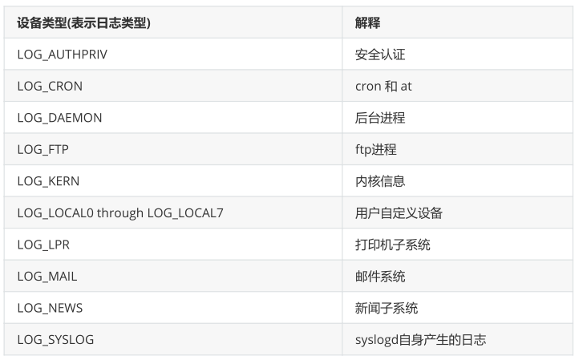
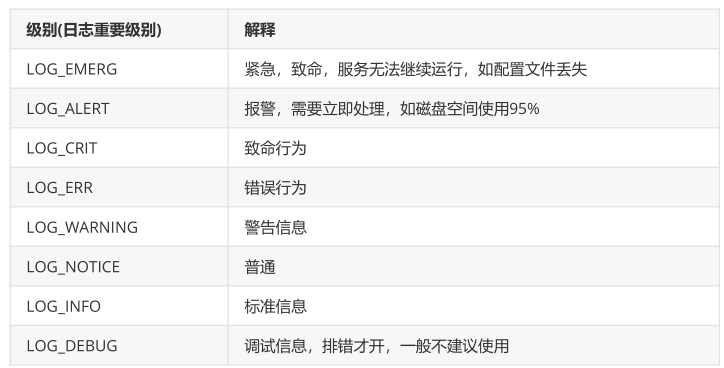

**日志管理基础**

# **1、处理日志的进程：rsyslogd:**

**查看rsyslogd进程：**

```
[root@localhost ~]# ps aux |grep rsyslogd
root    6789  0.2  0.2 216416  4068 ?    Ssl  14:17  0:00
/usr/sbin/rsyslogd -n
```

# 2、常见的日志文件系统（系统，进程，应用程序）



## 1）案例一：统计登录失败top5

```
[root@localhost ~]# grep 'Fail' /var/log/secure |awk '{print $11}' |sort
|uniq -c |sort -k1 -n -r |head -5
  779 hadoop
  501 test
  261 183.240.132.21
  224 user
  21 195.54.160.183
```

## 2)案例二：统计登录成功

```
[root@localhost ~]# grep 'Accepted' /var/log/secure |awk '{print $(NF-3)}'
|sort |uniq -c
   4 117.90.214.165
   2 122.194.35.187
```

## 3）案例三：查看网卡是否已被驱动

```
[root@localhost ~]# grep -i eth /var/log/dmesg
[   2.090634] e1000 0000:02:01.0 eth0: (PCI:66MHz:32-bit) 00:0c:29:bb:9a:bb
[   2.090642] e1000 0000:02:01.0 eth0: Intel(R) PRO/1000 Network Connection
```

# 3、rsyslogd子系统

```
[root@localhost ~]# rpm -qc rsyslog
/etc/logrotate.d/syslog # 日志轮转(切割)相关
/etc/rsyslog.conf # rsyslogd的主配置文件
/etc/sysconfig/rsyslog # rsyslogd相关文件
```

```
[root@localhost ~]# vim /etc/rsyslog.conf
# 告诉rsyslogd进程 哪个设备(facility)，关于哪个级别的信息，以及如何处理
authpriv.*                       /var/log/secure
mail.*                          -/var/log/maillog
cron.*                         /var/log/cron
*.emerg                         :omusrmsg:*
authpriv.*                       * #
所有终端
authpriv.*                       @192.168.1.123 #
UDP
authpriv.*                       @@192.168.1.123 #
TCP
```

设备facility相关内容，查看man手册[https://man7.org/linux/man-pages/man3/syslog.3.html](https://man7.org/linux/man-pages/man3/syslog.3.html)





# 4、案例，rsyslog远程管理日志

- 修改server1的rsyslog.conf配置文件，打开tcp、udp监听端口

```
[root@server1 httpd]# vim /etc/rsyslog.conf
# Provides UDP syslog reception
$ModLoad imudp
$UDPServerRun 514
# Provides TCP syslog reception
$ModLoad imtcp
$InputTCPServerRun 514
```

- 重启rsyslog，检查端口是否在监听

```
[root@server1 ~]# yum install net-tools -y
[root@server1 ~]# netstat -nltup |grep 514
tcp     0    0 0.0.0.0:514       0.0.0.0:*        LISTEN 
  1342/rsyslogd   
tcp6    0    0 :::514         :::*          LISTEN 
  1342/rsyslogd   
udp     0    0 0.0.0.0:514       0.0.0.0:*            
 1342/rsyslogd   
udp6    0    0 :::514         :::*              
  1342/rsyslogd 
```

- 修改server2的ssh配置文件，将日志发送到local0中

```
[root@server2 ~]# vim /etc/ssh/sshd_config
SyslogFacility LOCAL0
```

- 修改server2的rsyslog.conf

```
[root@server2 ~]# vim /etc/rsyslog.conf
local0.*                        @192.168.80.193
[root@server2 ~]# systemctl restart rsyslog.service
```