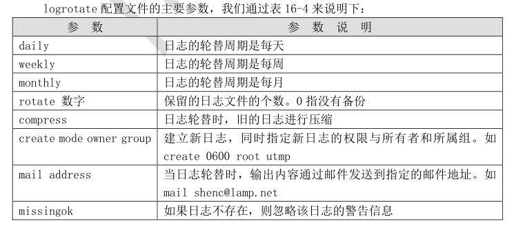
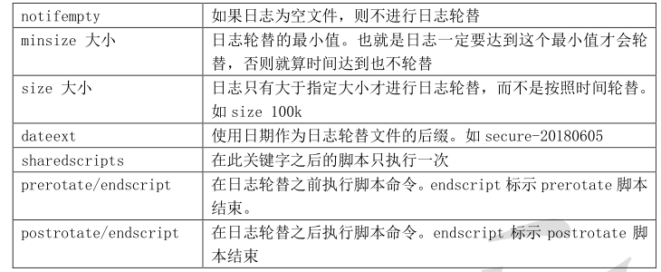

# 1 日志文件的命名规则


日志轮替最主要的作用就是把旧的日志文件移动并改名，同时建立新的空日志文件，当旧日志文
件超出保存的范围之后，就会进行删除。那么旧的日志文件改名之后，如何命名呢？主要依靠
/etc/logrotate.conf 配置文件中“dateext”参数：


```javascript
 如果配置文件中拥有“dateext”参数，那么日志会用日期来作为日志文件的后缀，例如
  “secure-20180605”。这样的话日志文件名不会重叠，所以也就不需要日志文件的改名，
  只需要保存指定的日志个数，删除多余的日志文件即可。
 如果配置文件中没有“dateext”参数，那么日志文件就需要进行改名了。当第一次进行日
  志轮替时，当前的“secure”日志会自动改名为“secure.1”，然后新建“secure”日志，
  用来保存新的日志。当第二次进行日志轮替时，“secure.1”会自动改名为“secure.2”，
  当前的“secure”日志会自动改名为“secure.1”，然后也会新建“secure”日志，用来保
  存新的日志，以此类推。
```


# 2 logrotate 配置文件


```javascript
[root@localhost ~]# vi /etc/logrotate.conf
# see "man logrotate" for details
# rotate log files weekly
weekly
#每周对日志文件进行一次轮替
# keep 4 weeks worth of backlogs
rotate 4
#保存 4 个日志文件，也就是说如果进行了 5 次日志轮替，就会删除第一个备份日志
# create new (empty) log files after rotating old ones
create
#在日志轮替时，自动创建新的日志文件
# use date as a suffix of the rotated file
dateext
#使用日期作为日志轮替文件的后缀
# uncomment this if you want your log files compressed
#compress
#日志文件是否压缩。如果取消注释，则日志会在转储的同时进行压缩
#以上日志日志配置为默认配置，如果需要轮替的日志没有设定独立的参数，那么都会遵守以上参数。
#如果轮替日志配置了独立参数，那么独立参数优先级更高。

# RPM packages drop log rotation information into this directory
include /etc/logrotate.d
#包含/etc/logrotate.d/目录中所有的子配置文件。也就是说会把这个目录中所有子配置文件读取进来，
#进行日志轮替。
# no packages own wtmp and btmp -- we'll rotate them here
#以下两个轮替日志有自己的独立参数，如果和默认的参数冲突，则独立参数生效。
/var/log/wtmp {
#以下参数仅对此目录有效
monthly
#每月对日志文件进行一次轮替
create 0664 root utmp
#建立的新日志文件，权限是 0664，所有者是 root，所属组是 utmp 组
minsize 1M
#日志文件最小轮替大小是 1MB。也就是日志一定要超过 1MB 才会轮替，否则就算
#时间达到一个月，也不进行日志转储
rotate 1
#仅保留一个日志备份。也就是只有 wtmp 和 wtmp.1 日志保留而已
}
/var/log/btmp {
#以下参数只对/var/log/btmp 生效
missingok
#如果日志不存在，则忽略该日志的警告信息
monthly
create 0600 root utmp
rotate 1
}
# system-specific logs may be also be configured here.
```








