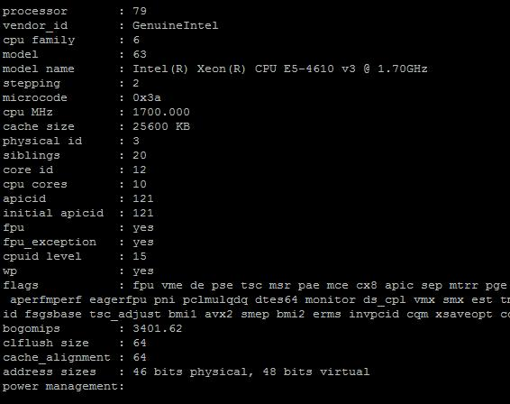

# 1、lscpu

```shell
[root@bj-dev-infra-001 ~]# lscpu
Architecture:          x86_64
CPU op-mode(s):        32-bit, 64-bit
Byte Order:            Little Endian
CPU(s):                24            #24个逻辑CPU=2(物理CPU) * 6(CPU核心数量) * 2 (每个核心的线程数量，如果大于1，表示启用了超线程。)
On-line CPU(s) list:   0-23        
Thread(s) per core:    2       #每个核心的线程数
Core(s) per socket:    6       #每个物理cpu核心数
sockets：              2       #插槽数量/物理CPU个数
NUMA 节点：         2
厂商 ID：           GenuineIntel
CPU 系列：          6
型号：              45
型号名称：        Genuine Intel(R) CPU  @ 2.00GHz
步进：              2
CPU MHz：             1200.000
CPU max MHz:           2001.0000
CPU min MHz:           1200.0000
BogoMIPS：            3999.99
虚拟化：           VT-x
L1d 缓存：          32K
L1i 缓存：          32K
L2 缓存：           256K
L3 缓存：           15360K
NUMA 节点0 CPU：    0-5,12-17
NUMA 节点1 CPU：    6-11,18-23
Flags:                 fpu vme de pse tsc msr pae mce cx8 apic sep mtrr pge mca cmov pat pse36 clflush dts acpi mmx fxsr sse sse2 ss ht tm pbe syscall nx pdpe1gb rdtscp lm constant_tsc arch_perfmon pebs bts rep_good nopl xtopology nonstop_tsc aperfmperf eagerfpu pni pclmulqdq dtes64 monitor ds_cpl vmx smx est tm2 ssse3 cx16 xtpr pdcm pcid dca sse4_1 sse4_2 x2apic popcnt tsc_deadline_timer aes xsave avx lahf_lm epb tpr_shadow vnmi flexpriority ept vpid xsaveopt dtherm ida arat pln pts
```

# 2、cat /proc/cpuinfo

首先要明确物理CPU、核数、逻辑cpu数的概念：

①物理CPU数（physical id）：主板上实际插入的cpu数量，可以数不重复的 physical id 有几个

②CPU核心数（cpu cores）：单块CPU上面能处理数据的芯片组的数量，如双核、四核等 

③逻辑CPU数：一般情况下，

　　逻辑CPU=物理CPU个数×每颗核数     　　#不支持超线程技术或没有开启次技术

　　逻辑CPU=物理CPU个数×每颗核数 *2  　  #表示服务器的CPU支持超线程技术（简单来说，它可使处理器中的1 颗内核如2 颗内核那样在操作系统中发挥作用。这样一来，操作系统可使用的执行资源扩大了一倍，大幅提高了系统的整体性能）



下面对上图的输出内容进行相应解释

- processor　：		系统中逻辑处理核心数的编号，从0开始排序。

- vendor_id　：		CPU制造商

- cpu family　：	CPU产品系列代号

- model　　　：	CPU属于其系列中的哪一代的代号

- model name：		CPU属于的名字及其编号、标称主频

- stepping　 ：		CPU属于制作更新版本

- cpu MHz　 ：		CPU的实际使用主频

- cache size ：		CPU二级缓存大小

- physical id ：		单个物理CPU的标号

- siblings ：		单个物理CPU的逻辑CPU数。siblings=cpu cores [*2]。

- core id ：			当前物理核在其所处CPU中的编号，这个编号不一定连续。

- cpu cores ：		该逻辑核所处CPU的物理核数。比如此处cpu cores 是4个，那么对应core id 可能是 1、3、4、5。

- apicid ：			用来区分不同逻辑核的编号，系统中每个逻辑核的此编号必然不同，此编号不一定连续

- fpu ：			是否具有浮点运算单元（Floating Point Unit）

- fpu_exception ：	是否支持浮点计算异常

- cpuid level ：		执行cpuid指令前，eax寄存器中的值，根据不同的值cpuid指令会返回不同的内容

- wp ：			表明当前CPU是否在内核态支持对用户空间的写保护（Write Protection）

- flags ：			当前CPU支持的功能

- bogomips：		在系统内核启动时粗略测算的CPU速度（Million Instructions Per Second

- clflush size ：		每次刷新缓存的大小单位

- cache_alignment ：		缓存地址对齐单位

- address sizes ：			可访问地址空间位数

- power management ：		对能源管理的支持