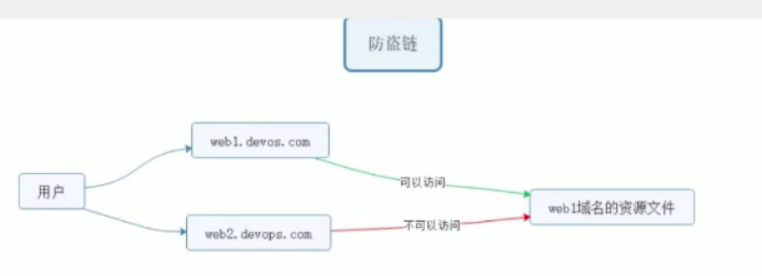

Location 配置语法

官方文档：[http://nginx.org/en/docs/http/ngx_http_core_module.html#location](http://nginx.org/en/docs/http/ngx_http_core_module.html#location)

# 1、location匹配规则

## 1.1 = 精准匹配

```
location = / {
    #规则
}
则匹配到 http://www.example.com/    这种请求
```

## 1.2 ~ 正则匹配，大小写敏感

```
location ~ /Example/ {
    #规则
}
 请求示例
http://www.example.com/Example/ [成功]
http://www.example.com/example/ [失败]
```

## 1.3 ~* 正则匹配，大小写忽略

```
location ~* /Example/ {
    #规则
}
 请求示例
http://www.example.com/Example/ [成功]
http://www.example.com/example/ [成功]
```

## 1.4 ^~  只匹配对应的开头的访问路径

```
location ^~ /img/ {
    #规则
}
请求实例
以/img/ 开头的请求，都会匹配上
http://www.example.com/img/a.jpg [成功]
http://www.example.com/img/b.mp4 [成功]
http://www.example.com/bimg/b.mp4 [失败]
http://www.example.com/lmg/b.mp4 [失败]
```

## 1.5 / 其他匹配都不成功 就匹配此项

```
location / {
    规则    
}
```

如果路径是资源文件是存在的，会优先获取资源文件

```
location匹配优先级
(location =) > (location 完整路径)>(location ^~路径)>（location ~，~* 正则顺序)>(location部分起始路径)>(/)
```

# 2、 location 匹配跳转

@+name

@,nginx内部跳转

```
location /img/ (
    error_page 404 = @img_err;
}
location @img_err {
    # 规则
    return 503;
}
```

以/img/开头的请求，如果链接的状态为 404。则会匹配到@img_err这条规则上

# 3、URL重写

ngx_http_rewrite_module 模块用于使用PCRE正则表达式更改请求URI，返回重定向，以及有条件地选择配置。

## 3.1、return

该指令用于结束规则的执行并返回状态码给客户端.

```
403 Forbidden.服务器已经理解请求,但是拒绝执行它
404 Not Found.请求失败,请求所希望得到的资源未在服务器上发现.404这个状态码被广泛应用于
            当服务器不想揭示为何请求被拒绝,或者没有其他适合的响应可用的情况下.
500 Internal Server Error.服务器遇到一个未曾预料的状况导致它无法完成对请求的处理,一般来说 这个问题都会在服务器的程序码出错时出现.
502 Bad Gateway.1作为网关或代理工作的服务器尝试执行请求时,从上游服务器接收到无效的。
503 Service Unavailable.田丹lmi品生护或小型，服务当前方法处理结个1时H 开目将什一段时间以后恢复.
        503状态码的存在并不意味着服务器在过载的时候必须使用它,某些服务器只不过是希望拒绝客户端的连接.
504 Gateway Timeout作为网关或代理工作的服务器尝试执行请求时,未能及时从上游服务器(URI标识出的服务器,例如HTTP,FTP,LDAP)
        或辅助服务器(例如DNS)收到响应。
```

请求状态码:[https://developer.mozilla.org/zh-CN/docs/Web/HTTP/Status](https://developer.mozilla.org/zh-CN/docs/Web/HTTP/Status)

示例语法:

```
#可以匹配到server location if中.推荐配置到10cation中
return 403;
```

## 3.2 rewrite

rewrite 匹配到请求URI，重写到新的URI ，类似于SNAT

```
rewrite语法四配到，替换为其他内容 
语法 rewrite [匹配内] [容替代内容] [标记]。
```

官方文档地址：[http://nginx.org/en/docs/http/ngx_http_rewrite_module.htmt#rewrite](http://nginx.org/en/docs/http/ngx_http_rewrite_module.htmt#rewrite)

```
flag标记说明:
last          #本条规则匹配完成后，继续向下匹配新的location URI规则，客户端URL地址不会发生跳转
break         #本条规则匹配完成即终止，不再匹配后面的任何规则，客户端URL地址不会发生跳转
redirect      #返回302临时重定向，浏览器地址会显示跳转后的URL地址
permanent     #返回301永久重定向，浏览器地址栏会显示跳转后的URL地址
```

- 案例：资源重定向实现

**业务需求描述:**

实际业务不存在index.html，需要重写访问index.php

URL为index.html，而实际访问的是index.php，对外被认为是html静态页面

以上方案就是 seo优化伪静态 的使用，把真实的后端的页面，伪装为静态html页面。

①修改配置

```
shell > vim /usr/local/nginx/conf/nginx.conf
```

添加配置

```
rewrite /index.html /index.php last;
```

③重载配置测试访问

- 2案例: 域名重定向实现

网站的域名升级了，需要启用新的域名使用。

但是用户却不知道，还可能使用旧的域名访问网站。

需要把通过旧域名访问的来源，重定向到新的域名。

```
 server {
        listen 80;
        server_name sina.com;                #旧域名
        rewrite /   http://sohu.com permanent;
    }


    server {
        listen       80;
        server_name  sohu.com;        #新域名

        location / {
            root   html;
            index  index.html index.htm;
        }
```

# 4、防盗链原理和实现



**业务需求描述:**

域名A的资源文件，经常被域名B直接调用访问r

而用户经常访问域名B，看到的资源（图片等）以为是域B的，实际则是域名A的。

但是域名A没有从中获得任何收益，缺要给域名B来源的访问耗费服务器资源和带宽。

所以，禁止域名B直接访问和调用域名A的资源的方式，就被称为"防止盗链"

语法:

```
定义允许访问的域名来源
valid_referers sohu.com;
if ($invalid_referer) {
    return 403;    
}
```

1、在ip的虚拟主机，静态文件调用图片

2、shop的虚拟主机，禁止ip的虚拟主机调用图片

①ip虚拟主机目录建立静态文件访问shop虚拟主机的图片资源

```
shell > cd /usr/local/nginx/html
shell > echo '' >> img .html
```

②在shop虚拟主机配置中，防止其他虚拟机主机盗链

```
server {
    valid_referers sohu.com;
    if ($invalid_referer) {
        return 403;    
    }
}
```

③图片防盗链

```
#定义在server里shop的server
location ~* \.(jpglpngljpeglgiflbmp）(
    valid_referers www.shop.com；
    if ($invalid_referer) {
        return 404;
    }
}
```