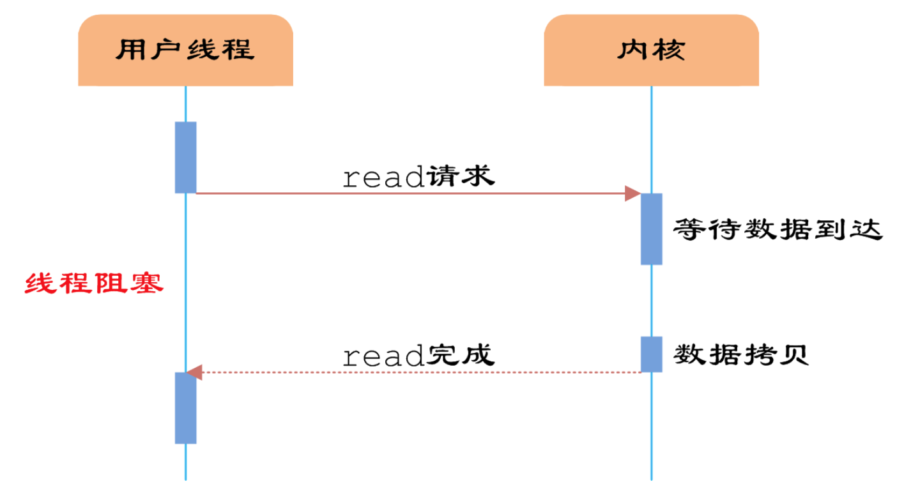
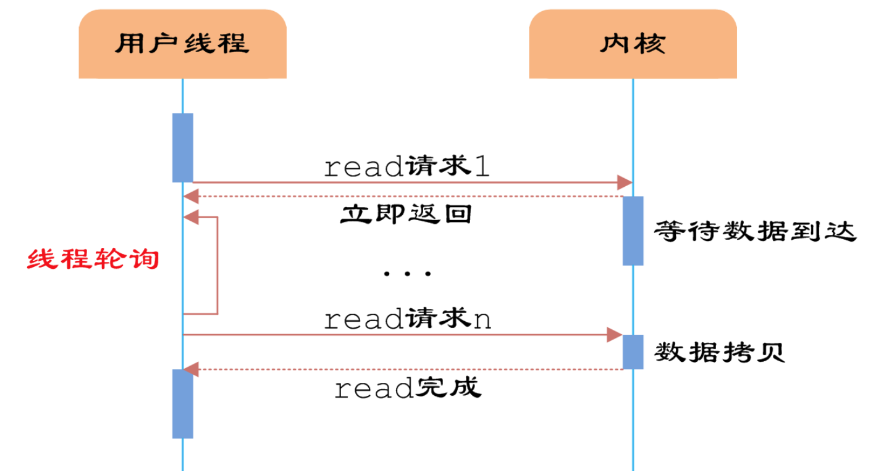
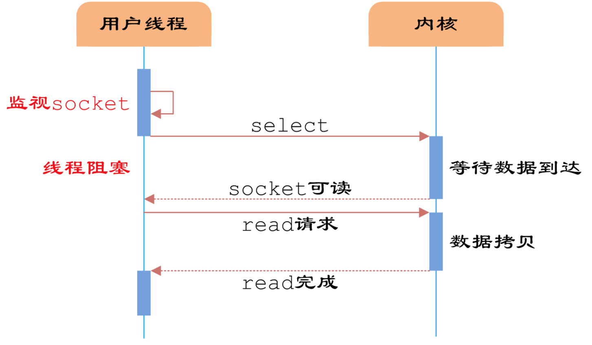
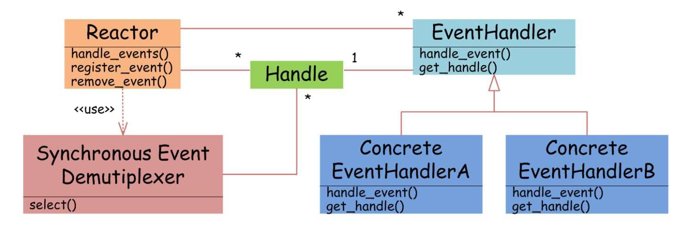
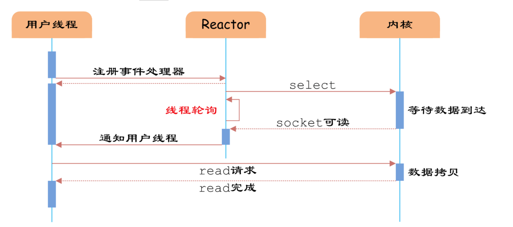
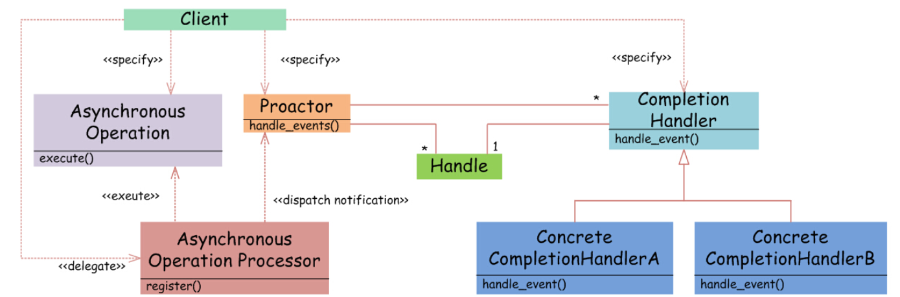

服务端编程需要构建高性能的IO模型，常见的IO模型主要有以下四种

- 同步阻塞IO

- 同步非阻塞IO 默认创建的socket都是阻塞的，非阻塞IO要求socket设置为NONBLOCK

- IO多路复用 经典Reactor设计模式，异步阻塞IO，select epoll

- 异步IO、 异步非阻塞IO

**同步与异步 **

**阻塞与非阻塞**

# 1、同步阻塞IO

用户线程通过系统调用read发起IO操作，由用户空间转到内核空间，内核等到数据包到达以后，将接受的数据拷贝到用户空间，完成read，用户需要等待read将socket中的数据读取到buffer后，才继续处理接收的数据，整个IO请求过程中，用户线程是被阻塞的，导致用户发起请求时，不能做任何事情，对CPU资源利用不够。

 

# **2、同步非阻塞IO**

同步非阻塞io，在同步阻塞io的基础上，将socket设置为nonblock，用户线程可以在发起io请求后立即返回；socket是非阻塞的方式，用户线程发起IO请求时立即返回，但并未读取到任何数据，用户线程需要不断发起IO请求，直到数据到达后，才真正读取到数据，继续执行；在整个IO请求的过程中，虽然用户线程每次发起IO请求后可以立即返回，但是为了等到数据，仍需要不断地轮询、重复请求、消耗大量CPU资源，一般很少使用这种模型，而是在其他IO模型中使用非阻塞IO

 

####  

# 3、IO多路复用

IO多路复用，是建立在内核上提供的多路分离函数select基础之上的，

 

使用select允许单线程内处理多个IO请求，但是每个IO请求的过程还是阻塞的，平均时间甚至比同步阻塞IO模型还要长，IO多路复用模型使用Reactor设计模式实现了这一机制，用户线程只注册自己感兴趣的socket或者IO请求，去做自己的事情，等到数据到来时再进行处理，可以提高cpu利用率；EventHandler抽象类表示IO事件处理器，拥有IO句柄get-handle，以及对Handle的操作handle-event，继承于EventHandler的子类可以对事件处理器的行为进行定制，Reactor类用于管理EventHandler注册、删除，并使用handle-events实现事件循环，不断调用内核中的

 

通过reactor的方式，将用户线程轮询IO操作状态的工作交给handle-even进行处理，用户线程进行事件注册之后进行其他工作（异步），而reactor线程负责调用内核select函数，当存在socket被激活时，通知相应的用户线程，执行handle-event进行数据读取、处理工作，由于select函数是阻塞的，所以

 

# 4、异步IO

 	真正的异步IO，需要操作系统更强的支持，在IO多路复用中，事件循环将文件句柄的状态事件通知给用户线程，由用户线程自行读取数据、处理数据，而在异步IO模型中，当用户线程收到通知时，数据已经被内核读取完毕，并放在用户线程指定的缓冲区内，内核在IO完成后通知用户线程直接使用即可。异步模型使用Proactor设计模式实现这一机制。

Proactor和Reactor模式在结构上比较相似，在Client使用方式上差别较大，Proactor模式中，用户线程将AO、Proactor以及操作完成时的CompletionHandler注册到AOP。AOP使用Facade模式提供一组异步操作API供用户使用，当用户线程调用异步API后，便执行自己的任务。AOP会开启独立的内核线程执行异步操作，当异步IO完成时，AOP将用户线程与AOP一起注册的Proactor和CompletionHandler取出，然后将CompletionHandler与IO操作的结果一致转发给Proactor，Proactor负责回调每一个异步操作事件完成处理函数handle-event，Proactor模式中每个异步操作都可以绑定一个proactor对象，一般操作系统中Proactor为单例模式，以便集中化分发操作完成事件。

 

异步IO模型中，用户线程直接使用内核提供的异步IO API发起read请求，发起后立即返回，继续执行用户线程代码。此时用户线程已经将调用的AO与CH注册到了内核，然后操作系统开启独立的内核线程去处理IO操作。当read请求的数据到达时，由内核负责读取socket中的数据，并写入用户指定的缓冲区中。最后内核将read的数据和用户线程注册的CH分发给内部Proactor，Proactor将IO完成的信息通知给用户线程，完成异步IO。

异步IO并不常见，高性能并发服务程序，使用