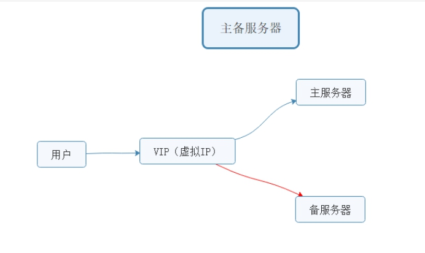

** 高可用服务搭建**

# 1、HA高可用

        高可用HA（High Availability）是分布式系统架构设计中必须考虑的因素之一，它通常是指通过设计，减少系统服务不可用的时间。假设系统一直能够提供服务，我们说系统的可用性是100%。如果系统每运行100个时间单位，会有1个时间单位无法提供服务，我们说系统的可用性是99%。很多公司的高可用目标是4个9，也就是99.99%，这就意味着，系统的年停机时间为0.876个小时。

| 描述 | 通俗叫法 | 可用性级别 | 年度停机时间 | 
| -- | -- | -- | -- |
| 基本可用性 | 2个9 | 99% | 87.6小时 | 
| 较高可用性 | 3个9 | 99.9% | 8.8小时 | 
| 具有故障自动恢复能力的可用性 | 4个9 | 99.99% | 53分钟 | 
| 极高可用性 | 5个9 | 99.999% | 5分钟 | 


> **实现高可用的核心点：①冗余（多台服务器）②自动切换**


备份服务器：

冷备  服务器不启用（域名不解析），使用的时候再开启，需要手动切换

热备  服务器在等待状态（监控主服务器状态），一旦主宕机，备就接管，自动切换

实现热备，引入VIP的切换



**通过VIP的方式，切换主备服务器**

①默认VIP绑定在主服务器（master）

②master不可用，就切换VIP到备份服务器（backup）

③用户可以使用到连续性更好的服务，通过VIP访问服务器

**常用来单独实现高可用的软件：**

==①keepalived==

②heartbeat  较早  属于redhat HA工程的一部分

# 2、keepalived介绍

	     Keepalived软件起初是专为LVS负载均衡软件设计的，用来管理并监控LVS集群系统中各个服务节点的状态，后来又加入了可以实现高可用的VRRP功能。因此，Keepalived除了能够管理LVS软件外，还可以作为其他服务（例如：Nginx、Haproxy、MySQL等）的高可用解决方案软件

# 3、keepalived组成和原理

 Keepalived软件主要是通过VRRP协议实现高可用功能的。

          VRRP是

         虚拟路由冗余协议，可以认为是实现路由器高可用的协议，即将N台提供相同功能的路由器组成一个路由器组，这个组里面有一个master和多个backup，master上面有一个对外提供服务的vip（该路由器所在局域网内其他机器的默认路由为该vip），master会发组播，当backup收不到vrrp包时就认为master宕掉了，这时就需要根据VRRP的优先级来选举一个backup当master。这样的话就可以保证路由器的高可用了。


Keepalived的功能体系结构，大致分两层：

**内核空间：**

主要包括IPVS（IP虚拟服务器，用于实现网络服务的负载均衡）和NETLINK（提供高级路由及其他相关的网络功能）两个部份。

**用户空间：**

> **WatchDog：负载监控checkers和VRRP进程的状况VRRP Stack：负载均衡器之间的失败切换FailOver，如果只用一个负载均衡器，则VRRP不是必须的。Checkers：负责真实服务器的健康检查healthchecking，是keepalived最主要的功能。换言之，可以没有VRRP Stack，但健康检查healthchecking是一定要有的。IPVS wrapper：用户发送设定的规则到内核ipvs代码Netlink Reflector：用来设定vrrp的vip地址等。**


keepalived主要使用三个模块，分别是core、check和vrrp。

core模块为keepalived的核心，负责主进程的启动、维护以及全局配置文件的加载和解析。

check负责健康检查，包括常见的各种检查方式。

vrrp模块是来实现VRRP协议的。

# 4、安装配置启动keepalived

master和backup都需要进行安装，也就是server01和server03机器

```
#安装keepalived
shell > yum -y install keepalived
```

| 主机名称 | 服务器IP |   | 
| -- | -- | -- |
| server01 | 192.168.17.102 | master | 
| server03 | 192.168.17.101 | backup | 


**keepalived需要使用的目录和文件：**

| 文件或者目录 | 作用 | 
| -- | -- |
| /etc/keepalived/keepalived.conf | 生效的配置文件 | 
| /etc/init.d/keepalived | 服务器管理脚本（centos7中没有） | 
| /var/log/messages | 日志信息 | 


**配置keepalived**

**①备份主备服务器的配置文件**

```
shell > cd  /etc/keepalived
shell > cp keepalived.conf keepalived.conf_bak
```

**②分别修改主备服务器配置文件**

```
shell > vim keepalived.conf
```

**示例配置文件说明**

```
! Configuration File for keepalived
#发送邮件的配置
global_defs {
   notification_email {
     acassen@firewall.loc
     failover@firewall.loc
     sysadmin@firewall.loc
   }
   notification_email_from Alexandre.Cassen@firewall.loc
   smtp_server 192.168.200.1
   smtp_connect_timeout 30
   router_id LVS_DEVEL
   vrrp_strict
}
#vrrp协议的配置
vrrp_instance VI_1 {
    #工作模式
    state MASTER
    #监听的网卡
    interface eth0
    #虚拟路由id 需要和备服务器一致
    virtual_router_id 51
    #权重 优先级,数字越大，优先级越高
    priority 100
    #vrrp包的发送周期  1s
    advert_int 1
    #权限验证
    authentication {
        auth_type PASS
        auth_pass 1111
    }
    #需要绑定切换的VIP
    virtual_ipaddress {
        192.168.200.16
        192.168.200.17
        192.168.200.18
    }
}
```

- 主服务器

```
! Configuration File for keepalived
global_defs {
   notification_email {
     acassen@firewall.loc
     failover@firewall.loc
     sysadmin@firewall.loc
   }
   notification_email_from Alexandre.Cassen@firewall.loc
   smtp_server 192.168.200.1
   smtp_connect_timeout 30
   router_id LVS_DEVEL
#   vrrp_strict         #将这个注释掉，否则VIPping不通 
}
vrrp_instance VI_1 {
    state MASTER
    interface eth0
    virtual_router_id 51
    priority 100
    advert_int 1
    authentication {
        auth_type PASS
        auth_pass 1111
    }
    #master默认只需要修改使用VIP即可
    virtual_ipaddress {
        192.168.17.200
    }
}
```

- 备服务器

```
! Configuration File for keepalived
global_defs {
   notification_email {
     acassen@firewall.loc
     failover@firewall.loc
     sysadmin@firewall.loc
   }
   notification_email_from Alexandre.Cassen@firewall.loc
   smtp_server 192.168.200.1
   smtp_connect_timeout 30
   router_id LVS_DEVEL
   #   vrrp_strict          #将这个注释掉，否则VIP ping不通    
}
vrrp_instance VI_1 {
    #修改工作模式为备
    state BACKUP
    interface eth0
    virtual_router_id 51
    priority 100
    advert_int 1
    authentication {
        auth_type PASS
        auth_pass 1111
    }
    #注意修改VIP
    virtual_ipaddress {
        192.168.17.200/24
    }
}
```

**③分别按照顺序启动主服务器和备服务器的keepalived**

```
shell > service keepalived start
```

**④查看主备服务器的网卡信息**

```
#需要通过ip a命令查看  分别在server01和server03查看
shell > ip a
```

# 5、模拟服务器不可用VIP切换

服务器整机不可用，常见于服务器断网，或者断电关机等。

**方法一：模拟主服务器断电关闭**

```
#关闭主服务器  VIP所在服务器
shell > poweroff
```

**方法二：模拟主服务器断网**

```
#关闭VIP所在服务器的网卡  使其不能够联网
shell > service network stop
```

通过以上实验检测，发现当主服务器整机不可用时，VIP会切换到备用服务器

# 6、实现服务HA

         通过keepalived可以直接实现主服务器整机不可用，实现VIP的切换。保证用户可以通过VIP进行访问服务。

但是实际情况下，往往并不是服务器整机不可用，只是对应的服务或者软件不可用。

比如说：nginx提供的web服务，nginx进程关闭

就需要检测当nginx不可用时，就切换VIP

**实现过程分析：**

VIP实际是由keepalived进行绑定的，所以当nginx服务不可用时，就关闭当前机器的keepalived即可，释放VIP。进而绑定到其他备用服务器。

①编写服务检测脚本，实现检测nginx是否可用，不可用则关闭当前所在主机的keepalived

②在keepalived配置中调用检测服务脚本

## 6.1 Nginx服务可用检测脚本

主备服务器都要实现此脚本

**①编写测试脚本  赋予执行权限**

```
shell > cd /etc/keepalived
shell > vim check_nginx.sh
```

**脚本内容：**

```
#!/bin/bash
nginx_status=`ps -C nginx --no-header | wc -l`
if [ $nginx_status -eq 0 ];then
   systemctl stop  keepalived 
fi
```

赋予脚本执行权限    方便之后其他软件调用执行

```
shell > chmod +x check_nginx.sh
```

**②测试脚本可用性**

启动nginx和keepalived  

关闭nginx   执行脚本  查看keepalived是否也关闭

## 6.2 模拟宕机实现服务切换

在多台服务器中配置keepalived定时触发检测nginx的脚本模块

```
#在vrrp_instance外上面定义
vrrp_script check_nginx {   #名称可自定义,这里面填写需要调用的脚本，以及间隔多久调用一次。
   #调用脚本地址
   script  /etc/keepalived/check_nginx.sh
   #检测间隔时间
   interval 3
}
#在vrrp_instance里调用
track_script {      #这里面调用vrrp_script 定义的需要调用的脚本信息。
    #上线定义的名称
    check_nginx
}
```

## 6. 3、实现web服务器高可用

以上案例已经实现了，服务不可用VIP切换到可用服务器。

现在需求用户的服务是连续不间断的，故

**①解析域名到VIP**

**②模拟用户访问**

# 7、keepalived的配置补充

> 脑裂（裂脑）：vip出现在了多台机器上。网络不通畅，禁用了数据包，主备服务器没法通讯，造成备服务器认为主服务器不可用，绑定VIP，主服务器VIP不会释放。解决方案：①双备或者多备模式  BACKUP  通过priority权重来区分谁的优先级更高②单播(定向广播)的方式 (一些特定环境禁用了组播方式)③时间不同步  服务器时间校时


## 7.1 非抢占模式

**①nopreempt**

在主备服务器的配置文件，vrrp_instance段中

**②设置state工作模式为BACKUP**

## 7.2 单播模式

一些特定环境下不允许发送组播，造成备服务器无法收到vrrp包，可能会造成脑裂现象。可以通过单播的方式解决。

**单播示例配置：**

> unicast_src_ip 192.168.1.21##（本地IP地址）unicast_peer {		192.168.1.22##（对端IP地址）此地址一定不能忘记}


**主服务器server01配置**

```
#在vrrp_instace段中加入
#本地IP
unicast_src_ip 192.168.17.102
unicast_peer {
    #对象IP  发送vrrp包给备服务器
    192.168.17.101
}
```

**备服务器server03配置**

```
#在vrrp_instace段中加入
#本地IP
unicast_src_ip 192.168.17.101
unicast_peer {
    #对象IP  发送vrrp包给备服务器
    192.168.17.102
}
```

**tcpdump抓vrrp包的方式：**

```
shell > tcpdump vrrp -n -i ens33
```