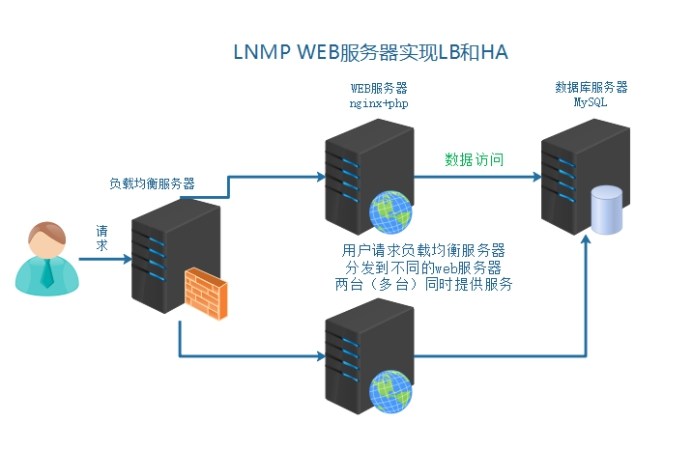
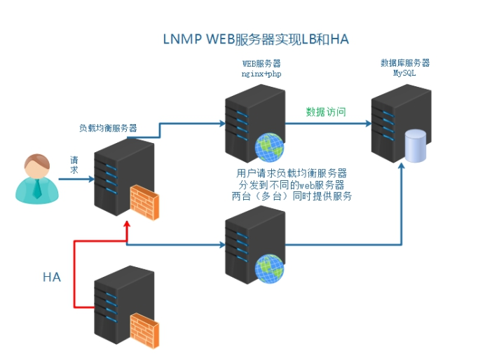

# 1、模拟运维设计方案



# 2、引入负载均衡技术

负载均衡技术（load blance) 是一种概念 把资源的使用进行平均分配。

负载均衡：分发流量、请求到不同的服务器。使流量平均分配（理想的状态的)

**作用：**

服务器容灾 流量分发

**主要作用:**

①流量分发 请求平均 降低单例压力

**其他作用:**

②安全 隐藏后端真实服务

③屏蔽非法请求（七层负载均衡)

# 3、负载均衡分类


- 二层负载均衡（mac)

根据OSI模型分的二层负载，一般是用虚拟mac地址方式，外部对虚拟MAC地址请求，负载均衡接收后分配后端实际的MAC地址响应

- 三层负载均衡（ip）

一般采用虚拟IP地址方式，外部对虚拟的ip地址请求，负载均衡接收后分配后端实际的IP地址响应

- 四层负载均衡（tcp) 	网络层面的负载均衡

在三层负载均衡的基础上，用ip+port接收请求，再转发到对应的机器

- 七层负载均衡（http） 智能型负载均衡

根据虚拟的url或IP，主机接收请求，再转向（反向代相应的处理服务器

# 4、常见实现方式

**实现方式分类：**

①软件级别 性价比高 可控性强

②硬件级别 性能好 价格高 几万到几十万不等

**硬件是实现方式:**

F5 BIG-IP   #四层和七层都可以

软件实现方式:

| OSI分层 | 实现方式 | 
| -- | -- |
| 七层 | Nginx、HAproxy | 
| 四层 | LVS、HAProxy | 


- **四层和七层对比：**


# 5、Nginx负载均衡配置

官方文档: [http://nginx.org/en/docs/http/ngx_http_upstream_module.html](http://nginx.org/en/docs/http/ngx_http_upstream_module.html)

- 架构分析：

- ①用户访问请求Nginx负载均衡服务器

- ②Nginx负载均衡服务再分发请求到web服务器

实际配置负载均衡，只需修改作为负载均衡服务器的Nginx即可。

①在客户端解析域名到负载均衡服务器

②在负载均衡的Nginx配置

配置文件示例：

```
#在http段进行配置
#分发请求到后端服务器
upstream shop {
    server 192.168.17.102;
    server 192.168.17.101;
}
server{
listen 80;
server name www.shop.com；
    location / {
    proxy_pass http://shop；           #代理转发到shop段 匹配到上面的upstream
    #以下两条配置，实质足设置了传输的header头信息
    #传输域名给后端服务器 进行识别 方便匹配对应server虚拟主机
    proxy_set_header Host $host;
    proxy_set_header X-Real-IP $remote_addr;     #发送客户端IP 给后端服务器 用来方便后端服务器识别用户真实IP
    }
}
```

# 6、负载均衡后获取客户端IP

负载均衡之后，在后端的web服务器获取到的是负载均衡服务器的IP，而不能够获取到客户端的真实IP。

需要进行以下特殊配置:

①首先在负载均衡服务器中配置，转发客户端IP给后端web服务器

```
 location / {
    proxy_pass http://shop；           #代理转发到shop段 匹配到上面的upstream
    #以下两条配置，实质足设置了传输的header头信息
    #传输域名给后端服务器 进行识别 方便匹配对应server虚拟主机
    proxy_set_header Host $host;
    proxy_set_header X-Real-IP $remote_addr;     #发送客户端IP 给后端服务器 用来方便后端服务器识别用户真实IP
    }
```

②后端web服务器需要配置，识别从负载均衡服务器传输过来的客户端真实IP

官方网址: [http://nginx.org/en/docs/http/ngx_http_realip_module.html](http://nginx.org/en/docs/http/ngx_http_realip_module.html)

用ngx_http__realip_module模块提供的set_real_ip_from语法，默认此模块没有安装，需要编译时添加编译参数

```
./configure   --with-http_realip_module
```

web服务器上配置set_real_ip_from 代表从哪儿来源的IP，需要识别真实客户端IP

示例配置:

```
#可配置到http、server、location中，推荐配置到server中
#配置需要识别的IP来源 负载均衡的IP
set_real_ip_from 192.168.17.103
```

# 7、upstream中server的关键字

upstream中的分发之后的几个关键字:

```
upstream webs {
   server 192.168.23.10:80 backup;     #备分 其他的没有backup标识的都无响应，才分发到backup
   server 192.168.23.10:80 down;    #此条配置，不会被分发到 
}
```

# 8、解决负载均衡后服务器session不一致问题

**分析原因:**

①比如分发到web1服务器，生成验证码，存储到session中，默认在服务器本地

②再次校验的时候，请求分发到web2服务器了，所有验证码一直校验不通过

**解决方案思路:**

①生成和验证session都请求同一台服务器

②共享session nfs mysql 内存缓存软件（memcached、redis）

# 9、Nginx 官方默认3种负载均衡的算法

```
①Round-Robin 	RR轮询（默认) 一次一个的来 (理论上的，实际实验可能会有间隔）
② weight	权重 权重高多分发一些 服务器硬件更好的设置权重更高一些
③ ip_hash       同一个IP，所有的访问都分发到同一个web服务器
```

- 验证加权轮询算法

示例配置:

```
upstream shop {
    server 192.168.17.182 weight=5;
    server 192.168.17.101 weight=3;
}
```

- 验证ip_hash 算法

示例配置:

```
upstream shop (
    #ip hash - 致性算法配置 设置此项 weight就失效了
    ip_hash;
    server 192.168.17.102 weight=5;
    server 192.168.17.101 weight=3;
}
```

# 10、负载均衡高可用

所有的请求流量，都要经过负载均衡服务器，负载均衡服务器压力很大，防止它宕机，导致后端服务所有都不可用，需要对负载均衡服务，做高可用



详细内容见：[14、Nginx+Keepalived 高可用构建](note://WEBafdc0f55e26591cf137701e0ac68d394)