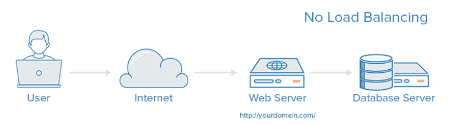
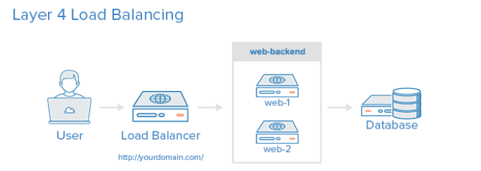
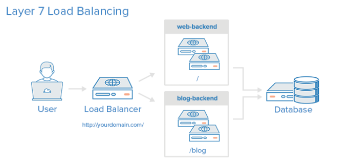

## 企业架构LB-服务器的负载均衡之HAProxy实现

> **学习目标和内容1，能够通过HAProxy实现负载均衡**


# 1、介绍

**简介**

HAProxy是高可用性代理(High Availability Proxy)的缩写，是一款流行的开源软件TCP/HTTP LoadBalancer和代理解决方案，可以在Linux、Solaris和FreeBSD上运行。它最常见的用途是通过将工作负载分布到多个服务器(例如:网络、应用、数据库)。它被用于许多引人注目的环境，包括:GitHub, Imgur, Instagram和Twitter。在本指南中，我们将概述HAProxy是什么，基本的负载平衡术语，以及如何使用它来提高您自己的服务器环境的性能和可靠性的例子。

**没有负载平衡**

一个简单的没有负载平衡的web应用环境可能看起来像这样:在这个例子中，用户直接连接到你的web服务器，在你的domain.com，没有负载平衡。如果你的单个网络服务器宕机，用户将不再能够访问你的网络服务器。此外，如果许多用户试图同时访问您的服务器，而它无法处理负载，他们可能会有一个缓慢的体验，或者他们可能根本无法连接。



**第四层负载均衡**

将网络流量负载均衡到多个服务器的最简单方法是使用第4层(传输层)负载均衡。这种负载均衡方式将基于IP范围和端口转发用户流量(即，如果请求进入[http://yourdomain.com/anything,](http://yourdomain.com/anything,)，流量将被转发到后端，后端在80端口上处理yourdomain.com的所有请求)。关于第4层的更多细节，请查看我们的网络介绍中的TCP部分。下面是一个简单的第四层负载均衡示例:用户访问负载均衡器，负载均衡器将用户的请求转发给后端服务器的web后端组。选择哪个后端服务器将直接响应用户的请求。一般来说，web后端中的所有服务器都应该提供相同的内容，否则用户可能会收到不一致的内容。注意，这两个web服务器连接到相同的数据库服务器



**第七层负载均衡**

另一种更复杂的负载平衡网络流量的方法是使用第7层(应用层)负载平衡。使用第7层允许负载均衡器根据用户请求的内容将请求转发到不同的后端服务器。这种负载均衡模式允许在同一个域和端口下运行多个web应用服务器。关于第7层的更多细节，请查看我们的网络介绍中的HTTP小节。下面是第7层负载平衡的一个简单示例:在这个示例中，如果用户请求yourdomain.com/blog，它们将被转发到博客后端，这是一组运行博客应用程序的服务器。其他请求被转发到web后端，它可能正在运行另一个应用程序。在本例中，两个后端都使用相同的数据库服务器



# 2、安装

百胜方式安装

```
shell > yum install -y haproxy
```

源码编译方式安装

# 3、配置

[http://cbonte.github.io/haproxy-dconv/1.8/intro.html](http://cbonte.github.io/haproxy-dconv/1.8/intro.html)

源配置文件说明

```
# cd /etc/haproxy/
# cp haproxy.cfg haproxy.cfg.bak
# vim haproxy.cfg
**********************************************************************
#---------------------------------------------------------------------
# Example configuration for a possible web application.  See the
# full configuration options online.
#
#   
#
#---------------------------------------------------------------------
 
#---------------------------------------------------------------------
# Global settings    
#---------------------------------------------------------------------
global    #全局配置文件
    # to have these messages end up in /var/log/haproxy.log you will
    # need to:     #配置日志
    #
    # 1) configure syslog to accept network log events.  This is done
    #    by adding the '-r' option to the SYSLOGD_OPTIONS in
    #    /etc/sysconfig/syslog    #修改syslog配置文件
    #
    # 2) configure local2 events to go to the /var/log/haproxy.log
    #   file. A line like the following can be added to
    #   /etc/sysconfig/syslog    #定义日志设备
    #
    #    local2.*                       /var/log/haproxy.log
    #
    log         127.0.0.1 local2        #日志配置，所有的日志都记录本地，通过local2输出
 
    chroot      /var/lib/haproxy        #改变haproxy的工作目录
    pidfile     /var/run/haproxy.pid    #指定pid文件的路径
    maxconn     4000                    #最大连接数的设定
    user        haproxy                 #指定运行服务的用户
    group       haproxy                 #指定运行服务的用户组
    daemon
 
    # turn on stats unix socket
    stats socket /var/lib/haproxy/stats
 
#---------------------------------------------------------------------
# common defaults that all the 'listen' and 'backend' sections will
# use if not designated in their block
#---------------------------------------------------------------------
defaults
     
    mode                    http                  #默认使用协议,可以为{http|tcp|health} http:是七层协议 tcp:是四层 health：只返回OK
    log                     global                #全局日志记录
    option                  httplog               #详细记录http日志
    option                  dontlognull           #不记录空日志
    option http-server-close                      #启用http-server-close
    option forwardfor       except 127.0.0.0/8    #来自这些信息的都不forwardfor
    option                  redispatch            #重新分发，ServerID对应的服务器宕机后，强制定向到其他运行正常的服务器
    retries                 3                      #3次连接失败则认为服务不可用
    timeout http-request    10s                    #默认http请求超时时间
    timeout queue           1m                     #默认队列超时时间
    timeout connect         10s                    #默认连接超时时间
    timeout client          1m                     #默认客户端超时时间
    timeout server          1m                     #默认服务器超时时间
    timeout http-keep-alive 10s                    #默认持久连接超时时间
    timeout check           10s                    #默认检查时间间隔
    maxconn                 3000                   #最大连接数
 
#---------------------------------------------------------------------
# main frontend which proxys to the backends
#---------------------------------------------------------------------
frontend  main *:80            #修改监听端口为80
    #定义ACL规则以如".html"结尾的文件；-i：忽略大小写
    #acl url_static       path_beg       -i /static /images /javascript /stylesheets
    #acl url_static       path_end       -i .jpg .gif .png .css .js
 
    #use_backend static          if url_static    #调用后端服务器并检查ACL规则是否被匹配
    default_backend             app              #客户端访问时默认调用后端服务器地址池
 
#---------------------------------------------------------------------
# static backend for serving up images, stylesheets and such
#---------------------------------------------------------------------
backend static                    #定义后端服务器
    balance     roundrobin        #定义算法;基于权重进行轮询
    server      static 127.0.0.1:4331 check    check:启动对后端server的健康状态检测
 
#---------------------------------------------------------------------
# round robin balancing between the various backends
#---------------------------------------------------------------------
backend app      #后端app段的定义
    balance     roundrobin        #轮询算法
    server  app1 127.0.0.1:80    check        #监听端口改为80
    server  app2 127.0.0.1:80    check
    server  app3 127.0.0.1:5003 check
    server  app4 127.0.0.1:5004 check
```

实际配置文件使用

```
#---------------------------------------------------------------------
# Example configuration for a possible web application.  See the
# full configuration options online.
#
#   
#
#---------------------------------------------------------------------
​
#---------------------------------------------------------------------
# Global settings
#---------------------------------------------------------------------
global
    # to have these messages end up in /var/log/haproxy.log you will
    # need to:
    #
    # 1) configure syslog to accept network log events.  This is done
    #    by adding the '-r' option to the SYSLOGD_OPTIONS in
    #    /etc/sysconfig/syslog
    #
    # 2) configure local2 events to go to the /var/log/haproxy.log
    #   file. A line like the following can be added to
    #   /etc/sysconfig/syslog
    #
    #    local2.*                       /var/log/haproxy.log
    #
    log         127.0.0.1 local2
​
    chroot      /var/lib/haproxy
    pidfile     /var/run/haproxy.pid
    maxconn     4000
    user        haproxy
    group       haproxy
    daemon
​
    # turn on stats unix socket
    stats socket /var/lib/haproxy/stats
​
#---------------------------------------------------------------------
# common defaults that all the 'listen' and 'backend' sections will
# use if not designated in their block
#---------------------------------------------------------------------
defaults
    mode                    http
    log                     global
    option                  httplog
    option                  dontlognull
    option http-server-close
    option forwardfor       except 127.0.0.0/8
    option                  redispatch
    retries                 3
    timeout http-request    10s
    timeout queue           1m
    timeout connect         10s
    timeout client          1m
    timeout server          1m
    timeout http-keep-alive 10s
    timeout check           10s
    maxconn                 3000
listen stats
    mode http
    bind *:1090
    stats enable
    stats hide-version
    stats uri    /hadmin?stats
    stats realm  Haproxy\ Statistics
    stats auth    admin:admin
    stats admin if TRUE
#---------------------------------------------------------------------
# main frontend which proxys to the backends
#---------------------------------------------------------------------
#1、修改haproxy默认监听在80端口
frontend  main *:80
    #2、下面几行注释掉
    #stats uri /status
    #acl url_static       path_beg       -i /static /images /javascript /stylesheets
    #acl url_static       path_end       -i .jpg .gif .png .css .js
​
    #use_backend static          if url_static
    #3、代理转发到后端服务器  app段
    default_backend             app
​
#---------------------------------------------------------------------
# static backend for serving up images, stylesheets and such
#---------------------------------------------------------------------
#backend static
#    balance     roundrobin
#    server      static 127.0.0.1:4331 check
​
#---------------------------------------------------------------------
# round robin balancing between the various backends
#---------------------------------------------------------------------
#4、后端app段定义
backend app
    balance     roundrobin
    #定义真实后端服务器IP
    server  app1 192.168.17.100:80 check
    server  app2 192.168.17.104:80 check
    #server  app1 192.168.17.100:80 weight 1
    #server  app2 192.168.17.104:80 weight 1
    #server  app3 127.0.0.1:5003 check
    #server  app4 127.0.0.1:5004 check
```