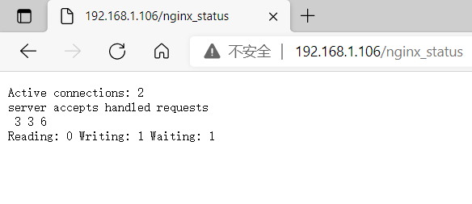
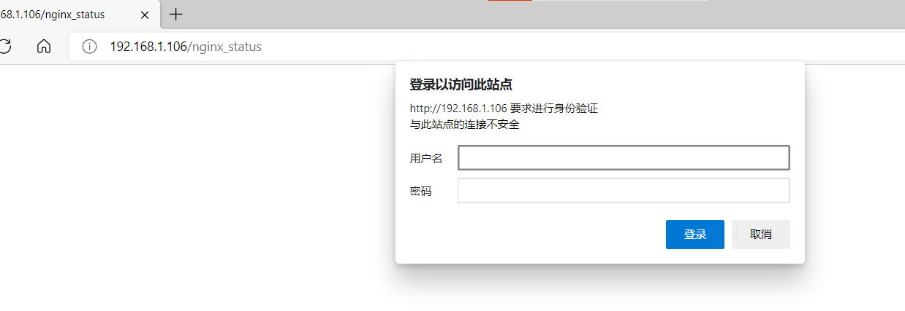
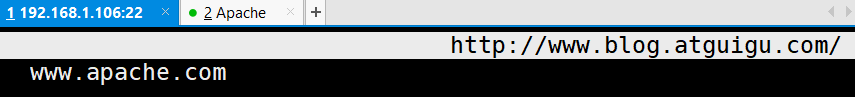
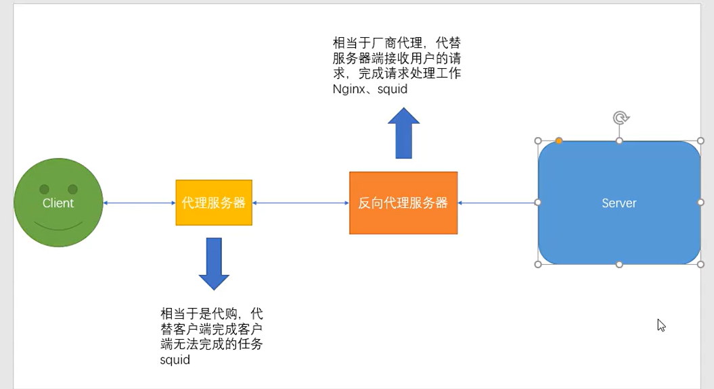
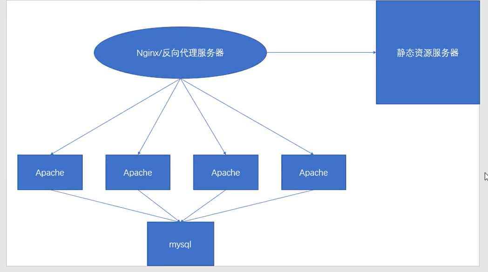

- **< 注意事项>	**

1. 注意配置文件中的结尾有;作为结束~！（切记！）

2. 每次实验修改完配置文件后需要

```javascript
# pkill -HUP nginx
```

# **实验 1：Nginx 的状态统计**

- a、安装 nginx 时将 --with-http_stub_status_module 模块开启

- b、修改 nginx 配置文件（写入要访问的 server 标签中）：**vi /usr/local/nginx/conf/nginx.conf**

```javascript
location /nginx_status{
stub_status on;
access_log off;
}
```

检查语法是否有误：/usr/local/nginx/sbin/nginx -t

```javascript
[root@bogon ~]# nginx  -t
nginx: the configuration file /usr/local/nginx/conf/nginx.conf syntax is ok
nginx: configuration file /usr/local/nginx/conf/nginx.conf test is successful   #没有问题
```

- c、客户端访问网址:http://IP/nginx_status

"Active connections"表示当前的活动连接数；

"server accepts handled requests"表示已经处理的连接信息

三个数字依次表示已处理的连接数、成功的 TCP 握手次数、已处理的请求数



# **实验 2 ：目录保护（访问控制）**

- a、原理和 apache 的目录保护原理一样（利用上一个实验接着完成）

- b、在状态统计的 location 中添加：

```javascript
auth_basic "Welcome to nginx_status!";
auth_basic_user_file /usr/local/nginx/html/htpasswd.nginx;
```

- c、使用 http 的命令 htpasswd 进行用户密码文件的创建（生成在上面指定的位置）

```javascript
[root@bogon ~]# htpasswd -c /usr/local/nginx/html/htpasswd.nginx  [用户名]
New password: 
Re-type new password: 
Adding password for user user
```

**htpasswd是Apache的命令，如果没有安装，需要安装：yum install  -y httpd**

- d、重启 nginx 并再次访问统计页面





# **实验 3 ：基于 IP 的身份验证（访问控制）
**

- a、接着上一个实验完成操作



- b、在状态统计的 location 中添加：

```javascript
allow 192.168.88.1;
deny 192.168.1.102;        #真实机ip  禁止这个ip登录
```

elinks 192.168.1.106/status



# **实验 4 ：nginx 的虚拟主机 （ 基于域名） ）**

- a、提前准备好两个网站的域名，并且规划好两个网站网页存放目录

- b、在 Nginx 主配置文件中并列编写两个 server 标签，并分别写好各自信息

```javascript
#log_format  main  '$remote_addr - $remote_user [$time_local] "$request" '   #去掉注释，下面也是
    #                  '$status $body_bytes_sent "$http_referer" '
    #                  '"$http_user_agent" "$http_x_forwarded_for"';
```

```javascript
server {
    listen 80;
    server_name www.blog.atguigu.com;
    index index.html index.htm index.php;
    root html/blog;
    access_log logs/blog-access.log main;
}

server {
    listen 80;
    server_name www.bbs.atguigu.com;
    index index.html index.htm index.php;
    root html/bbs;
    access_log logs/bbs-access.log main;
}
```

- c、分别访问两个不同的域名验证结果

**记得修改hosts 文件，增加本地域名解析；**

```javascript
[root@bogon html]# vi /etc/hosts

127.0.0.1   localhost localhost.localdomain localhost4 localhost4.localdomain4
::1         localhost localhost.localdomain localhost6 localhost6.localdomain6
192.168.1.106  www.blog.atguigu.com
192.168.1.106  www.bbs.atguigu.com
```

# **实验 5 ：nginx 的反向代理
**

**代理和反向代理？**

**代理：**

**反向代理：**

- a、在另外一台机器上安装 apache，启动并填写测试页面

```javascript
[root@localhost ~]# cd /var/www/html/
[root@localhost html]# ls
[root@localhost html]# vi index.html
www.apache.com
[root@localhost html]  iptables -F
[root@localhost html]  setenforce 0
[root@localhost html]  servcie httpd start     
```

- b、在 nginx 服务器的配置文件中添加（写在某一个网站的 server 标签内）

- proxy-pass (Prosy,代理，pass,路径：代理路径）

```javascript
location / {
proxy_pass http://192.168.88.100:80; #此处填写 apache 服务器的 IP 地址
}
```

- c、重启 nginx，并使用客户端访问测试：elinks 

```javascript
[root@bogon html]# curl www.blog.atguigu.com       
dhbskjchjksb  
<br>
www.apache3.com
[root@bogon html]# curl www.blog.atguigu.com
www.apache.com

[root@bogon html]# curl www.blog.atguigu.com
dhbskjchjksb  
<br>
www.apache3.com
[root@bogon html]# curl www.blog.atguigu.com
www.apache.com

```

- 




# **实验 6 ：反向代理+负载调度（负载均衡）
**

负载均衡（Load Balance）其意思就是将任务分摊到多个操作单元上进行执行，例如 Web 服务器、FTP

服务器、企业关键应用服务器和其它关键任务服务器等，从而共同完成工作任务。

- a、使用默认的 rr 轮训算法，修改 nginx 配置文件

```javascript
upstream [blog标记名称] {                     #此标签写在 server 标签的外面
    server 192.168.88.100:80;
    server 192.168.88.200:80;
}
server {
    ........;
    #修改自带的 location / 的标签，将原内容删除，添加下列两项
    location / {
        proxy_pass http://blog; #添加反向代理，代理地址填写 upstream 声明的名字
        proxy_set_header Host $host; #重写请求头部，保证网站所有页面都可访问成功
    }
}
```

- c、开启并设置两台 88.100 & 88.200 的主机

安装 apache 并设置不同的 index.html 页面内容（设置不同页面是为了看实验效果）

- d、重启 nginx，并使用客户端访问测试

拓展补充：rr 算法实现加权轮询（后期集群再讲更多算法类型和功能）

```javascript
upstream bbs {
server 192.168.88.100:80 weight=1;
server 192.168.88.200:80 weight=2;
}
```



# **实验 7 ：nginx 实现 https { 证书+rewrite}
**

- a、安装 nginx 时，需要将--with-http_ssl_module 模块开启

- b、在对应要进行加密的 server 标签中添加以下内容开启 SSL

```
server {
.......;
ssl on;
ssl_certificate /usr/local/nginx/conf/ssl/atguigu.crt;
ssl_certificate_key /usr/local/nginx/conf/ssl/atguigu.key;
ssl_session_timeout 5m;
ssl_prefer_server_ciphers on;
ssl_ciphers
 "EECDH+CHACHA20:EECDH+CHACHA20-draft:EECDH+AES128:RSA+AES128:EECDH+AES2
56:RSA+AES256:EECDH+3DES:RSA+3DES:!MD5";
}
```

- c、生成证书和秘钥文件

注意：在实验环境中可以用命令生成测试，在生产环境中必须要在 https 证书厂商注册

```
openssl genrsa -out atguigu.key 1024
   # 建立服务器私钥，生成 RSA 密钥
openssl req -new -key atguigu.key -out atguigu.csr
#需要依次输入国家，地区，组织，email。最重要的是有一个 common name，可以写你的名字或者域
    #名。如果为了 https 申请，这个必须和域名吻合，否则会引发浏览器警报。生成的 csr 文件交给 CA 签
名后形成服务端自己的证书
 openssl x509 -req -days 365 -sha256 -in atguigu.csr -signkey atguigu.key -out atguigu.crt   
#生成签字证书

cp atguigu.crt /usr/local/nginx/conf/ssl/atguigu.crt
cp atguigu.key /usr/local/nginx/conf/ssl/atguigu.key
    #将私钥和证书复制到指定位置
```

- d、设置 http 自动跳转 https 功能

原有的 server 标签修改监听端口

```javascript
server {
..........;
listen 443;
}
```

新增以下 server 标签（利用虚拟主机+rewrite 的功能）

```javascript
server{
listen 80;
server_name bbs.atguigu.com;
rewrite / https://bbs.atguigu.com permanent;
root html/bbs;
index index.html index.htm;
}
```

- e、重启 nginx，并测试