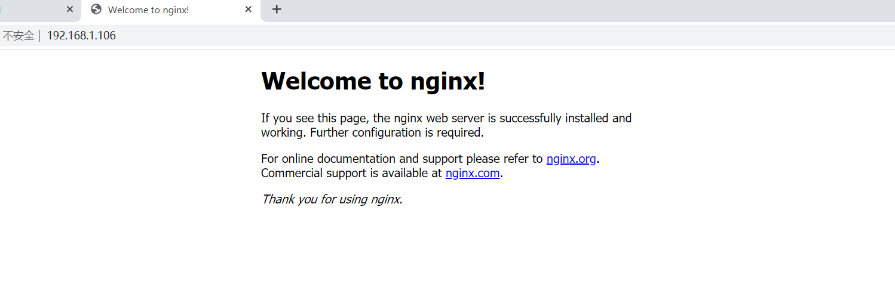

**源码软件包安装**

# **1 .Nginx源码安装
**

Nginx是一款轻量级的Web 服务器/反向代理服务器及电子邮件（IMAP/POP3）代理服务器，在BSD-like

协议下发行。其特点是占有内存少，并发能力强。

# **2 、下载 Nginx 源码包
 
**

```javascript
# wget http://nginx.org/download/nginx-1.12.2.tar.gz
```

# **3、 创建用于运行 Nginx 的用户
**

```javascript
# useradd -r -s /sbin/nologin nginx
```

# **4、安装依赖**

```javascript
yum -y install pcre-devel zlib-devel openssl-devel gcc gcc-c++
```

# **5、 解压缩 Nginx 并安装
**

```javascript
./configure --prefix=/usr/local/nginx --user=www --group=www --with-http_stub_status_module --with-http_ssl_module
#编译参数说明
    参数					作用
    --prefix				编译安装到的软件目录
    --USer					worker进程运行用户
    --group				worker进程运行用户组
    --with-http_ssl_module			支持https 需要 pcel-devel 依赖
    --with-http_stub_status_module	        基本状态信息显示 查看请求数、连接数等
    --with-http_realip_module		定义客户端地址和端口为header头信息 常用于反向代理后的真实IP获取
make -j4
make install
```

# **6.  nginx命令选项**

```javascript
nginx version: nginx/1.14.2
Usage: nginx [-?hvVtTq] [-s signal] [-c filename] [-p prefix] [-g directives]
Options:
-？,-h	:this htlp			#查看帮助
-v		: show version and exit		#查看版本并退出
-V		: show version and configure options then exit	#查看版本和配置选项并退出
-t		: test configuration and exit			#检测配置文件语法并退出
-T		: test configuration, dump it and exit		#检测配置文件语法打印它并退出
-q	: suppress non-error messages during configuration testing	#在配置测试期间禁止显示非错误信息
-s signal	: send signal to a master process: stop, quit, reopen, reload
    	#发送信号给主进程 stop强制退出quit优雅的退出reopen重开日志 reload重载配置
-p prefix	: set prefix path (default:/usr/local/nginx/)			#设置nginx目录Sprefix路径
-c filename	: set configuration file (default: conf/nginx.conf)	#指定启动使用的配置文件
-g directives : set global directives out of configuration file		#在配置文件之外设置全局指令
一般主要使用：
-s参数控制管理nginx服务
-V参数查看nginx开启的模块和编译参数
-t参数检测配置文件是否有错误
```

# **3. 服务配置**

- 使用社区的服务配置文件

nginx编译包里默认服务启动脚本模板，可以通过社区获得

[https://www.nginx.com/resources/wiki/start/topics/examples/redhatnginxinit/](https://www.nginx.com/resources/wiki/start/topics/examples/redhatnginxinit/)

- 上传脚本到nginx配置文件到/etc/init.d目录下

```javascript
shell > vim /etc/init.d/nginx
```

- 脚本内容

更改nginx="/usr/local/nginx/sbin/nginx"     

```
#!/usr/bin/bash
. /etc/rc.d/init.d/functions
. /etc/sysconfig/network
# Check that networking is up.
[ "$NETWORKING" = "no" ] && exit 0
nginx="/usr/local/nginx/sbin/nginx"                #命令路径，根据需要更改
prog=$(basename $nginx)
NGINX_CONF_FILE="/usr/local/nginx/conf/nginx.conf"
[ -f /etc/sysconfig/nginx ] && . /etc/sysconfig/nginx
lockfile=/var/lock/subsys/nginx
make_dirs() {
   # make required directories
   user=`$nginx -V 2>&1 | grep "configure arguments:.*--user=" | sed 's/[^*]*--user=\([^ ]*\).*/\1/g' -`
   if [ -n "$user" ]; then
      if [ -z "`grep $user /etc/passwd`" ]; then
         useradd -M -s /bin/nologin $user
      fi
      options=`$nginx -V 2>&1 | grep 'configure arguments:'`
      for opt in $options; do
          if [ `echo $opt | grep '.*-temp-path'` ]; then
              value=`echo $opt | cut -d "=" -f 2`
              if [ ! -d "$value" ]; then
                  # echo "creating" $value
                  mkdir -p $value && chown -R $user $value
              fi
          fi
       done
    fi
}
start() {
    [ -x $nginx ] || exit 5
    [ -f $NGINX_CONF_FILE ] || exit 6
    make_dirs
    echo -n $"Starting $prog: "
    daemon $nginx -c $NGINX_CONF_FILE
    retval=$?
    echo
    [ $retval -eq 0 ] && touch $lockfile
    return $retval
}
stop() {
    echo -n $"Stopping $prog: "
    killproc $prog -QUIT
    retval=$?
    echo
    [ $retval -eq 0 ] && rm -f $lockfile
    return $retval
}
restart() {
    configtest || return $?
    stop
    sleep 1
    start
}
reload() {
    configtest || return $?
    echo -n $"Reloading $prog: "
    killproc $prog -HUP
    retval=$?
    echo
}
force_reload() {
    restart
}
configtest() {
  $nginx -t -c $NGINX_CONF_FILE
}
rh_status() {
    status $prog
}
rh_status_q() {
    rh_status >/dev/null 2>&1
}
case "$1" in
    start)
        rh_status_q && exit 0
        $1
        ;;
    stop)
        rh_status_q || exit 0
        $1
        ;;
    restart|configtest)
        $1
        ;;
    reload)
        rh_status_q || exit 7
        $1
        ;;
    force-reload)
        force_reload
        ;;
    status)
        rh_status
        ;;
    condrestart|try-restart)
        rh_status_q || exit 0
            ;;
    *)
        echo $"Usage: $0 {start|stop|status|restart|condrestart|try-restart|reload|force-reload|configtest}"
        exit 2
esac
```

修改软件和配置路径

```javascript
#执行文件路径 第22行
nginx="/usr/local/nginx/sbin/nginx"
#配置文件路径 第25行
NGINIX_CONF_FILE="/usr/local/nginx/conf/nginx.conf"
```

⑧添加自启动

```javascript
shell > chmod +x/etc/init.d/nginx
shell > chkconfig --add nginx
shell > chkconfig nginx on
```

注意在服务脚本中，有chkconfig配置开启模式、开启顺序、关闭顺序设置

```
# chkconfig:   - 85 15
#           开启模式（0-6）开启顺序  关闭顺序
```

### **启动测试：/usr/local/nginx/sbin/nginx  **

**打开浏览器：服务器ip地址：**



# **2 、nginx重装和升级**

 在实际业务场景中，需要使用软件新版本的功能、特性。就需要对原有软件进行升级或者重装操作。

```
旧statble    稳定版1.14
stable       稳定版1.16
mainline     主线版本 最新的1.15
```

## 2.1 信号参数

Kill 命令 传输信号给进程 Nginx的主进程

```
TERM, INT    （快速退出，当前的请求不执行完成就退出） Quick shutdown   -s stop
QUIT     (优雅退出，执行完当前的请求后退出) Graceful shutdown  优雅的关闭进程,即等请求结束后再关闭          -s quit
HUP     (重新加载配置文件，用新的配置文件启动新worker进程，并优雅的关闭旧的worker进程) 改变配置文件,平滑的重读配置文件   -s reload
USR1     (重新打开日志文件)  Reopen the log files 重读日志,在日志按月/日分割时有用       -s reopen
USR2    （平滑的升级nginx二进制文件 拉起一个新的主进程 旧主进程不停止) Upgrade Executable on the fly 平滑的升级
WINCH     (优雅的关闭worker进程)Gracefully shutdown the worker processes 优雅关闭旧的进程(配合USR2来进行升级)   
```

```
Kill 选项参数    pid  
kill -INT pid    ##快速关闭
kill -QUIT pid    ##优雅关闭
```

## 2.2、重新安装

①停止掉服务，删除编译的安装的软件包和源码包

②重新解压编译安装即可

注意：如果有需要，请备份配置文件和网站目录里的资源文件

## 2.3、平滑升级

升级软件版本之后，需要启动新的版本，启动不了，端口已经被占用。

如果直接把旧版本的服务停止掉，会影响线上业务的使用。

- 最佳解决办法:

```
①旧的不先停掉
②新的又可以起来
③旧的和新的同时提供服务，旧的请求完成之后，就停掉旧进程
-USR2 平滑启动一个进程（平滑升级）
-WINCH 优雅的关闭子进程
-QUIT 优雅关闭主进程
```

①编译安装新版本

```
shell > tar xvf nginx-1.16.0.tar.gz
shell > cd nginx-1.16.0
shell > ./configure --prefix=/usr/local/nginx --user=www --group=www - -with-http_ssl_module
--with-http_stub_status_module --with-http_realip_module
shell > make && make install
```

升级新版本，需要把软件的安装路径，指定到旧版本上。

②新旧版本同时运行

```
shell > kill -USR2  旧的主进程号
```

③停止掉旧进程

查看旧的主进程号，并使用kill -WINCH 优雅的关闭的子进程,再关闭旧主进程

```
shell > kill -WINCH 旧的子进程号， 
    #然后浏览器访问，看响应的是否是新的子进程，如果是，则没什么问题，可以放心大胆的kill掉旧的主进程了
        #如果响应的依然是旧的进程，就再kill -WINCH 一次旧的子进程
shell > kill -QUIT 旧主进程号
```

在nginx中，默认提供了平滑升级的操作，只需要执行以下命令

```
#注意先configure 在nginx源码包执行
shell > make install && make upgrade
```