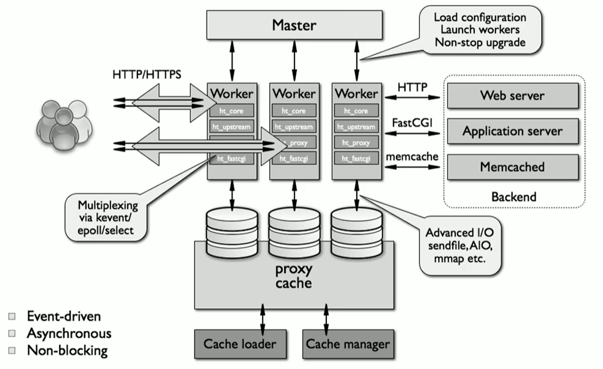
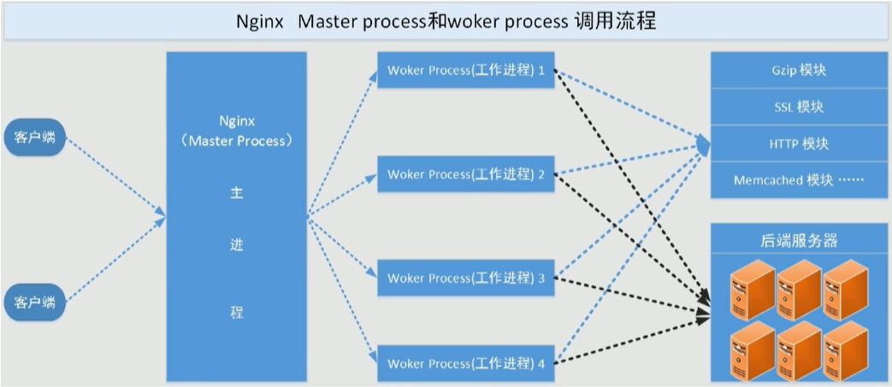
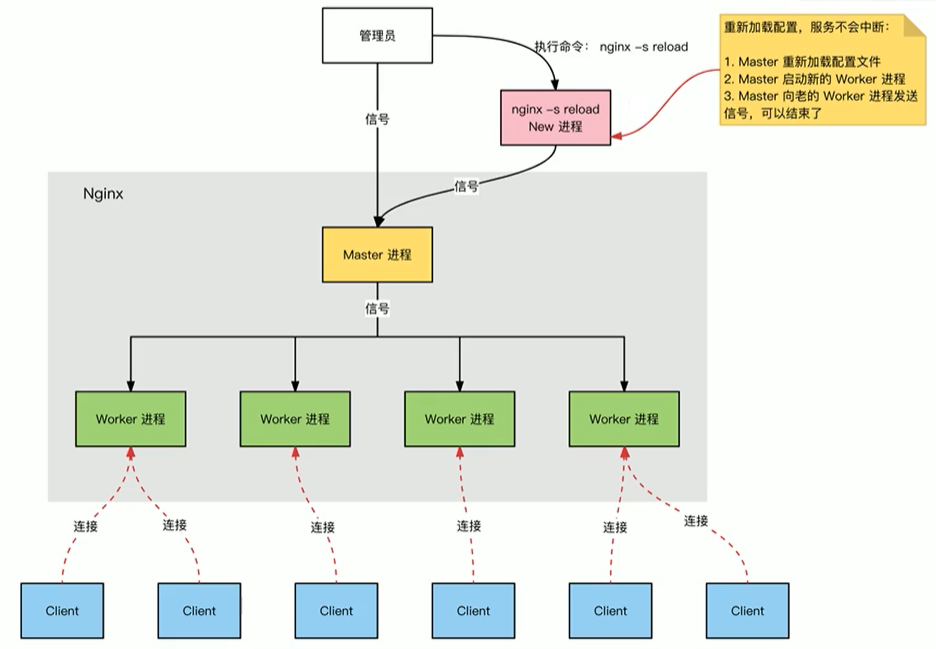
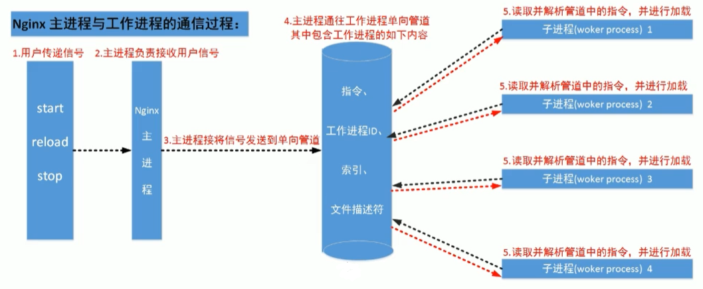
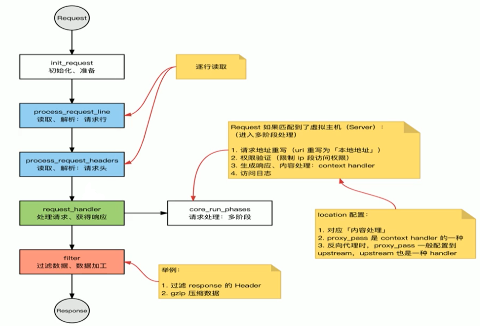

# **1、Nginx介绍**

## **1）Nginx简介**

- Nginx是lgor Sysoev为俄罗斯访问量第二的rambler.ru站点设计开发的。从2004年发布至今，凭借开源的力量， 已经接近成熟与完善。

- Nginx功能丰富，可作为HTTP服务器，也可作为反向代理服务器，邮件服务器。支持FastCGI、SSL、Virtual Host、URL Rewrite、Gzip等功能。并且支持很多第三方的模块扩展。

- 官方：

## 2）Nginx特点

支持高并发，消耗内存资源少

具有多种功能

网站web服务功能

网站负载均衡功能

正向代理反向代理

网站缓存功能

在多种系统平台都可以部署

nginx实现网络通讯时使用的是异步网络IO模型：epoll模型，

参考博客：[https://segmentfault.com/a/1190000003063859#item-3-13](https://segmentfault.com/a/1190000003063859#item-3-13)

## 3）工作原理

- Nginx由内核和一系列模块组成，内核提供web服务的基本功能,如启用网络协议,创建运行环境,接

收和分配客户端请求,处 理模块之间的交互。Nginx的各种功能和操作都由模块来实现。Nginx的模

块从结构上分为核心模块、基础模块和第三方 模块。

- 1）核心模块： HTTP模块、EVENT模块和MAIL模块

- 2）基础模块： HTTP Access模块、HTTP FastCGI模块、HTTP Proxy模块和HTTP Rewrite模块

- 3）第三方模块： HTTP Upstream Request Hash模块、Notice模块和HTTP Access Key模块及用

户自己开发的模块

# 2、Nginx架构和进程

## 1）Nginx架构

## 2）Nginx进程结构

- web请求处理机制

- 多进程方式:服务器每接收到一个客户端请求就有服务器的主进程生成一个子进程响应客户

端，直到用户关闭连接，这样的优势是处理速度快。子进程之间相互独立，但是如果访问过大

会导致服务器资源耗尽而无法提供请求。

- 多线程方式:与多进程方式类似，但是每收到一个客户端请求会有服务进程派生出一个线程来

个客户方进行交互，一个线程的开销远远小于一个进程，因此多线程方式在很大程度减轻了

web服务器对系统资源的要求，但是多线程也有自己的缺点。即当多个线程位于同一个进程内

工作的时候，可以相互访问同样的内存地址空间，所以他们相互影响，一旦主进程挂掉则所有

子线程都不能工作了，IIS服务器使用了多线程的方式，需要间隔一段时间就重启一次才能稳定。

- Nginx是多进程组织模型，而且是一个由Master主进程和Worker工作进程组成。

- 主进程(master process)的功能:

- 对外接口:接收外部的操作(信号)

- 对内转发:根据外部的操作的不同，通过信号管理worker

- 监控:监控worker进程的运行状态，worker进程异常终止后，自动重启worker进程

- 读取Nginx配置文件并验证其有效性和正确性

- 建立、绑定和关闭socket连接

- 按照配置生成、管理和结束工作进程

- 接受外界指令，比如重启、升级及退出服务器等指令

- 不中断服务，实现平滑升级，重启服务并应用新的配置

- 开启日志文件，获取文件描述符

- 不中断服务，实现平滑升级，升级失败进行回滚处理

- 编译和处理perl脚本

- 工作进程(worker process的功能:

- 所有Worker进程都是平等的

- 实际处理:网络请求，由Worker进程处理

- Worker进程数量:在nginx.conf 中配置，一般设置为核心数，充分利用CPU资源，同时，避免

- 进程数量过多，避免进程竞争CPU资源，增加

- 上下文切换的损耗

- 接受处理客户的请求

- 将请求依次送入各个功能模块进行处理

- I/O调用，获取响应数据

- 与后端服务器通信，接收后端服务器的处理结果

- 缓存数据，访问缓存索引，查询和调用缓存数据

- 发送请求结果，响应客户的请求

- 接收主程序指令，比如重启、升级和退出等

## 3)Nginx进程间通信

⼯作进程是有主进程⽣成的，主进程由root启用，主进程使⽤fork()函数，在Nginx服务器启动过程中主

进程根据配置⽂件决定启动⼯作进程的数量，然后建⽴⼀张全局的⼯作表⽤于存放当前未退出的所有的

⼯作进程，主进程⽣成⼯作进程后会将新⽣成的⼯作进程加⼊到⼯作进程表中，并建⽴⼀个单向的管道

并将其传递给⼯作进程，该管道与普通的管道不同，它是由主进程指向⼯作进程的单项通道，包含了主

进程向⼯作进程发出的指令、⼯作进程ID、⼯作进程在⼯作进程表中的索引和必要的⽂件描述符等信

息，单向管道，工作进程只能监听内容之后读取指令。 主进程与外界通过信号机制进⾏通信，当接收到

需要处理的信号时，它通过管道向相关的⼯作进程发送正确的指令，每个⼯作进程都有能⼒捕获管道中

的可读事件，当管道中有可读事件的时候，⼯作进程就会从管道中读取并解析指令，然后采取相应的执

⾏动作，这样就完成了主进程与⼯作进程的交互。

⼯作进程之间的通信原理基本上和主进程与⼯作进程之间的通信是⼀样的，只要⼯作进程之间能够取得

彼此的信息，建⽴管道即可通信，但是由于⼯作进程之间是完全隔离的，因此⼀个进程想要知道另外⼀

个进程的状态信息就只能通过主进程来设置了。

为了实现⼯作进程之间的交互，主进程在⽣成⼯作进程之后，在⼯作进程表中进⾏遍历，将该新进程的

ID以及针对该进程建⽴的管道句柄传递给⼯作进程中的其他进程，为⼯作进程之间的通信做准备，当⼯

作进程1向⼯作进程2发送指令的时候，⾸先在主进程给它的其他⼯作进程⼯作信息中找到2的进程ID，

然后将正确的指令写⼊指向进程2的管道，⼯作进程2捕获到管道中的事件后，解析指令并进⾏相关操

作，这样就完成了⼯作进程之间的通信。

## 4)连接建立和请求处理过程

- Nginx启动时，Master 进程，加载配置文件

- Master进程，初始化监听的socket

- Master进程，fork 出多个Worker进程

- Worker进程，竞争新的连接，获胜方通过三次握手，建立Socket连接，并处理请求

## 5)HTTP处理过程

