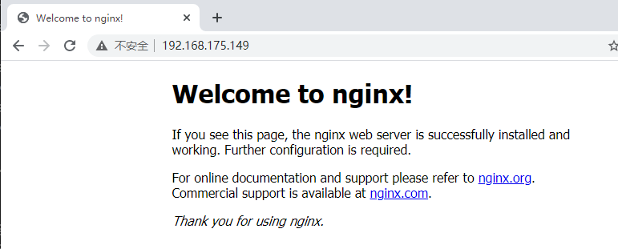

**Nginx服务部署安装**

# 1、yum安装

- yum安装，安装前需要先安装扩展源

```
[root@localhost ~]# yum install epel-release.noarch -y
[root@localhost ~]# yum install nginx -y
```

- 启动nginx

```
[root@localhost ~]# systemctl start nginx.service
[root@localhost ~]# systemctl status nginx
● nginx.service - The nginx HTTP and reverse proxy server
 Loaded: loaded (/usr/lib/systemd/system/nginx.service; disabled; vendor
preset: disabled)
 Active: active (running) since 五 2020-09-25 09:39:46 CST; 7s ago
Process: 7195 ExecStart=/usr/sbin/nginx (code=exited, status=0/SUCCESS)
Process: 7192 ExecStartPre=/usr/sbin/nginx -t (code=exited,
status=0/SUCCESS)
Process: 7190 ExecStartPre=/usr/bin/rm -f /run/nginx.pid (code=exited,
status=0/SUCCESS)
Main PID: 7197 (nginx)
```

- 关闭防火墙和selinux

```
[root@localhost ~]# systemctl stop firewalld.service
[root@localhost ~]# setenforce 0
```

- 浏览器输入IP地址即可访问


# 2、编译安装

## 1）从官网获取源码包，以1.18.0举例

```
[root@localhost ~]# wget http://nginx.org/download/nginx-1.18.0.tar.gz -P
/usr/local/src/
[root@localhost ~]# cd /usr/local/src
[root@localhost src]# tar -xzvf nginx-1.18.0.tar.gz
[root@localhost src]# cd nginx-1.18.0
[root@localhost nginx-1.18.0]# ./configure --help
```

- 编译安装

```
[root@localhost nginx-1.18.0]# yum -y install gcc pcre-devel openssl-devel
zlib-devel
[root@localhost nginx-1.18.0]# useradd -r -s /sbin/nologin nginx
[root@localhost nginx-1.18.0]# ./configure --prefix=/apps/nginx \
--user=nginx \
--group=nginx \
--with-http_ssl_module \
--with-http_v2_module \
--with-http_realip_module \
--with-http_stub_status_module \
--with-http_gzip_static_module \
--with-pcre \
--with-stream \
--with-stream_ssl_module \
--with-stream_realip_module
[root@localhost nginx-1.18.0]# make -j 2 && make install
[root@localhost nginx-1.18.0]# chown -R nginx.nginx /apps/nginx
[root@localhost nginx-1.18.0]# ln -s /apps/nginx/sbin/nginx /usr/bin/
[root@localhost nginx-1.18.0]# nginx -v
```

- nginx完成安装以后，有四个主要的目录

- conf:保存nginx所有的配置文件，其中nginx.conf是nginx服务器的最核心最主要的配置文

件，其他的.conf则是用来配置nginx相关的功能的，例如fastcgi功能使用的是fastcgi. conf和

fastcgi.params两个文件，配置文件一般都有个样板配置文件，是文件名. default结尾，使用

的使用将其复制为并将default去掉即可。

- html:目录中保存了nginx服务器的web文件，但是可以更改为其他目录保存web文件，另外

还有一个50x的web文件是默认的错误页面提示页面。

- logs:用来保存ngi nx服务器的访问日志错误日志等日志，logs目录可以放在其他路径，比如/var/logs/nginx面。

- sbin:保存nginx二进制启动脚本，可以接受不同的参数以实现不同的功能。

```
[root@localhost nginx-1.18.0]# tree /apps/nginx -C -L 1
/apps/nginx
├── conf
├── html
├── logs
└── sbin
```

## 2）启动和停止nginx测试访问web界面

- 启动和关闭nginx

```
[root@localhost nginx-1.18.0]# nginx
[root@localhost nginx-1.18.0]# nginx -s stop
```



## 3）创建nginx自启动文件

```
# 复制同一版本的nginx的yum安装生成的service文件
[root@localhost ~]# vim /usr/lib/systemd/system/nginx.service
[Unit]
Description=The nginx HTTP and reverse proxy server
Documentation=http://nginx.org/en/docs/
After=network.target remote-fs.target nss-lookup.target
Wants=network-online.target
[Service]
Type=forking
PIDFile=/apps/nginx/run/nginx.pid
ExecStart=/apps/nginx/sbin/nginx -c /apps/nginx/conf/nginx.conf
ExecReload=/bin/kill -s HUP $MAINPID
ExecStop=/bin/kill -s TERM $MAINPID
[Install]
WantedBy=multi-user.target

[root@localhost ~]# mkdir /apps/nginx/run/
[root@localhost ~]# vim /apps/nginx/conf/nginx.conf
pid    /apps/nginx/run/nginx.pid;
```

## 4）验证Nginx自启动文件

```
[root@localhost ~]# systemctl daemon-reload
[root@localhost ~]# systemctl enable --now nginx
[root@localhost ~]# ll /apps/nginx/run
总用量 4
-rw-r--r--. 1 root root 5 5月  24 10:07 nginx.pid
```