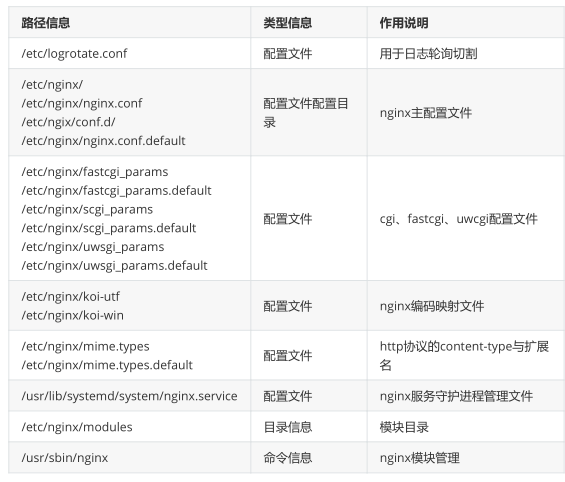
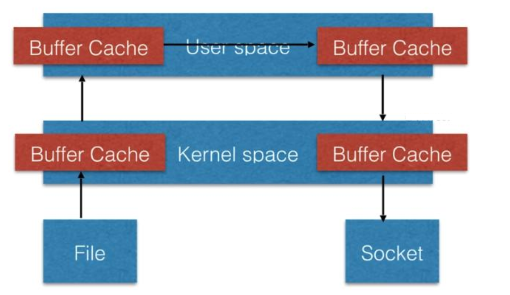

# 1、Nginx目录结构介绍



# 2、日志切割

1. /etc/logrotate.d/nginx：可以实现日志切割

1. 日志切割方式一

1. mv /var/log/nginx/access.log /var/log/nginx/access_$(date +%F).log

1. 重启nginx systemctl restart nginx

1. 日志切割方式二，使用专用的文件切割程序--logrotate

```
[root@localhost logrotate.d]# cat /etc/logrotate.conf
# see "man logrotate" for details
# rotate log files weekly
weekly    # 定义默认日志切割周期                      
 
# keep 4 weeks worth of backlogs
rotate 4   # 定义只保留几个切割后的文件
# create new (empty) log files after rotating old ones
create    # 切割后创建出一个相同的源文件，后面可以跟上文件权限、属主、属组
# use date as a suffix of the rotated file
dateext   # 定义角标，扩展名称信息
# uncomment this if you want your log files compressed
#compress  # 是否对切割后的文件进行压缩处理
# RPM packages drop log rotation information into this directory
include /etc/logrotate.d
# no packages own wtmp and btmp -- we'll rotate them here
/var/log/wtmp {       # 当都对某个文件进行切割配置
 monthly
 create 0664 root utmp
 minsize 1M
 rotate 1
}
/var/log/btmp {
 missingok
 monthly
 create 0600 root utmp
 rotate 1
}
```

# 3、配置文件默认参数说明

## 1）

```
[root@localhost ~]# cp /etc/nginx/nginx.conf{,.bak}
[root@localhost ~]# grep -Ev "#|^$" /etc/nginx/nginx.conf.bak
>/etc/nginx/nginx.conf
[root@localhost ~]# cat /etc/nginx/nginx.conf
=====================第一个部分，配置文件的主区域======================
user nginx;                             # 定义
worker进程的管理用户
worker_processes auto;                  # 定义worker进程数，auto会自动调整为cpu核数
error_log /var/log/nginx/error.log;     # 定义错误日志
pid /run/nginx.pid;                     # 定义pid文件
include /usr/share/nginx/modules/*.conf;
=====================第二个部分，配置文件的事件区域====================
events {
 worker_connections 1024;     # 定义一个worker进程可以同时接受1024个请求
}
=====================第三个部分，配置文件的http区域====================
http {
 log_format main  '$remote_addr - $remote_user [$time_local] "$request"
           '$status $body_bytes_sent "$http_referer" '
           '"$http_user_agent" "$http_x_forwarded_for"';   # 定义日志格式
 access_log /var/log/nginx/access.log main;
                    # 指定日志文件路径
 sendfile      on;  # 允许sendfile方式传输文件 ，sendfile系统调用在两个文
                    #件描述符之间直接传递数据(完全在内核中操作)，从而避免了数据在内核缓冲区和用户缓冲区之间的拷
                    #贝，操作效率很高，被称之为零拷贝。
 tcp_nopush     on;  # 在sendfile启动下，使用TCP_CORK套接字，当有数据时，
先别着急发送, 
                     #确保数据包已经装满数据, 避免了网络拥塞
 tcp_nodelay     on;  # 接连接保持活动状态
 keepalive_timeout  65;  # 超时时间
 types_hash_max_size 2048;# 连接超时时间
 include       /etc/nginx/mime.types;    # 文件扩展名与文件类型映射表
 default_type    application/octet-stream;  # 默认文件类型，默认为
text/plain
 include /etc/nginx/conf.d/*.conf;
 server {
   listen    80 default_server;    # 指定监听的端口
   listen    [::]:80 default_server;
   server_name _;                      # 指定网站主
机名
   root     /usr/share/nginx/html;  # 定义站点目录的位置
   include /etc/nginx/default.d/*.conf; # 定义首页文件
   location / {
   }
   error_page 404 /404.html;             # 定义优雅显示页面信息
     location = /40x.html {
   }
   error_page 500 502 503 504 /50x.html;
     location = /50x.html {
   }
 }
}
```



## 2）location表达式

- ~ 表示执行一个正则匹配，区分大小写；

- ~* 表示执行一个正则匹配，不区分大小写；

- ^~ 表示普通字符匹配。使用前缀匹配。如果匹配成功，则不再匹配其他location；

- = 进行普通字符精确匹配。也就是完全匹配；

- @ 它定义一个命名的 location，使用在内部定向时，例如 error_page, try_files

- 优先级：=/^ / ,~*/常规字符串

```
location = / {
[ configuration A ]
}
location / {
[ configuration B ]
}
location /documents/ {
[ configuration C ]
}
location ^~ /images/ {
[ configuration D ]
}
location ~* \.(gif|jpg|jpeg)$ {
[ configuration E ]
}
A：请求 /
B: 请求 index.html
C: 请求 /documents/document.html
D: 请求 /images/1.jpg
E: 请求 /documents/document.gif
```

## 3）客户端相关配置

```
keepalive_timeout # 保持连接的超时时长
keepalive_requests # 一次连接允许请求资源的最大数量
keepalive_disable # 对某种浏览器禁用长连接
send_timeout # 向客户端发送响应报文的超时时长
client_body_buffer_size # 接收客户端请求报文的body部分的缓冲区大小
client_body_temp_path # 设定用于存储客户端请求报文的body部分的临时存储路径及子目录结构
和数量
limit_rate rate # 限制响应给客户端的传输速率
limit_except # 限制对指定的请求方法之外的其它方法的使用客户端
```