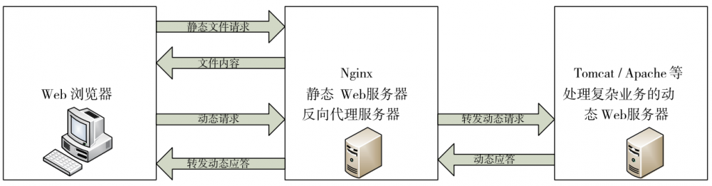

# 1、介绍

反向代理（Reverse Proxy）方式是指以代理服务器来接受internet上的连接请求，然后将请求转发给内

部网络上的服务 器，并将从服务器上得到的结果返回给internet上请求连接的客户端，此时代理服务器

对外就表现为一个反向代理服务 器，通常使用到的http/https协议和fastgci（将动态内容和http服务器分离）

# 2、代理相关模块及配置

- nginx代理基于ngx_http_proxy_module模块的功能，该模块有很多配置指令：

## 1）正向代理

1. resolver：指定dns服务器地址

1. proxy_pass：代理到的地址

1. resolver_timeout：dns解析超时时长

案例

- 添加配置文件

```
[root@nginx1 ~]# cat /etc/nginx/conf.d/www.conf
server{
  listen *:8090;
  resolver 114.114.114.114;
  location / {
    proxy_pass http://$http_host$request_uri;
  }
}
```

- 重启nginx

- 测试

方式一：

```
[root@client ~]# curl -x 192.168.80.10:8090 "http://www.baidu.com" -I
HTTP/1.1 200 OK
Server: nginx/1.20.1
Date: Wed, 21 Jul 2021 06:16:29 GMT
Content-Type: text/html
Content-Length: 277
Connection: keep-alive
Accept-Ranges: bytes
Cache-Control: private, no-cache, no-store, proxy-revalidate, no-transform
Etag: "575e1f60-115"
Last-Modified: Mon, 13 Jun 2016 02:50:08 GMT
Pragma: no-cache
```

方式二：

```
[root@client ~]# export http_proxy=http://192.168.80.10:8090 
```

## 2）反向代理相关指令

- **proxy_pass指令**

```
Syntax:  proxy_pass URL;
Default:  —
Context:  location, if in location, limit_except
http://localhost:8000/uri/
http://192.168.56.11:8000/uri/
http://unix:/tmp/backend.socket:/uri/
```

其中，URL为要设置的被代理服务器的地址，包含传输协议、主机名称或ip地址+端口号等元素。当URL

中不包含URI时，nginx服务器将不改变源地址中的URI，当URL中包含URI时，服务器将会改变源地址中

的URI；

- **proxy_set_header指令**

```
Syntax:  proxy_set_header field value;
Default:  proxy_set_header Host $proxy_host;
     proxy_set_header Connection close;
Context:  http, server, location
# 用户请求的时候HOST的值是www.eagleslab.com, 那么代理服务会像后端传递请求的还是
eagleslab
proxy_set_header Host $http_host;
# 将$remote_addr的值放进变量X-Real-IP中，$remote_addr的值为客户端的ip
proxy_set_header X-Real-IP $remote_addr;
# 客户端通过代理服务访问后端服务, 后端服务通过该变量会记录真实客户端地址
proxy_set_header X-Forwarded-For $proxy_add_x_forwarded_for;
```

该指令可以更改nginx服务器接收到的客户端请求的请求头信息，然后将新的请求头发送给被代理的服务器

- **proxy_connect_timeout**

```
Syntax: proxy_connect_timeout time;
Default: proxy_connect_timeout 60s;
Context: http, server, location
```

该指令配置nginx服务器与后端被代理服务器尝试建立连接的超时时间

- **proxy_read_timeout**

```
Syntax:  proxy_read_timeout time;
Default:  proxy_read_timeout 60s;
Context:  http, server, location
```

该指令配置nginx服务器向后端被代理服务器发出read请求后，等待响应的超时时间

- **proxy_send_timeout**

```
Syntax: proxy_send_timeout time;
Default: proxy_send_timeout 60s;
Context: http, server, location
```

该指令配置nginx服务器向后端被代理服务器发出write请求后，等待响应的超时时间

- **proxy_buffering**

```
Syntax: proxy_buffering on | off;
Default: proxy_buffering on;
Context: http, server, location
```

该指令nginx会把后端返回的内容先放到缓冲区当中，然后再返回给客户端，边收边传，不是全部接收完再传给客户端

- ** proxy_buffer_size**

```
Syntax: proxy_buffer_size size;
Default: proxy_buffer_size 4k|8k;
Context: http, server, location
```

该指令设置nginx代理保存用户头信息的缓冲区大小

- **proxy_buffers 缓冲区**

```
Syntax: proxy_buffers number size;
Default: proxy_buffers 8 4k|8k;
Context: http, server, location
```

## 3）缓存相关模块及配置

proxy 中的buffer和cache都是用于提高IO吞吐效率的，但是他们是一对不同的概念，翻译成中文分别是

缓冲和缓存。buffer主要用于传输效率不同步或者优先级别不相同的设备之间传递数据，一般通过对一

方数据进行临时存放，再统一发送的办法传递给另一方，以降低进程之间的等待时间，保证速度较快的

进程不发生间断，临时存放的数据一旦发送给另一方，这些数据本身也就没有用处了；cache主要用于

将硬盘上已有的数据在内存中建立缓存数据，提高数据的访问效率，提高数据的访问效率，对于过期不

用的缓存可以随时销毁，但不会销毁硬盘上的数据。

需要注意的是proxy cache机制依赖于proxy buffer机制，只有在proxy buffer机制开启的情况下proxy

cache的配置才会发挥作用

- proxy_cache_path：该指令用于设置nginx服务器存储缓存数据的路径以及缓存索引相关内容

```
Syntax: proxy_cache_path path [levels=levels] [use_temp_path=on|off]
keys_zone=name:size [inactive=time] [max_size=size] [min_free=size]
[manager_files=number] [manager_sleep=time] [manager_threshold=time]
[loader_files=number] [loader_sleep=time] [loader_threshold=time]
[purger=on|off] [purger_files=number] [purger_sleep=time]
[purger_threshold=time];
Default: —
Context: http
---
path：设置缓存数据存放的根路径，该路径应该是预先存在于磁盘上的
levels：设置在相对于path指定目录的第几级hash目录中缓存数据
keys_zone：nginx服务器的缓存索引重建进程在内存中为缓存数据建立索引，这一对变量用来设置存放
缓存索引的内存区域的名称和大小
```

- proxy_cache_valid：针对不同的HTTP响应状态设置不同的缓存时间

```
Syntax: proxy_cache_valid [code ...] time;
Default: —
Context: http, server, location
```

- proxy_hide_header ：默认情况下，nginx不会将代理服务器的响应中的头字段“Date”、“Server”、

“X-Pad”和“X-Accel-…”传递给客户机。proxy_hide_header指令设置将不传递的其他字段。相反，

如果需要允许传递字段，则可以使用proxy_pass_ header指令。

```
Syntax: proxy_hide_header field;
Default: —
Context: http, server, location
```

- proxy_connect_timeout

- proxy_read_timeout

- proxy_send_timeout

# 3、基于http协议代理实验

## 实验一、简单实现反向代理功能

```
[root@server conf.d]# cat proxy.conf
server {
listen 8080;
server_name www.server1.com;
location / {
proxy_pass http://192.168.80.128:8090;
}
}
```

## 实验二、proxy代理网站常用优化配置写入到新文件，调用时使用include即可

```
[root@server conf.d]# cat /etc/nginx/proxy_params
proxy_set_header Host $http_host;
proxy_set_header X-Real-IP $remote_addr;
proxy_set_header X-Forwarded-For $proxy_add_x_forwarded_for;
proxy_connect_timeout 30;
proxy_send_timeout 60;
proxy_read_timeout 60;
proxy_buffering on;
proxy_buffer_size 32k;
proxy_buffers 4 128k;
[root@server conf.d]# cat proxy.conf
server {
listen 8080;
server_name www.server1.com;
location / {
proxy_pass http://192.168.80.128:8090;
include proxy_params;
}
}
```

# 4、proxy_cache缓存实验

- 准备配置文件

```
http { 
# 其他配置-------------
# 指定了数据存放路径在/myweb/server/proxycache目录下，它包含两级hash目录，缓存数据的
总量不能超过20m，如果缓存在5分钟之内没有被访问则强制刷新，定义缓存空间mycache
proxy_cache_path /myweb/server/proxycache levels=1:2 max_size=20m
inactive=5m loader_sleep=1m keys_zone=mycache:10m;
# 配置响应数据的临时存放目录
proxy_temp_path /myweb/server/tmp;
# 其他配置--------------
server {
proxy_pass http://192.168.80.20;
proxy_cache mycache;
proxy_cache_valid 200 301 1h;   # 状态码为200 301的响应缓存1h
proxy_cache_valid any 1m;     # 配置其他状态的响应数据缓存1分钟
 }
}
```

# 5、基于fastcgi协议代理和缓存实验：



```
# 官网示例
server {
 location / {
   fastcgi_pass localhost:9000;
   fastcgi_param SCRIPT_FILENAME $document_root$fastcgi_script_name;
   fastcgi_param QUERY_STRING  $query_string;
 }
 location ~ \.(gif|jpg|png)$ {
   root /data/images;
 }
}
```

```
node1为代理服务器
node2为lnmp服务器
[root@node1 ~]# cat /etc/nginx/nginx.conf
http{
...
fastcgi_cache_path /var/cache/nginx/fastcgi_cache levels=1:2:1
keys_zone=fcgi:20m
inactive=120s;
}
[root@node1 conf.d]# cat proxy.conf
server{
server_name 172.16.0.10;
location / {
proxy_pass http://192.168.10.20;
}
```

```
# 实现动静分离
location ~ .*\.(html|txt)$ {
root /usr/share/nginx/html/;
}
# 缓存相关配置
location ~* \.php$ {
fastcgi_cache fcgi;
fastcgi_cache_key $request_uri;
fastcgi_cache_valid 200 302 10m;
fastcgi_cache_valid 301 1h;
fastcgi_cache_valid any 1m;
}
[root@node2 ~]# yum install php-fpm
[root@node2 ~]# systemctl start php-fpm.service
[root@node2 ~]# cat /etc/nginx/conf.d/php.conf
server{
listen 80;
server_name 192.168.10.20;
root /usr/share/nginx/html;
location ~* \.php$ {
fastcgi_pass 127.0.0.1:9000;
fastcgi_index index.php;
fastcgi_param SCRIPT_FILENAME /usr/share/nginx/html$fastcgi_script_name;
include fastcgi_params;
}
}
测试：
1. 访问http://172.16.0.10/index.html 和 index.php
2. 查看node1上的cache目录下缓存内容
```