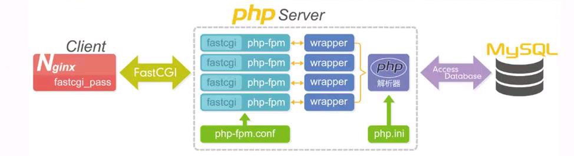
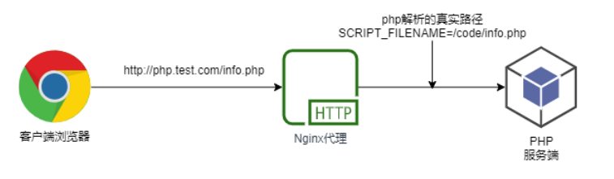
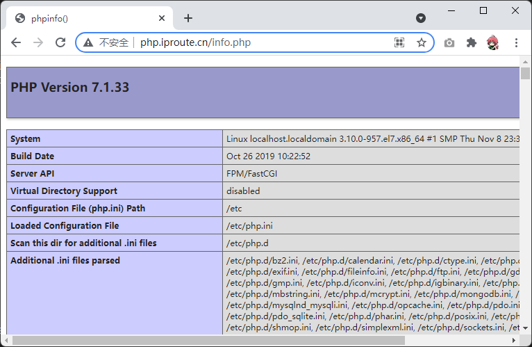
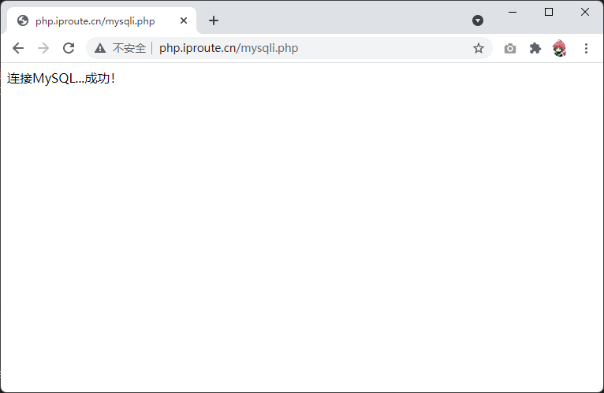

# 1、LNMP架构概述

## 1）什么是LNMP

LNMP是一套技术的组合，L=Linux、N=Nginx、M~=MySQL、P=PHP

## 2）LNMP架构是如何工作的

- 首先nginx服务是不能请求动态请求，那么当用户发起动态请求时，nginx无法处理

- 当用户发起http请求，请求会被nginx处理，如果是静态资源请求nginx则直接返回，如果是动态请

求nginx则通过fastcgi协议转交给后端的PHP程序处理


## 3）Nginx与fastcgi详细工作流程



1. 用户通过http协议发起请求，请求会先抵达LNMP架构中的nginx；

1. nginx会根据用户的请求进行location规则匹配；

1. location如果匹配到请求是静态，则由nginx读取本地直接返回；

1. location如果匹配到请求是动态，则由nginx将请求转发给fastcgi协议；

1. fastcgi收到请求交给php-fpm管理进程，php-fpm管理进程接收到后会调用具体的工作进程wrapper；

1.  wrapper进程会调用PHP程序进行解析，如果只是解析代码，php直接返回；

1.  如果有查询数据库操作，则由php连接数据库（用户 密码 ip）发起查询的操作；

1.  最终数据由mysql-->php-->php-fpm-->fastcgi-->nginx-->http-->user

# 1、LNMP架构环境部署

## 1）安装nginx

在Centos7默认的软件仓库中默认是没有nginx的，我们需要安装一个扩展软件仓库 epel-release 才可以安装

```
# 安装扩展软件源
yum -y install epel-release
# 安装nginx
yum -y install nginx
# 启动nginx并且设置为开机自启动
systemctl start nginx
systemctl enable nginx
# 检查nginx是否成功安装
nginx -v
```

**修改nginx用户**

为了安全和方便后面的php进程的权限管理，这边建议将nginx的用户改为www用户

```
# 创建www用户组
groupadd www -g 666
# 添加www用户
useradd www -u 666 -g 666 -s /sbin/nologin -M
# 修改配置切换nginx运行用户为www
sed -i '/^user/c user www;' /etc/nginx/nginx.conf
# 重启nginx服务
systemctl restart nginx
# 检查nginx运行的用户
ps aux |grep nginx
```

## 2）安装php

Centos7软件仓库中默认自带的php版本很老，并不能支持运行比较新的网站，所以我们需要添加一个

php官方的软件仓库，才可以正确安装。

```
# 安装webtstic软件仓库
rpm -Uvh https://mirror.webtatic.com/yum/el7/webtatic-release.rpm
# 安装php环境，php所需的组件比较多，我们可以一次性安装全面了
yum -y install php71w php71w-cli php71w-common php71w-devel php71w-embedded
php71w-gd php71w-mcrypt php71w-mbstring php71w-pdo php71w-xml php71w-fpm
php71w-mysqlnd php71w-opcache php71w-pecl-memcached php71w-pecl-redis php71w-
pecl-mongodb
```

### 切换php用户

配置php-fpm用于与nginx的运行用户保持一致

```
sed -i '/^user/c user = www' /etc/php-fpm.d/www.conf
sed -i '/^group/c group = www' /etc/php-fpm.d/www.conf
```

### 启动php-fpm

启动并且加入开机自启动

```
systemctl start php-fpm
systemctl enable php-fpm
```

## 3)安装Mariadb数据库

```
# 安装mariadb数据库软件
yum install mariadb-server mariadb -y
# 启动数据库并且设置开机自启动
systemctl start mariadb
systemctl enable mariadb
# 设置mariadb的密码
mysqladmin password '123456'
# 验证数据库是否工作正常
mysql -uroot -p123456 -e "show databases;"
+--------------------+
| Database      |
+--------------------+
| information_schema |
| mysql       |
| performance_schema |
| test        |
+--------------------+
```

## 4)安装php探针

为了测试php环境是否正常，我们可以编写一个php文件，然后查看是否运行正常来进行判断

```
# 首先为php探针创建一个虚拟主机
vim /etc/nginx/conf.d/php.conf
server {
   listen 80;
   server_name php.iproute.cn;
   root /code;
   location / {
       index index.php index.html;
    }
   location ~ \.php$ {
       fastcgi_pass 127.0.0.1:9000;
       fastcgi_param SCRIPT_FILENAME
$document_root$fastcgi_script_name;
       include fastcgi_params;
    }
}
# 测试nginx配置是否正确
nginx -t
# 重启nginx服务
systemctl restart nginx
```

编写php文件，在php文件中编写如下代码

```
vim /code/info.php
<?php
  phpinfo();
?>
```

在浏览器中访问，可以得到如下的结果





## 5)测试数据库连接

为了确保php能正确访问数据库，我们可以编写如下php代码用于验证数据库是否正确连接

```
vim /code/mysqli.php
<?php
  $servername = "localhost";
  $username = "root";
  $password = "123456";
  // 创建连接
  $conn = mysqli_connect($servername, $username, $password);
  // 检测连接
  if (!$conn) {
    die("Connection failed: " . mysqli_connect_error());
 }
  echo "连接MySQL...成功！";
?>
```

使用浏览器访问，可以得到数据库连接的结果

