**安装博客系统**

# 1、部署虚拟主机

```
# 为博客创建虚拟主机
vim /etc/nginx/conf.d/typecho.conf
server {
   listen 80;
   server_name blog.iproute.cn;
   root /code/typecho;
   index index.php index.html;
   location ~ .*\.php(\/.*)*$ {
       root /code/typecho;
       fastcgi_pass  127.0.0.1:9000;
       fastcgi_index index.php;
       fastcgi_param SCRIPT_FILENAME
$document_root$fastcgi_script_name;
       include fastcgi_params;
   }
}
# 检查nginx配置，并且重启nginx
nginx -t
systemctl restart nginx
# 下载源代码然后解压重命名
cd /code/
wget http://typecho.org/downloads/1.1-17.10.30-release.tar.gz
tar xzvf 1.1-17.10.30-release.tar.gz
mv build typecho
```

# 2、创建数据库

点击数据库

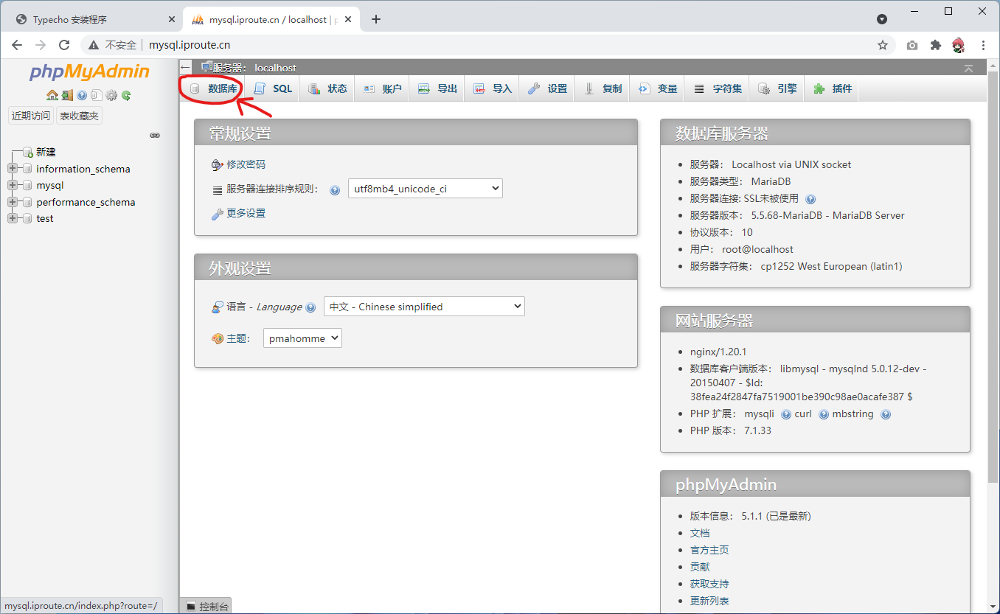

输入数据库名之后，就可以点击创建

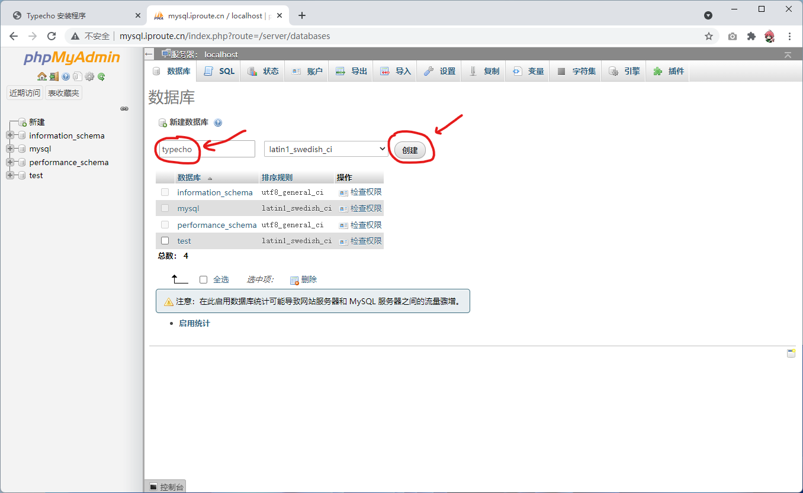

# 3、安装博客系统

下面就可以开始进入网站安装的部分了，访问博客系统页面

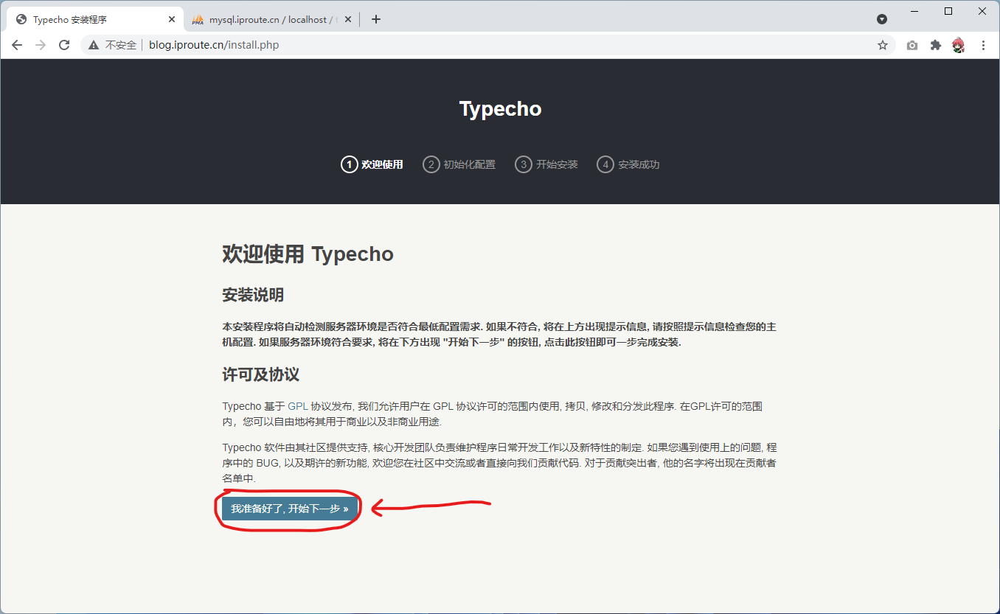

填写数据库密码和网站后台管理员密码

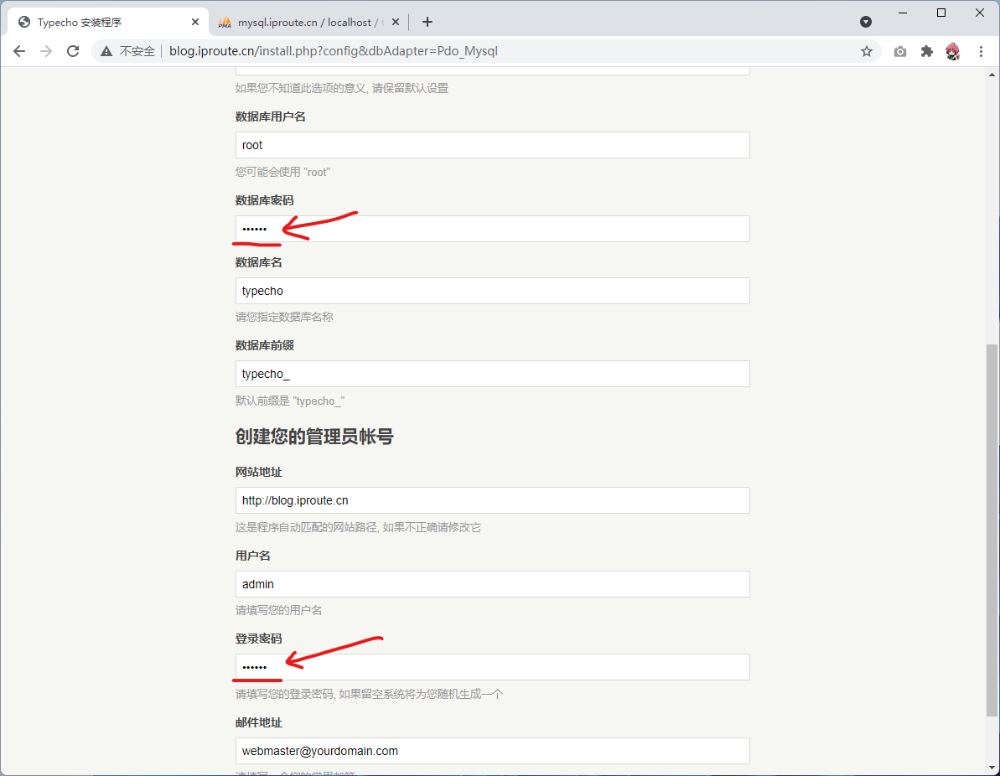

点击开始安装之后，会出现了如下页面，这个是因为php的用户是www用户，而/code/typecho文件夹

是root用户的，所以这个网站根本没有权限保存数据相关的配置到文件夹中

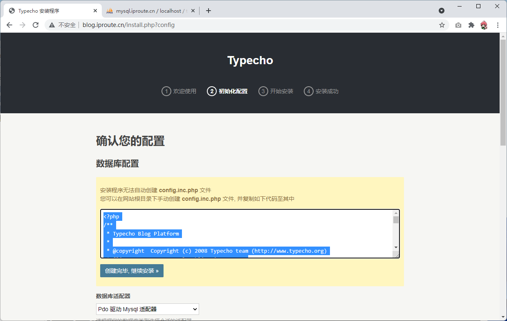

方法一：直接将typecho文件夹赋予www权限

方法二：手动去帮助网站创建网站没有权限的配置文件，下面将会演示方法二

直接在/code/typecho下创建 config.inc.php 文件，然后将网页提示内容写入这个文件中

```
vim /code/typecho/config.inc.php
复制网页上的内容进去
```

配置文件创建完成之后，可以点击 创建完毕，继续安装>>

下面是安装成功的页面

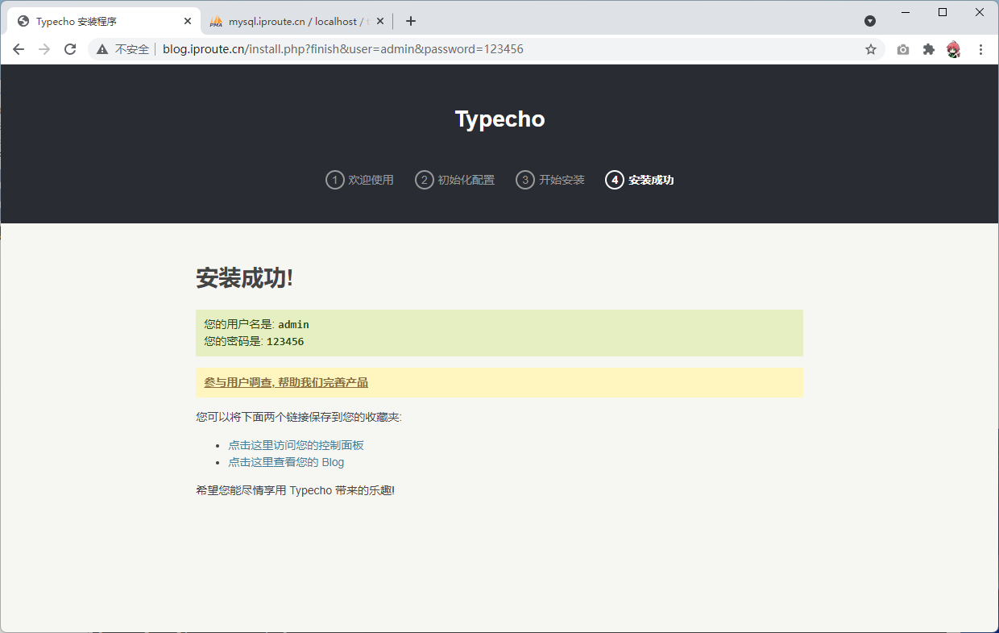

# 4、切换主题

默认的主题如下，界面比较的简洁，我们可以给这个网站替换主题，也可以借此加深熟悉我们对Linux命

令行的熟练程度

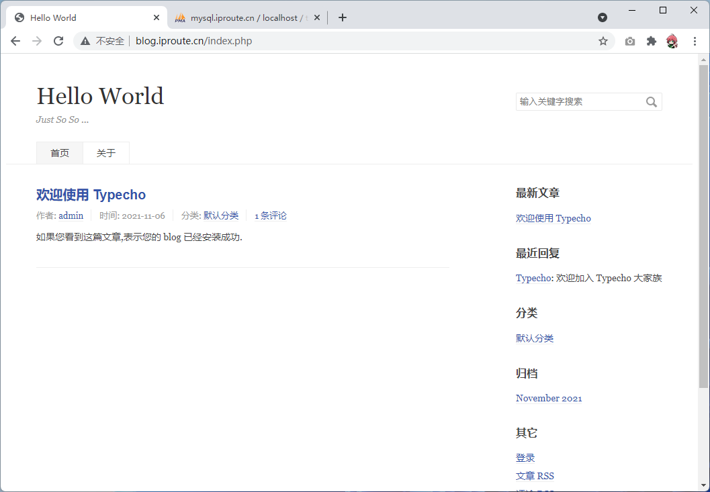

打开官方主题站：[https://typecho.me/](https://typecho.me/)

这边以这个主题为例

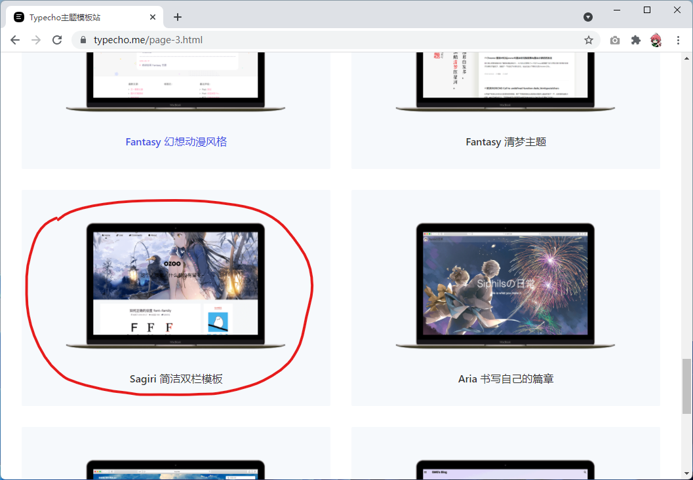

点击模板下载

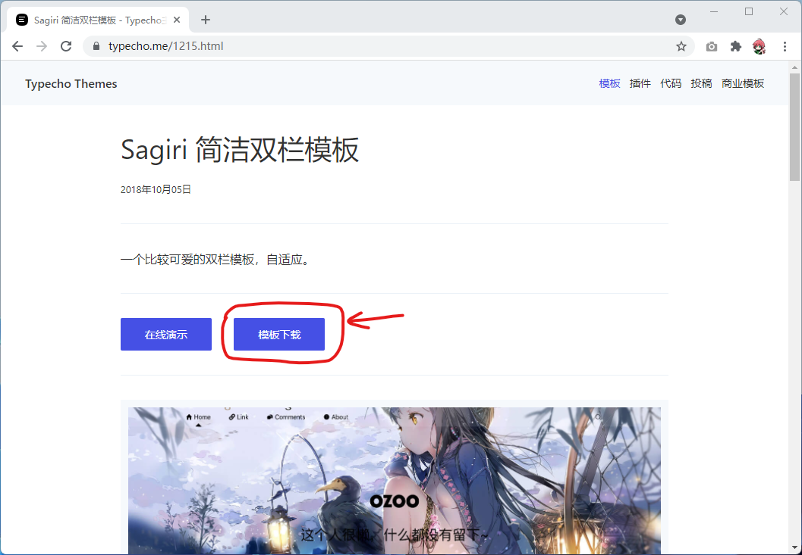

点击下载压缩包

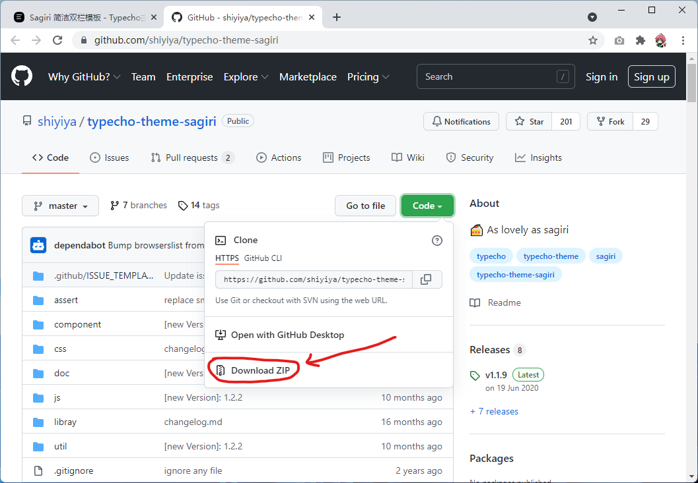

将主题上传到博客主题的目录 /code/typecho/usr/themes

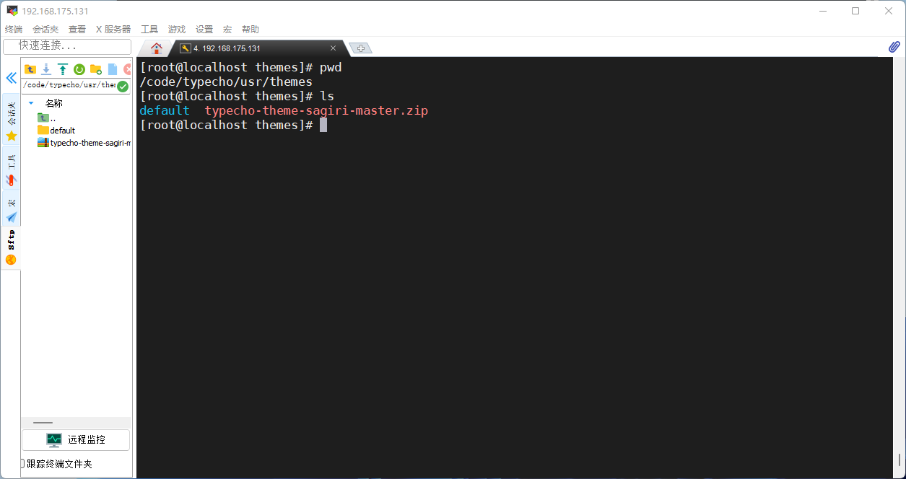

```
# 解压压缩包，并且将主题文件夹重命名
unzip typecho-theme-sagiri-master.zip
mv typecho-theme-sagiri-master sagiri
# 可以删除旧的压缩包文件
rm -rf typecho-theme-sagiri-master.zip
```

进入网站后台切换主题，在地址后面加上 /admin 就可以进入后台登录页面了

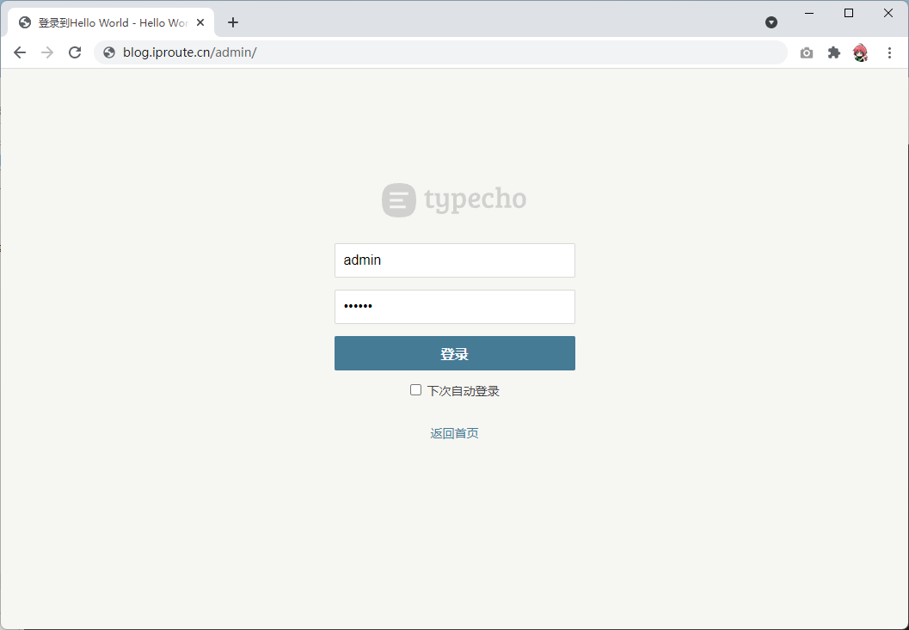

启用我们刚刚安装的主题

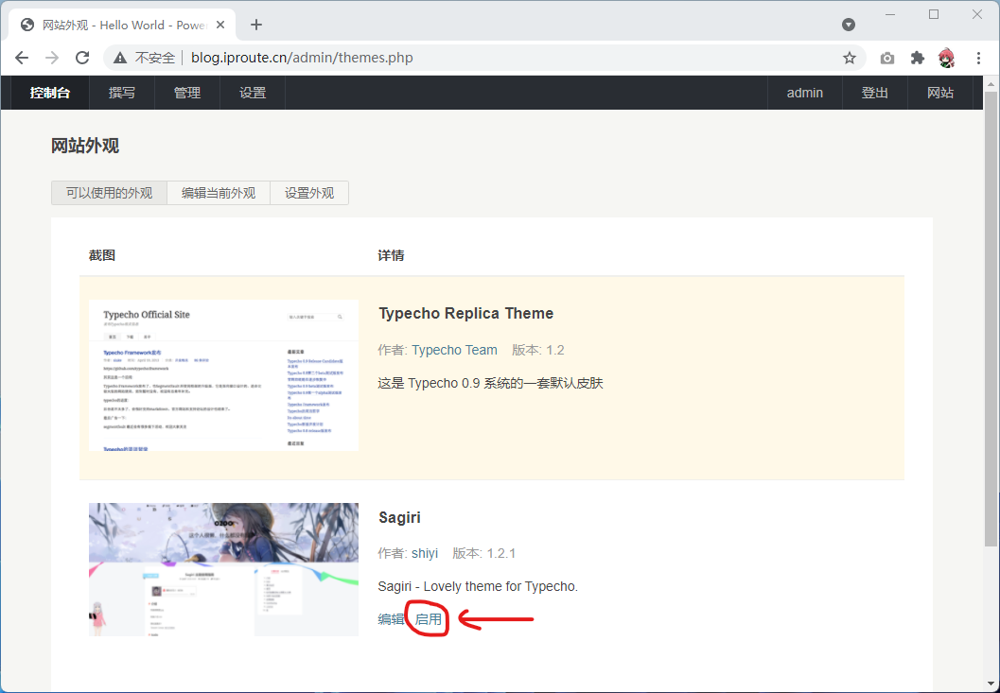

访问网页前端，查看最终的效果

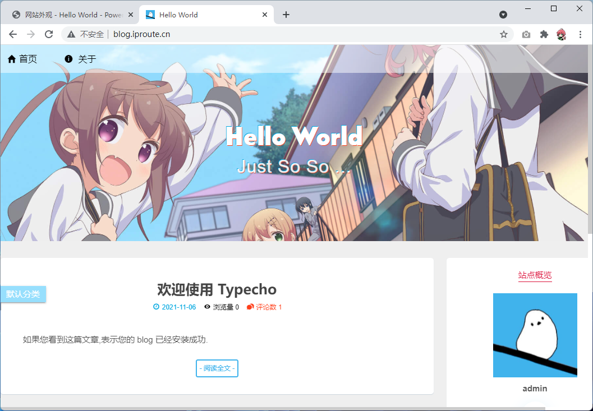