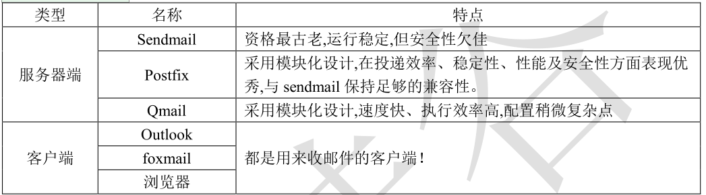

# 一. .邮件 概述


电子邮件服务器是处理邮件交换的软硬件设施的总称，包括电子邮件程序、电子邮箱等。为用户提供


基于 E-mail 服务的电子邮件系统，人们通过访问服务器实现邮件的交换。


常见的邮件服务器





---

# 二. .邮件应用协议


SMTP 简单邮件传输协议（发邮件）TCP 25 端口，加密时使用 TCP 465 端口


POP3 第三版邮局协议（收邮件）TCP 110 端口，加密时使用 TCP 995 端口


IMAP4 第四版互联网邮件访问协议（收邮件）TCP 143 端口，加密时使用 TCP 993 端口


---

# 三. 软件 相关


软件 名：Postfix


主目录：/etc/postfix


主配置文件：main.cf


```javascript
myhostname:	邮件服务器主机名
mydomain:		邮件域
myorigin:		设置允许发信的用户的邮件域
mydestination:	设置允许收信的用户的邮件域

```

