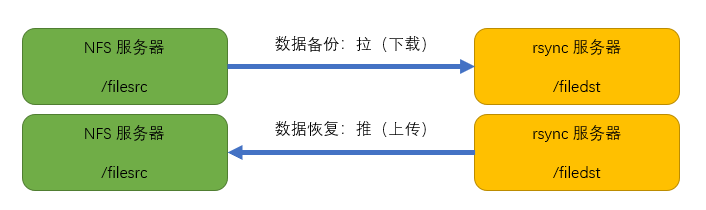

# 1. rsync 概述

  rsync 是类 unix 系统下的数据镜像备份工具。一款支持快速完全备份和增量备份的工具，支持本
地复制，远程同步等，类似于 scp 命令；rsync 命令在同步文件之前要先登录目标主机进行用户身份
认证，认证过后才能进行数据同步，身份认证方式取决于所使用的协议类型，rsync 一般使用两种协
议进行数据同步：ssh 协议和 rsync 协议。

---

# 2. rsync 特性

⚫ 能更新整个目录树和文件系统

⚫ 有选择性的保留符号链接、硬链接、文件属性、权限、设备以及时间等

⚫ 对于安装来说，无任何特殊权限要求

⚫ 对于多个文件来说，文件传输效率高

⚫ 能用 ssh 或自定义端口作为传输入口端口

---

### 3. rsync 工作原理

既然涉及到数据同步，必要的两个概念是：源地址（文件），目标地址（文件），以及以哪一方

为基准，例如，想让目标主机上的文件和本地文件保持同步，则是以本地文件为同步基准，将本地文

件作为源文件推送到目标主机上。

- rsync 在进行数据同步之前需要先进行用户身份验证，验证方式取决于使用的连接方式：

- ssh 登录验证模式 ：使用 ssh 协议作为基础进行用户身份认证，然后进行数据同步。

- rsync 登录验证模式 ：使用 rsync 协议进行用户身份认证（非系统用户），然后进行数据同步。

数据同步方式 ：推送（上传）、拉取（下载）