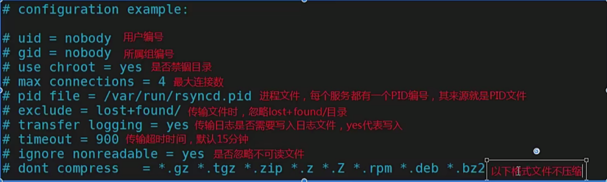

**一、RSYNC概述**

# 1、什么是rsync （sync,同步）

- rsync的好姐妹

- sync同步：刷新文件系统缓存，强制将修改过的数据块写入磁盘，并且更新超级块。

- async异步：将数据先放到缓冲区，再周期性（一般是30s)的去同步到磁盘。

- rsync远程同步：remote synchronous

- 数据同步过程

- sync数据同步=>保存文件（目标）=>强制把缓存中的数据写入磁盘（立即保存），实时性要求比较高的场景

- async数据异步=>保存文件（目标)=>将数据先放到缓冲区，再周期性（一般是30s)的去同步到磁盘，适合大批量数据同步的场景

```
-v, --verbose 详细模式输出。
-q, --quiet 精简输出模式。
-c, --checksum 打开校验开关，强制对文件传输进行校验。
-a, --archive 归档模式，表示以递归方式传输文件，并保持所有文件属性，等于-rlptgoD。
-r, --recursive 对子目录以递归模式处理。
-R, --relative 使用相对路径信息。
-b, --backup 创建备份，也就是对于目的已经存在有同样的文件名时，将老的文件重新命名为~filename。可以使用--suffix选项来指定不同的备份文件前缀。
--backup-dir 将备份文件(如~filename)存放在在目录下。
-suffix=SUFFIX 定义备份文件前缀。
-u, --update 仅仅进行更新，也就是跳过所有已经存在于DST，并且文件时间晚于要备份的文件，不覆盖更新的文件。
-l, --links 保留软链结。
-L, --copy-links 想对待常规文件一样处理软链结。
--copy-unsafe-links 仅仅拷贝指向SRC路径目录树以外的链结。
--safe-links 忽略指向SRC路径目录树以外的链结。
-H, --hard-links 保留硬链结。
-p, --perms 保持文件权限。
-o, --owner 保持文件属主信息。
-g, --group 保持文件属组信息。
-D, --devices 保持设备文件信息。
-t, --times 保持文件时间信息。
-S, --sparse 对稀疏文件进行特殊处理以节省DST的空间。
-n, --dry-run现实哪些文件将被传输。
-w, --whole-file 拷贝文件，不进行增量检测。
-x, --one-file-system 不要跨越文件系统边界。
-B, --block-size=SIZE 检验算法使用的块尺寸，默认是700字节。
-e, --rsh=command 指定使用rsh、ssh方式进行数据同步。
--rsync-path=PATH 指定远程服务器上的rsync命令所在路径信息。
-C, --cvs-exclude 使用和CVS一样的方法自动忽略文件，用来排除那些不希望传输的文件。
--existing 仅仅更新那些已经存在于DST的文件，而不备份那些新创建的文件。
--delete 删除那些DST中SRC没有的文件。
--delete-excluded 同样删除接收端那些被该选项指定排除的文件。
--delete-after 传输结束以后再删除。
--ignore-errors 及时出现IO错误也进行删除。
--max-delete=NUM 最多删除NUM个文件。
--partial 保留那些因故没有完全传输的文件，以是加快随后的再次传输。
--force 强制删除目录，即使不为空。
--numeric-ids 不将数字的用户和组id匹配为用户名和组名。
--timeout=time ip超时时间，单位为秒。
-I, --ignore-times 不跳过那些有同样的时间和长度的文件。
--size-only 当决定是否要备份文件时，仅仅察看文件大小而不考虑文件时间。
--modify-window=NUM 决定文件是否时间相同时使用的时间戳窗口，默认为0。
-T --temp-dir=DIR 在DIR中创建临时文件。
--compare-dest=DIR 同样比较DIR中的文件来决定是否需要备份。
-P 等同于 --partial。
--progress 显示备份过程。
-z, --compress 对备份的文件在传输时进行压缩处理。
--exclude=PATTERN 指定排除不需要传输的文件模式。
--include=PATTERN 指定不排除而需要传输的文件模式。
--exclude-from=FILE 排除FILE中指定模式的文件。
--include-from=FILE 不排除FILE指定模式匹配的文件。
--version 打印版本信息。
--address 绑定到特定的地址。
--config=FILE 指定其他的配置文件，不使用默认的rsyncd.conf文件。
--port=PORT 指定其他的rsync服务端口。
--blocking-io 对远程shell使用阻塞IO。
-stats 给出某些文件的传输状态。
--progress 在传输时现实传输过程。
--log-format=formAT 指定日志文件格式。
--password-file=FILE 从FILE中得到密码。
--bwlimit=KBPS 限制I/O带宽，KBytes per second。
-h, --help 显示帮助信息。
```

#  2、本地文件同步

本地文件同步简单理解就是把文件从一个位置（同步=>拷贝）到另外一个位置（类似cp)】

案例：/dir1、/dir2与/dir3,/dir1中创建三个文件file1、file2、fle3,使用rsync本地同步

```
[root@server1 ~]# mkdir /dirl    
[root@server1 ~]# mkdir /dir2
[root@server1 ~]# mkdir /dir3
[root@server1 ~]# touch /dir1/file(1..3)
[root@server1 ~]# rsync -av /dir1/ /dir2    //=> /dir1目录中的所有文件拷贝到/dir2目录中
[root@server1 ~]# rsync -av /dir1 /dir3     //=> 把/dir1目录整体同步到/d1r3目录中
```

案例：rsync-R选项的应用（保留相对路径）

```
rsync -avR /dir1/  /dir2
```

案例：rsync  -delete:删除目标目录里多余的文件

```
[root@server1 ~]# rsync -av --delete /dir1/ /dir2
//    /dir1        =====        /dir2
//    file1、file2             file1l、file2、file3
//    rsync-deletel同步后，会自动删除file3文件。（让dirl与dir2目录中的文件高度一致）
```

# 3、远程文件同步

首先准备两台服务器,然后执行以下操作。

- 第一步：关闭防火墙与SELinux

```
systemctl stop firewalld
systemctl disable firewalld
setenforce 0
vim /etc/selinux/config
SELINUX=disabled
```

- 第二步：更改主机名称

```
hostnamectl set-hostname code.itcast.cn
hostnamectl set-hostname backup.itcast.cn
```

- 第三步：更改IP地址（静态P)

```
vim /etc/sysconfig/network-scripts/ifcfg-ens33
BOOTPROTO="none"
IPADDR=10.1.1.10
NETMASK=255.255.255.0
GATEWAY=10.1.1.2
DNS1=8.8.8.8
DNS2=114.114.114.114
```

- 第四步：关闭NetworkManager

```
systemctl stop NetworkManager
systemctl disable NetworkManager
```

- 第六步：时间同步

```
ntpdate cn.ntp.org.cn
```

- Push:上传文件到远程服务器端

```
rsync-av 本地文件或目录 远程用户名@远程服务器的IP地址：目标路径
```

案例：把linux.txt文档传输到远程服务器端(push)

```
rsync -av linux.txt root@192.168.23.12：/root/rsync
```

- Pull:下载文件到本地服务器端

```
rsync-av 远程用户名@远程服务器的IP:目标文件或目录 本地存储位置
```

案例：把远程服务器的/etc/hosts.文件下载到本地

```
rsync -av root@10.1.1.100:/etc/hosts ./
```

问题2：如果Backup服务器端更改了SSH的默认密码，那这个数据该如何？

```
rsync -e "ssh -p 10086" -av rsync.txt root@10.1.1.100:/root
```

# 4、rsync作为系统服务

默认情况下，rsyc只是作为一个命令来进行使用的(ps在查询进程时，找不到对应的服务)，但是rsyc提供了一种作为系统服务的实现方式。

- 思路：

- 对外提供服务一一>端口监呀一一>启动服务一一>启动脚本（没有）一一>配置文件（修改需求)

Centos7中，直接启动即可

```
systemctl start rsyncd
```

**注：如果rsync作为系统服务单独运行，则其底层就不需要SSH服务了！**

- 配置文件：vim /etc/rsyncd.conf



# 5、给RSYNC服务添加密码

- 环境

backup:10.1.1.250	/backup

appl-server 10.1.1.1	app/java_project

①修改主配置文件：

```
motd file=/etc/rsyncd.welcome    //消息文件
[app1]
comment=xxxx        //共享给客户端看到的名字，可以自己定义
path=/app/java_project            //路径
auth users=user1,user2             //用户名
secrets file=/etc/rsyncd.secrets    //密码文件
```

②创建安全用户，该文件不能被其他人查看

```
[root@app1-server~]#vim /etc/rsyncd.secrets
user1:123            //用户名：密码
user2:123
[rooteapp1-server ~]11 /etc/rsyncd.secrets
-rw-r--r--1 root root 20 Aug 29 09:57 /etc/rsyncd.secrets
[rooteapp1-server ~]chmod 600 /etc/rsyncd.secrets    
```

# 6、实时同步rsync（结合INOTIFY）

- 第一步：早Code服务器端，安装inotify-tools工具（监控器）

```
[root@server1 ~]# yum install -y inotify-tools
[root@server1 ~]# rpm -ql inotify-tools 
/usr/bin/inotifywait             #等待
/usr/bin/inotifywatch            #看守
```

- 第二步，编写inotify脚本：inotify脚本

```
#!/bin/bash
/usr/bin/inotifywait -mrq -e modify,delete,create,attrib,move /root/dir1 |while read events
do
    rsync -a --delete /dir1 /dir2/
    echo"`date+%F\%T`出现事件$events">>/var/log/rsync.log 2>&1
done
```

- 第三步：添加可执行权限

```
chmod +x inotify.sh
```

- 第四步：让inotify.sh一直执行下去

```
# nohup ./inotify.sh    &        #让这个脚本一直在后台运行。即使关闭终端，也会继续运行。
```

### inotifywait命令参数

```
-m    是要持续监视变化。
-r    使用递归形式监视目录。
-q    减少冗余信息，只打印出需要的信息。
-e    指定要监视的事件列表。
--timefmt是    指定时间的输出格式。
--format    指定文件变化的详细信息。
```

| 事件 | 描述 | 
| -- | -- |
| access | 访问 | 
| modify | 修改 | 
| attrib | 属性 | 
| move | 移动 | 
| create | 创建 | 
| open | 打开 | 
| close | 关闭 | 
| delete | 删除 | 
