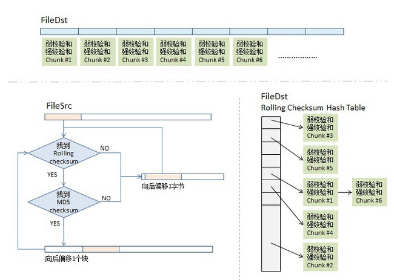

**RSYNC**

# 1、什么是RSYNC

- rsync是类unix下的一款数据镜像备份工具——remote sync。

- Rsync 的基本特点如下：

- 可以镜像保存整个目录树和文件系统；

- 可以很容易做到保持原来文件的权限、时间、软硬链接等；

- 无须特殊权限即可安装；

- 优化的流程，文件传输效率高；

- 可以使用 rcp、ssh 等方式来传输文件，当然也可以通过直接的 socket 连接；

- 支持匿名传输；

- rsync的主要特点就是**增量传输**，只对变更的部分进行传送。

# 2、RSYNC原理

rsync 是 linux 下同步文件的一个高效算法，用于同步更新两处计算机的文件和目录，并适当利用查找

文件中的不同块以减少数据传输。 rsync 的主要特点就是增量传输，只对变更的部分进行传送。

## 1)增量同步算法

假如我们现在需要同步两个文件保持一致，并且只想传送不同的部分，那么我们就需要对两边的文件做diff ，但是这两个文件在两台不同的机器上，无法做 diff 。如果我们做 diff ，就要把一个文件传到另一台机器上做 diff ，但这样一来，我们就传了整个文件，这与我们只想传输不同部的初衷相背。于是我们就要想一个办法，让这两边的文件见不到面，但还能知道它们间有什么不同。这就是 rsync 的算法。

## 2)rsync同步算法

我们将同步源文件名称为 fileSrc ，同步目的文件叫 fileDst 。

### **1-分块Checksum 算法**

**找到文件不同的地方**

首先，我们会把 fileDst 的文件平均切分成若干个小块，比如每块 512 个字节（最后一块会小于这个数），然后对每块计算两个 checksum :

1. 一个叫 rolling checksum ，是弱 checksum ， 32 位的 checksum

1. 另一个是强 checksum ， 128 位的，以前用 md4 ，现在用 md5 hash 算法。

为什么要这样？因为若干年前的硬件上跑 md4 的算法太慢了，所以，我们需要一个快算法来鉴别文件块的不同，但是弱的 adler32 算法碰撞概率太高了，所以我们还要引入强的 checksum 算法以保证两文件块是相同的。也就是说，弱的 checksum 是用来区别不同，而强的是用来确认相同。

### 2-传输算法

同步目标端会把 fileDst 的一个 checksum 列表传给同步源，这个列表里包括了三个东西， rolling checksum(32bits)，md5 checksume(128bits) ，文件块编号。

同步源机器拿到了这个列表后，会对 fileSrc 做同样的 checksum ，然后和 fileDst 的 checksum 做对

比，这样就知道哪些文件块改变了。

但是，聪明的你一定会有以下两个疑问：

如果我 fileSrc 这边在文件中间加了一个字符，这样后面的文件块都会位移一个字符，这样就完全和fileDst 这边的不一样了，但理论上来说，我应该只需要传一个字符就好了。这个怎么解决？

如果这个 checksum 列表特别长，而我的两边的相同的文件块可能并不是一样的顺序，那就需要查找，线性的查找起来应该特别慢吧。这个怎么解决？

很好，让我们来看一下同步源端的算法。

### 3-checksum 查找算法

同步源端拿到 fileDst 的 checksum 数组后，会把这个数据存到一个 hash table （特殊的数据结构体，可以快速检索）中，用 rolling checksum 做 hash ，以便获得 O(1) 时间复杂度的查找性能。这个 hash table 是 16bits 的，所以， hash table 的尺寸是 2的16次方 ，对 rolling checksum hash 会被散列到 0 到 2^16 – 1 中的某个整数值。

### 4.-比对算法

1. 取 fileSrc 的第一个文件块（我们假设的是 512 个长度），也就是从 fileSrc 的第 1 个字节到第

1. 如果查到了，说明发现在 fileDst 中有潜在相同的文件块，于是就再比较 md5 的 checksum ，因为 rolling checksume 太弱了，可能发生碰撞。于是还要算 md5 的 128bits 的 checksum ，这样一来，我们就有 2^-(32+128) = 2^-160 的概率发生碰撞，这太小了可以忽略。如果 rolling checksum 和 md5 checksum 都相同，这明在 fileDst 中有相同的块，我们需要记下这一块在fileDst 下的文件编号。

1. 如果 fileSrc 的 rolling checksum 没有在 hash table 中找到，那就不用算 md5 checksum了。表示这一块中有不同的信息。总之，只要 rolling checksum 或 md5 checksum 其中有一个在 fileDst 的 checksum hash 表中找不到匹配项，那么就会触发算法对 fileSrc 的 rolling 动作。于是，算法会住后 step 1 个字节，取 fileSrc 中字节 2-513 的文件块要做 checksum，go to

(1.) – 现在你明白什么叫 rolling checksum 了吧。

1. 这样，我们就可以找出 fileSrc 相邻两次匹配中的那些文本字符，这些就是我们要往同步目标端传的文件内容了。

### 5-传输

最终在同步源这端，我们的 rsync 算法可能会得到这个样子的一个数据数组，图中，红色块表示在目标端已匹配上，不用传输（注：我专门在其中显示了两块 chunk #5 ，代表数据中有复制的地方，不用传输），而白色的地方就是需要传输的内容（注意：这些白色的块是不定长的），这样，同步源这端把这个数组（白色的就是实际内容，红色的就放一个标号）压缩传到目的端，在目的端的 rsync 会根据这个

表重新生成文件，这样，同步完成。

参考博客：

[https://segmentfault.com/a/1190000018391604?utm_source=tag-newest](https://segmentfault.com/a/1190000018391604?utm_source=tag-newest)