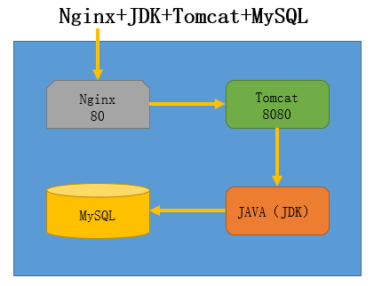
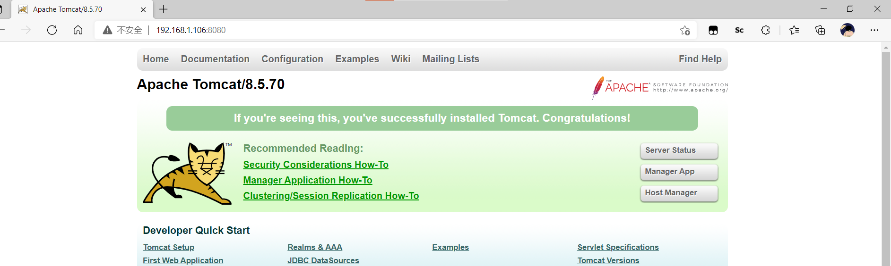
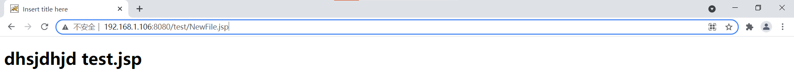





# **1.初识 Tomcat
**

Tomcat 服务器是一个免费的开放源代码的 Web 应用服务器，属于轻量级应用服务器，在中小型
系统和并发访问用户不是很多的场合下被普遍使用，是开发和调试 JSP 程序的首选。Tomcat 是 Apache
服务器的扩展，但运行时它是独立运行的，所以当你运行 tomcat 时，它实际上作为一个与 Apache 独
立的进程单独运行的。

# **2.JavaWeb环境 ：Nginx+ JDK+Tomcat+ MySQL**



# **
**

1. 所有服务部署在同一个主机上，也可
分开部署

2. Nginx 默认开启的是 80 端口，用来接
收用户的 web 请求

3. Tomcat 默认开启的是 8080 端口，用
来接收 Nginx 转发过来的 web 请求

# **3.环境部署流程
**

# **1. 安装 JDK （java 解析器）
**

## ** 1 、 首先安装 gcc
**

```javascript
# yum -y install gcc
```

## **2 、 将软件包 上传、解压、 并移至指定位置
**

```javascript
# mv jdk1.8.0_181/ /usr/local/jdk1.8
```

## **3 、 配置 JDK 的环境变量
**

```javascript
# vim /etc/profile #添加以下内容
export JAVA_HOME=/usr/local/jdk1.8
export JAVA_BIN=/usr/local/jdk1.8/bin
export PATH=$PATH:$JAVA_HOME/bin
export CLASSPATH=.:$JAVA_HOME/lib/dt.jar:$JAVA_HOME/lib/tools.jar
# source /etc/profile
```

## ** 4 、 查看java 是否安装成功
**

```javascript
# java -version
[root@localhost ~]# java -version
java version "1.7.0_99"		#显示版本，成功配置；
OpenJDK Runtime Environment (rhel-2.6.5.1.el6-x86_64 u99-b00)
OpenJDK 64-Bit Server VM (build 24.95-b01, mixed mode)

```



# **2. 安装 tomcat
**

## **1 、将软件包 上传 、 解压 、并复制到指定目录下
**

```javascript
# cp -a 解压目录 /usr/local/tomcat
```

## **2 、 配置 Tomcat 的环境变量
**

```javascript
# vim /etc/profile
export TOMCAT_HOME=/usr/local/tomcat
export PATH=$PATH:$TOMCAT_HOME/bin
# source /etc/profile
```

## **3 、将tomcat 的启动脚本赋予执行权限
**

```javascript
# chmod +x /usr/local/tomcat/bin/*
```

## **4 、 开启 tomcat
**

```javascript
# /usr/local/tomcat/bin/catalina.sh start
# netstat -antp #查看端口8080，确认是否启动
```

## **5 、 在客户端 访问页面 进行测试 192.168.10.20:8080**



## **
**

# **3. 安装 MySQL 数据库
**

## ** 1 、 安装依赖包 ncurses- - devel
**

```javascript
# yum -y install ncurses-devel gcc
```

## **2 、将mysql 文件进行传输到192.168.20.10 上 进行 安装
**

```javascript
# useradd -r -s /sbin/nologin mysql
# ./configure --prefix=/usr/local/mysql --with-charset=utf8
--with-collation=utf8_general_ci --with-extra-charsets=gbk,gb2312
# make
# make install
```

## **3 、生成配置文件
**

```javascript
# cp -a support-files/my-medium.cnf /etc/my.cnf
# ln -s /usr/local/mysql/bin/* /usr/local/bin/
# ln -s /usr/local/mysql/sbin/* /usr/local/sbin/
```

## **4 、初始化数据库 ，生成授权表
**

```javascript
# cd /usr/local/mysql
# ./bin/mysql_install_db --user=mysql
```

## **5 、生成启动管理脚本，启动mysql 并设置开机自启
**

```javascript
# cd ~/mysql-5.1.55/support-files
# cp -a mysql.server /etc/init.d/mysqld
# chmod +x /etc/init.d/mysqld
# chkconfig --add mysqld
# chkconfig mysqld on
# service mysqld start|stop|restar
```

## **6 、为数据库的管理用户root 设置登录密码
**

```javascript
# mysqladmin -uroot password 123456
```

## **7 、 登录数据库，查看是否安装正确**

```javascript
[root@localhost ~]# mysql -uroot -p123456
Welcome to the MySQL monitor.  Commands end with ; or \g.
Your MySQL connection id is 1
Server version: 5.5.62-log Source distribution

Copyright (c) 2000, 2018, Oracle and/or its affiliates. All rights reserved.

Oracle is a registered trademark of Oracle Corporation and/or its
affiliates. Other names may be trademarks of their respective
owners.

Type 'help;' or '\h' for help. Type '\c' to clear the current input statement.

mysql> 

mysql> show databases;				#安装成功
+--------------------+
| Database           |
+--------------------+
| information_schema |
| mysql              |
| performance_schema |
| test               |
+--------------------+
4 rows in set (0.01 sec)

mysql> 

```



# **4. 安装 nginx
**

## ** 1 、 解压 nginx
**

```javascript
# tar -xf nginx-1.2.6.tar.gz
```

## **2 、安装nginx 依赖包
**

```javascript
# yum -y install pcre-devel zlib-devel gcc
```

## **3 、添加用户
**

```javascript
# useradd -r -s /sbin/nologin nginx
```

## **4 、编译并安装
**

```javascript
# ./configure --user=nginx --group=nginx
# make
# make install
```

## **5 、修改nginx 配置文件
**

```javascript
# vim /usr/local/nginx/conf/nginx.conf
user nginx;
.....
upstream tomcat { 		#添加负载调度（为了后期扩展更多 Tomcat 服务器方便）
server 192.168.10.20:8080;
}
server{
    .......
    location / { 		#添加反向代理
    .....
    	proxy_pass http://tomcat;
    	proxy_set_header Host $host;
    }
    .....
}
```

## **6 、 重启服务
**

```javascript
# pkill -HUP nginx
```

## **7 、 在客户端进行测试，输入nginx 地址，打开的为tomcat 部署的网站
**

# **4. 部署JAVA 的WAR 包
**

## **1 、 在 /usr/lo cal/tomcat /conf /server.xml 配置文件中的 server 区域中添加标 红 内容
**

```javascript
<Host name="localhost" appBase="webapps" unpackWARs="true" autoDeploy="true">
<Context path="" docBase="test.war" debug="0" privileged="true"/>
```

## **2 、将war 包 拷贝到webapps 目录 中
**

```javascript
# cp -a test.war /usr/local/tomcat/webapps/
```

## **3、 删除 网站的 ROOT目录
**

```javascript
# rm -rf ROOT
```

## **4 、 重启tomcat 服务
**

```javascript
# /usr/local/tomcat/bin/catalina.sh stop
# /usr/local/tomcat/bin/catalina.sh start
```

## **5 、 测试
**

使用客户端浏览访问 Nginx 服务的端口

**注意：原本的 tomcat 使用 8080 端口进行访问，也可以将端口修改为 80 使用 IP 直接访问，修改
**

**/usr/local/tomcat/conf/server.xml 配置中的 8080 改变为 80（切记不要和其他 web 服务器冲突）**







# **5. 创建多个tomcat 实例 （ 拓展 ）
**

## **1 、 首先将 tomcat 进行停止
**

```javascript
# /usr/local/tomcat/bin/catalina.sh stop
```

## **2 、 拷贝原来的Tomcat 到另外一个目录，如 tomcat-2， 清除logs 目录
**

```javascript
# cp -a tomcat/ tomcat-2
# rm -rf tomcat-2/logs/*
```

## **3 、 修改 Tomcat-2 中的l /conf/server.xml 文件，把shutdown 和Connector 端口修改成另外的数值，
**

## **关闭端口修改为 8006 ，连接端口 修改为8090
**

```javascript
# vim /usr/local/tomcat-2/conf/server.xml
<Server port=”8006” shutdown=”SHUTDOWN”>
<Connector port=”8090” protocol=”HTTP/1.1”
connectionTimeout=”20000”
redirectPort=”8443”/>
```

## ** 4 、 修改startup.sh 和shutdown.sh 文件
**

```javascript
在第一行均加入：export CATALINA_HOME=/usr/local/tomcat-2
```

## ** 5 、 启动 tomcat
**

```javascript
# /usr/local/tomcat/bin/catalina.sh start
# /usr/local/tomcat-2/bin/catalina.sh start
# netstat -antp #查看 8080 和 8090 端口是否正常启动
```

## **6 、 查看结果
**

浏览 http://192.168.10.20:8080

浏览 http://192.168.10.20:8090

可以直接将 8090 写入配置好的 Nginx 负载均衡中
