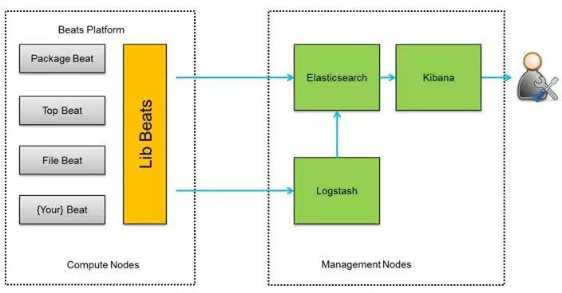

ELK 日志分析

# 1.为什么用到 ELK

一般我们需要进行日志分析场景：直接在日志文件中 grep、awk 就可以获得自己想要的信息。

但在规模较大的场景中，此方法效率低下，面临问题包括日志量太大如何归档、文本搜索太慢怎么办、

如何多维度查询。需要集中化的日志管理，所有服务器上的日志收集汇总。常见解决思路是建立集中

式日志收集系统，将所有节点上的日志统一收集，管理，访问。

一般大型系统是一个分布式部署的架构，不同的服务模块部署在不同的服务器上，问题出现时，

大部分情况需要根据问题暴露的关键信息，定位到具体的服务器和服务模块，构建一套集中式日志系

统，可以提高定位问题的效率。

- 一个完整的集中式日志系统，需要包含以下几个主要特点：

- 收集－能够采集多种来源的日志数据

- 传输－能够稳定的把日志数据传输到中央系统

- 存储－如何存储日志数据

- 分析－可以支持 UI 分析

- 警告－能够提供错误报告，监控机制 ELK 提供了一整套解决方案，并且都是开源软件，之间互相配
合使用，完美衔接，	高效的满足了很多场合的应用。目前主流的一种日志系统。

---

# 2. ELK 简介

ELK 是三个开源软件的缩写，分别表示：Elasticsearch , Logstash, Kibana , 它们都是开源软件。新增了

一个 FileBeat，它是一个轻量级的日志收集处理工具(Agent)，Filebeat 占用资源少，适合于在各个服务

器上搜集日志后传输给 Logstash，官方也推荐此工具。

Elasticsearch 是个开源分布式搜索引擎，提供搜集、分析、存储数据三大功能。它的特点有：分布式，

零配置，自动发现，索引自动分片，索引副本机制，restful 风格接口，多数据源，自动搜索负载等。

Logstash 主要是用来日志的搜集、分析、过滤日志的工具，支持大量的数据获取方式。一般工作方式

为 c/s 架构，client 端安装在需要收集日志的主机上，server 端负责将收到的各节点日志进行过滤、修

改等操作在一并发往 elasticsearch 上去。

Kibana 也是一个开源和免费的工具，Kibana 可以为 Logstash 和 ElasticSearch 提供的日志分析友好

的 Web 界面，可以帮助汇总、分析和搜索重要数据日志。

Filebeat 隶属于 Beats。目前 Beats 包含四种工具：

- Packetbeat（搜集网络流量数据）

- Topbeat（搜集系统、进程和文件系统级别的 CPU 和内存使用情况等数据）

- Filebeat（搜集文件数据）

- Winlogbeat（搜集 Windows 事件日志数据）

