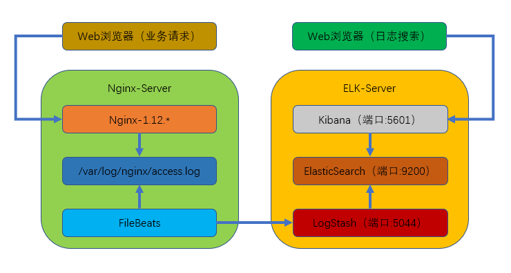

实验部署


本次部署的是 filebeats(客户端)，logstash+elasticsearch+kibana(服务端)组成的架构。


业务请求到达 nginx-server 机器上的 Nginx； Nginx 响应请求，并在 access.log 文件中增加访问记


录； FileBeat 搜集新增的日志，通过 LogStash 的 5044 端口上传日志； LogStash 将日志信息通过本


机的 9200 端口传入到 ElasticSerach； 搜索日志的用户通过浏览器访问 Kibana，服务器端口是 5601；


Kibana 通过 9200 端口访问 ElasticSerach；





---

实验环境：


本次部署的是单点 ELK 用了两台机器(CentOS-7.5)


ELK 服务端：192.168.88.100


Nginx 客户端：192.168.88.110


---

# 1. 准备 工作： ：


配置好网络 yum 源


```javascript
# wget http://mirrors.aliyun.com/repo/Centos-7.repo
# wget http://mirrors.aliyun.com/repo/epel-7.repo
```

关闭防火墙：systemctl stop(disable) firewalld


关闭 SELinux：SELINUX=disabled


---

# 2. 下载并安装软件包： ：


```javascript
# mkdir /elk  
# cd /elk
# wget https://artifacts.elastic.co/downloads/elasticsearch/elasticsearch-6.2.3.tar.gz
# wget https://artifacts.elastic.co/downloads/logstash/logstash-6.2.3.tar.gz
# wget https://artifacts.elastic.co/downloads/kibana/kibana-6.2.3-linux-x86_64.tar.gz
```

全部解压缩，并复制到/usr/local/目录下


---

# 3. 装安装 JDK(java) 环境 工具： ：


```javascript
# yum -y install java-1.8*
```


---

# 4. 配置 elasticsearch ：


## 1) 新建 elasticsearch 用户并启动(用 elasticsearch 普通用户启动)


```javascript
# useradd elasticsearch
# chown -R elasticsearch.elasticsearch /usr/local/elasticsearch-6.2.3/
# su - elasticsearch
# cd /usr/local/elasticsearch-6.2.3/
# ./bin/elasticsearch -d
```

## 2) 查看进程是否启动成功（等待一下）


```javascript
# netstat -antp		#端口号：9200

```

## 3) 若出现错误可以查看日志


```javascript
# cat /usr/local/elasticsearch-6.2.3/logs/elasticsearch.log
```

## 4) 测试是否可以正常访问


```javascript
# curl localhost:9200

[elasticsearch@bogon ~]$ curl localhost:9200     #启动成功后可以查看；
{
  "name" : "-tjybV-",
  "cluster_name" : "elasticsearch",
  "cluster_uuid" : "tbcyjbLRTpSNa6Rq5RlVUA",
  "version" : {
    "number" : "6.2.3",
    "build_hash" : "c59ff00",
    "build_date" : "2018-03-13T10:06:29.741383Z",
    "build_snapshot" : false,
    "lucene_version" : "7.2.1",
    "minimum_wire_compatibility_version" : "5.6.0",
    "minimum_index_compatibility_version" : "5.0.0"
  },
  "tagline" : "You Know, for Search"
}

```


---

# 5.配置 logstash


Logstash 收集 nginx 日志之使用 grok 过滤插件解析日志，grok 作为一个 logstash 的过滤插件，支持根


据模式解析文本日志行，拆成字段。


## 1) logstash 中 grok 的正则匹配


```javascript
[elasticsearch@bogon local]$ exit
exit
[root@bogon local]# cd /usr/local/logstash-6.2.3/
[root@bogon logstash-6.2.3]# vim vendor/bundle/jruby/2.3.0/gems/logstash-patterns-core-4.1.2/patterns/grok-patterns
#Nginx log      
WZ ([^ ]*)
NGINXACCESS %{IP:remote_ip} \- \- \[%{HTTPDATE:timestamp}\] "%{WORD:method} %{WZ:request}
HTTP/%{NUMBER:httpversion}" %{NUMBER:status} %{NUMBER:bytes} %{QS:referer} %{QS:agent}
%{QS:xforward}
```

## 2) 创建 logstash 配置文件


```javascript
vim /usr/local/logstash-6.2.3/default.conf
input {
    beats {

    	port => "5044"
    }
}

#数据过滤
filter {
    grok {
    	match => { "message" => "%{NGINXACCESS}" }
    }
    geoip {
    # nginx 客户端 ip
    source => "192.168.88.110"
    }
}

#输出配置为本机的 9200 端口，这是 ElasticSerach 服务的监听端口
output {
    elasticsearch {
    hosts => ["127.0.0.1:9200"]
    }
}
```

## 3) 进入到/usr/local/logstash-6.2.3 目录下，并执行下列命令


```javascript
后台启动 logstash：nohup bin/logstash -f default.conf &
查看启动日志：tailf nohup.out
查看端口是否启动：netstat -napt|grep 5044      #稍等几分钟之后查看
```


---

# 6. 配置 kibana


## 1) 打开 Kibana 配置文件/usr/local/kibana-6.2.3-linux-x86_64/config/kibana.yml，找到下面这行并修改


```javascript
# vim /usr/local/kibana-6.2.3-linux-x86_64/config/kibana.yml
#server.host: "localhost"
修改为
server.host: "192.168.88.100"
这样其他电脑就能用浏览器访问 Kibana 的服务了；
```

## 2) 进入 Kibana 的目录：cd /usr/local/kibana-6.2.3-linux-x86_64


```javascript
执行启动命令：nohup bin/kibana &
查看启动日志：tail -f nohup.out
查看端口是否启动：netstat -napt|grep 5601
```

## 3) 测试：


在浏览器访问 192.168.88.100:5601


到此。ELK 部署完成


---

# 7. Nginx 客户端配置


## 1) yum 安装二进制 nginx 软件包


```javascript
# yum -y install nginx
```

## 2) 下载 filebeat 并解压到/usr/local/


```javascript
# wget https://artifacts.elastic.co/downloads/beats/filebeat/filebeat-6.2.3-linux-x86_64.tar.gz
# tar -xf ./filebeat-6.2.3-linux-x86_64.tar.gz -C /usr/local/
```

## 3) 打开文件/usr/local/filebeat-6.2.3-linux-x86_64/filebeat.yml，找到如下位置：修改三处


```javascript
enable：false 		#修改为 true
paths：/var/log/*.log 	#修改为/var/log/nginx/*.log
#output.elasticsearch: 	#将此行注释掉
#hosts: ["localhost:9200"] #将此行注释掉
output.logstash:		 #取消此行注释
hosts: ["192.168.88.100:5044"] #取消此行注释并修改 IP 地址为 ELK 服务器地址
```

## 4) 切换到/usr/local/filebeat-6.2.3-linux-x86_64 目录下


```javascript
# cd /usr/local/filebeat-6.2.3-linux-x86_64
后台启动 filebeat：nohup ./filebeat -e -c filebeat.yml &
查看日志：tailf nohup.out
```

## 5) 通过浏览器多访问几次 nginx 服务，这样能多制造一些访问日志，访问地址：https://192.168.137.131


## 6) 访问 Kibana：https://192.168.88.100:5601，点击左上角的 Discover，就可以看到访问日志已经被


ELK 搜集了，然后按照下列步骤完成设置


⚫ 输入 logstash-*，点击”Next step”


⚫ 选择 Time Filter，再点击“Create index pattern”


⚫ 然后可自行创建日志内容查询规则