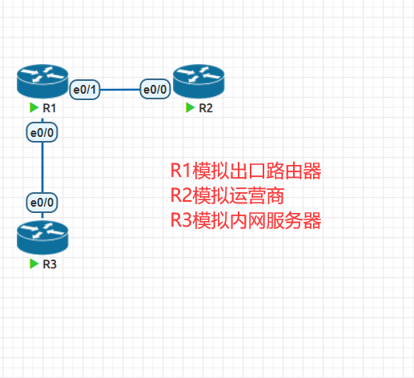
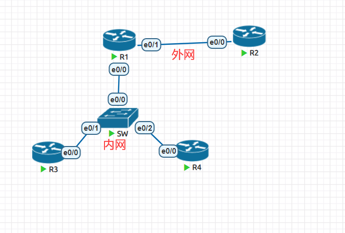
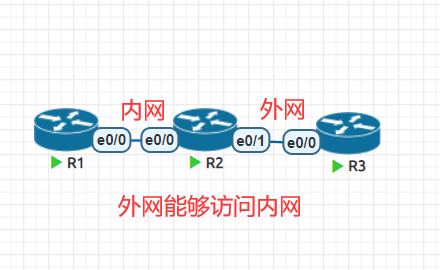
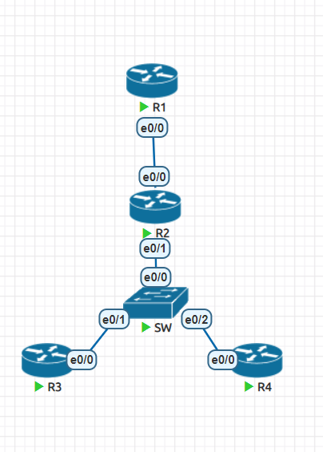

**NAT(Network Address Translation)**

- 当今的互联网是由一个个小的自治系统组成，一个家庭，一个企业就是一个小的自治系统

- 自治系统内部有着众多的设备需要IP地址联网，每个地址都需要去IANA申请明显做不到，所以就会使用私有IP地址进行分配

- 私有IP地址无法做到互联网通信，在内网之中就需要一个默认网关来代替大家请求互联网数据

- NAT网络地址转换技术能够将数据包中的IP地址进行转换

# 1、NAT优缺点


# 2、NAT术语


- inside 表示源地址， outside 表示目的地址

- local 表示转换之前， global 表示转换之后

# 3、静态NAT

- 一对一映射，为每个内部的地址指定一个公网IP地址

- 这种方法主要用在内网中存在需要对公网提供服务的服务器的场景，类似的例子有WEB服务器、邮

件服务器、FTP服务器等



## 1）地址配置

```
R1(config)#int e0/0
R1(config-if)#ip add 192.168.13.1 255.255.255.0
R1(config-if)#no sh
R1(config-if)#int e0/1
*Feb 1 07:53:24.935: %LINK-3-UPDOWN: Interface Ethernet0/0, changed state
to up
*Feb 1 07:53:25.946: %LINEPROTO-5-UPDOWN: Line protocol on Interface
Ethernet0/0, changed state to up
R1(config-if)#int e0/1
R1(config-if)#ip add 100.12.12.1 255.255.255.0
R1(config-if)#no sh
R1(config-if)#
*Feb 1 07:53:40.608: %LINK-3-UPDOWN: Interface Ethernet0/1, changed state
to up
*Feb 1 07:53:41.615: %LINEPROTO-5-UPDOWN: Line protocol on Interface
Ethernet0/1, changed state to up
R1(config-if)#
R2(config)#int e0/0
R2(config-if)#ip add 100.12.12.2 255.255.255.0
R2(config-if)#no sh
R2(config-if)#int lo0
R2(config-if)#ip add 2.2.2.2 255.255.255.0
R3(config)#int e0/0
R3(config-if)#ip add 192.168.13.3 255.255.255.0
R3(config-if)#no sh
```

## 2）在R1，R3上添加一条默认路由指向运营商

```
R1(config)#ip route 0.0.0.0 0.0.0.0 100.12.12.2
R3(config)#ip route 0.0.0.0 0.0.0.0 192.168.13.1
```

## 3）在R1 上做静态nat转换，我们找运营商获得一个全新的公网IP地址，假设是 100.12.12.3 ，然后将其对应的分配给 192.168.13.3 ，那么R3在上网的时候就可以用公网IP地址对外了

```
R1(config)#int e0/0
R1(config-if)#ip nat inside
R1(config-if)#int e0/1
R1(config-if)#ip nat outside
R1(config-if)#exit
R1(config)#ip nat inside source static 192.168.13.3 100.12.12.3
```

## 4）在R3上验证上外网

```
R3#ping 2.2.2.2
Type escape sequence to abort.
Sending 5, 100-byte ICMP Echos to 2.2.2.2, timeout is 2 seconds:
.!!!!
Success rate is 80 percent (4/5), round-trip min/avg/max = 1/1/2 ms
```

# 4、PAT(端口地址转换)

- 正常情况下我们家用宽带，或者仅仅只是有上网需求的情况下，没必要为每个设备都申请一个公网IP(也做不到)

- 在数据通信的时候只是需要一个端口号用于接收和发送数据即可，而一个IP地址可以有65535个端

口号，所以将端口号轮流着分配给内网设备即可



## 1)配置ip地址

```
R1(config)#int e0/0
R1(config-if)#ip add 192.168.123.1 255.255.255.0
R1(config-if)#no sh
R1(config-if)#int e0/1
R1(config-if)#ip add
R1(config-if)#ip add 100.12.12.1 255.255.255.0
R1(config-if)#no sh
R2(config)#int e0/0
R2(config-if)#ip add 100.12.12.2 255.255.255.0
R2(config-if)#no sh
R2(config-if)#int lo0
R2(config-if)#ip add 2.2.2.2 255.255.255.0
R3(config)#int e0/0
R3(config-if)#ip add 192.168.123.3 255.255.255.0
R3(config-if)#no sh
R4(config)#int e0/0
R4(config-if)#ip add 192.168.123.4 255.255.255.0
R4(config-if)#no sh
```

## 2)给R1，R3，R4添加默认路由

```
R1(config)#ip route 0.0.0.0 0.0.0.0 100.12.12.2
R3(config)#ip route 0.0.0.0 0.0.0.0 192.168.123.1
R4(config)#ip route 0.0.0.0 0.0.0.0 192.168.123.1
```

## 3)在R1上进行配置pat

```
R1(config)#int e0/0
R1(config-if)#ip nat inside
R1(config-if)#int e0/1
R1(config-if)#ip nat outside
R1(config-if)#exit
R1(config)#access-list 1 permit 192.168.123.0 /24
R1(config)#ip nat inside source list 1 interface e0/1 overload
```

## 4)查看nat映射关系

```
R1#sh ip nat tr
Pro Inside global   Inside local    Outside local   Outside global
icmp 100.12.12.1:0   192.168.123.3:0  2.2.2.2:0     2.2.2.2:0
icmp 100.12.12.1:1   192.168.123.4:0  2.2.2.2:0     2.2.2.2:1
```

# 5、端口映射

- NAT会导致只能内网主动访问外网，而互联网没法主动访问内部网络，这样虽然保护了内部网络，

但是却丢失了端到端通信的过程

- 端口映射可以将公网IP地址的端口对应到内网某个IP的端口号，从而让内网的设备也可以对外发布服务

- 端口映射可以让内网多个IP地址共用一个公网IP，可以节约很多成本



## 1）配置IP地址

```
R1(config)#int e0/0
R1(config-if)#ip add 192.168.12.1 255.255.255.0
R1(config-if)#no sh
R2(config)#int e0/0
R2(config-if)#ip add 192.168.12.2 255.255.255.0
R2(config-if)#no sh
R2(config-if)#int e0/1
R2(config-if)#ip add 100.23.23.2 255.255.255.0
R2(config-if)#no sh
R3(config)#int e0/0
R3(config-if)#ip add 100.23.23.3 255.255.255.0
R3(config-if)#no sh
```

## 2）在R1，R2上添加默认路由

```
R1(config)#ip route 0.0.0.0 0.0.0.0 192.168.12.2
R2(config)#ip route 0.0.0.0 0.0.0.0 100.23.23.3
```

## 3）做端口映射

```
R2(config)#int e0/0
R2(config-if)#ip nat inside
R2(config-if)#int e0/1
R2(config-if)#ip nat outside
R2(config-if)#ip nat inside source static tcp 192.168.12.1 23 interface
Ethernet0/1 23
```

## 4）开启R1 的telnet服务

```
R1(config)# line vty 0 4
R1(config)# pass cisco
R1(config)# login
R1(config)# tran in telnet
```

## 5）在R3上尝试telnet公网地址

```
R3#telnet 100.23.23.2
Trying 100.23.23.2 ... Open
User Access Verification
Password:
R1>
```

## 6）查看一下端口映射关系

```
R2#sh ip nat tr
Pro Inside global   Inside local    Outside local   Outside global
tcp 100.23.23.2:23   192.168.12.1:23  100.23.23.3:13107
100.23.23.3:13107
tcp 100.23.23.2:23   192.168.12.1:23  ---        ---
```

# 6、负载均衡

- NAT也支持对公网IP地址的请求，分发给内部的设备来进行处理

- R2 R3 R4是内网，内网的设备要求能访问外网

- R1是外网，外网的设备能访问内网的服务



## 1）地址配置

```
R1(config)#int e0/0
R1(config-if)#ip add 100.12.12.1 255.255.255.0
R1(config-if)#no sh
R1(config-if)#int lo0
R1(config-if)#ip add 1.1.1.1 255.255.255.0
R2(config)#int e0/0
R2(config-if)#ip add 100.12.12.2 255.255.255.0
R2(config-if)#no sh
R2(config-if)#int e0/1
R2(config-if)#ip add 192.168.234.2 255.255.255.0
R2(config-if)#no sh
R3(config)#int e0/0
R3(config-if)#ip add 192.168.234.3 255.255.255.0
R3(config-if)#no sh
R4(config)#int e0/0
R4(config-if)#ip add 192.168.234.4 255.255.255.0
R4(config-if)#no sh
```

## 2）为R2，R3，R4添加网关

```
R2(config)#ip route 0.0.0.0 0.0.0.0 100.12.12.1
R3(config)#ip route 0.0.0.0 0.0.0.0 192.168.234.2
R4(config)#ip route 0.0.0.0 0.0.0.0 192.168.234.2
```

## 3）开启R3、R4telnet服务

```
R3(config)#line vty 0 4
R3(config-line)#pass cisco
R3(config-line)#login
R3(config-line)#tran in telnet
R4(config)#line vty 0 4
R4(config-line)#pass cisco
R4(config-line)#login
R4(config-line)#tran in telnet
```

## 4）通过nat做负载均衡

```
R2(config)#int e0/0
R2(config-if)#ip nat outside
R2(config-if)#int e0/1
R2(config-if)#ip nat inside
R2(config-if)#exit
R2(config)#access-list 2 permit 100.12.12.2
R2(config)#ip nat pool telnetservers 192.168.234.3 192.168.234.4 netmask
255.255.255.0 type rotary
R2(config)#ip nat inside destination list 2 pool telnetservers
```

## 5）在外网telnet R2的公网地址验证负载均衡是否成功

```
R1#telnet 100.12.12.2
Trying 100.12.12.2 ... Open
User Access Verification
Password:
R3>exit
[Connection to 100.12.12.2 closed by foreign host]
R1#telnet 100.12.12.2
Trying 100.12.12.2 ... Open
User Access Verification
Password:
R4>exit
[Connection to 100.12.12.2 closed by foreign host]
```