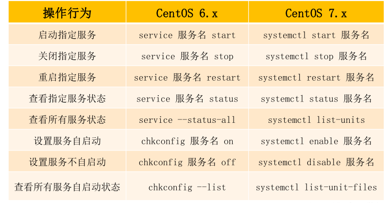

1、文件系统

2、防火墙、内核版本、默认数据库

3、时间同步，修改时区，修改语言

4、主机名

5、网络服务管理

6、网络设置


---


# 1、文件系统

- CentOS 6.x ： EXT4


- Ext4的单个文件系统容量达到1EB，单个文件大小则达到16TB，


- CentOS 7.x ： XFS


- XFS默认支持8EB减1字节的单个文件系统，最大可支持的文件大小为9EB，最


大文件系统尺寸为18EB


---

# 2、防火墙、内核版本、默认数据库


CentOS 6.x


防火墙：iptables


内核版本：2.6.x-x


默认数据库：MySQL


CentOS 7.x


防火墙：firewalld


内核版本：3.10.x-x


默认数据库：MariaDB


---

# 3、时间同步，修改时区，修改语言

CentOS 6.x


时间同步：ntpq -p


修改时区：/etc/sysconfig/clock


修改语言：/etc/sysconfig/i18n


CentOS 7.x


时间同步：chronyc sources


修改时区：timedatectl set-timezone Asia/Shanghai


修改语言：localectl set-locale LANG=zh_CN.UTF-8


---

# 4、主机名

- CentOS 6.x的配置文件为/etc/sysconfig/network（永久设置）


- CentOS 7.x的配置文件为/etc/hostname（永久设置）


- CentOS 7.x还可以使用命令永久设置


```javascript
    [root@localhost ~]# hostnamectl set-hostname atguigu.com
```


---

# 5、网络服务管理





---

# 6、网络设置


- 网卡名


    CentOS 6.x网卡名是：eth0 CentOS 7.x网卡名是：ens33


- 网络配置命令


    CentOS 6.x中：ifconfig/setup CentOS 7.x中：ip/nmtui


- 网络服务


    CentOS 6.x默认使用 network 服务


    CentOS 7.x默认使用 NetworkManager 服务(network作为备用)


