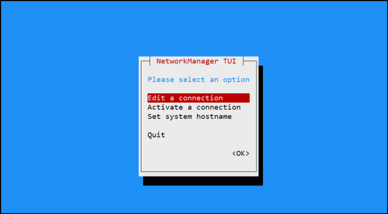
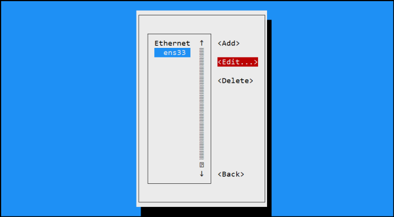
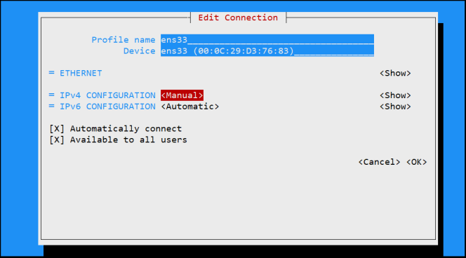
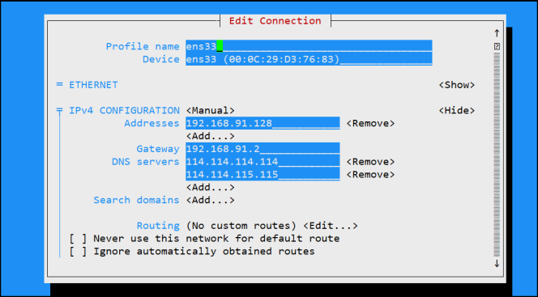
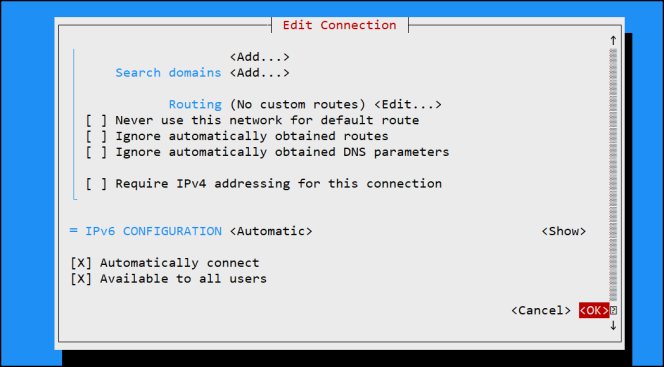
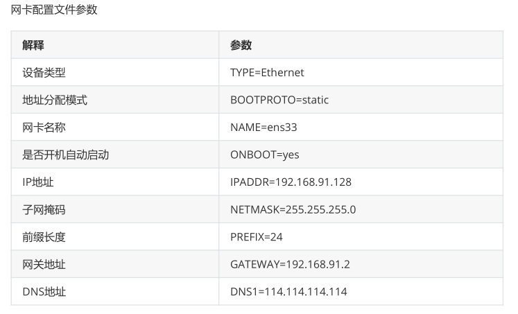

**配置网络服务**

# 1、通过图形化工具配置网络

使用nmtui命令来配置网络

```
[root@localhost ~]# nmtui
```











# 2、通过配置文件修改

**网卡配置文件 **

**配置文件目录:	/etc/sysconfig/network-scripts/ifcfg-ens33**

**配置管理命令：ifconfig/ip address show**

**配置文件内容：**

```javascript
DEVICE=ens33		#设备名称

NAME=ens33 		#网卡名称

BOOTPROTO=static 	#连接方式（dhcp/static）

ONBOOT=yes 		#是否开机加载

IPADDR=192.168.12.250 	#IP地址

NETMASK=255.255.255.0 	#子网掩码（PREFIX=24）

GATEWAY=192.168.12.1 	#网关

DNS1=8.8.8.8 		#DNS
NAME=ens33
UUID=7cb2fd3e-61dd-4856-87fa-c6db7ec0169b
DEVICE=ens33

```

注意：网卡配置文件内，选项要大写，小写不报错，但不生效，参数可小写



**当修改完Linux系统中的服务配置文件后，并不会对服务程序立即产生效果。要想让服务程序获取到最新
**

**的配置文件，需要手动重启相应的服务，之后就可以看到网络畅通了。**

# **3、修改网卡名为eth0**

## **1）修改属性配置文件****（包括文件的名称，建议将源文件先进行备份）**

```javascript
cp -a ifcfg-ens33 ifcfg-eth0   #拷贝原文件
mv ificg-ens33  /root/cpdir/   #备份原文件
```

- 修改  网卡名：NAME=eth0

- 修改 设备名：DEVICE=eth0

## **2) 修改内核属性配置文件grub；**

- 添加：net.ifname=0   bisodevname=0     关闭一致性命名规则

```javascript
vi /etc/default/grub
GRUB_CMDLINE_LINUX=“crashkernel=auto rhgb quiet    net.ifnames=0 biosdevname=0“    #在此处添加
```

## **3)更新 grub动作配置文件，并加载新的参数
**

```javascript
grub2-mkconfig -o /boot/grub2/grub.cfg
```

## **4)重启操作系统
**

```javascript
reboot
```

# 4、通过nmcli工具修改

**（nmcli-Network Manage CLI,cli命令行界面：命令行界面网络管理工具）**

## 1）查看设备信息

```
[root@server1 ~]# nmcli device status
设备  类型   状态  连接 
ens33 ethernet 连接的 ens33
lo   loopback 未托管  --  
```

## 2）查看连接信息

```
[root@server1 ~]# nmcli connection show
名称  UUID                 类型      设备 
ens33 a1fff70f-e683-48ca-a462-d704a06c5f8b  802-3-ethernet ens33
```

## 3）启动停止接口

```
[root@server1 ~]# nmcli connection up ens33
[root@server1 ~]# nmcli connection down ens33
```

## 4）创建连接

```
[root@server1 ~]# nmcli connection add type ethernet con-name dhcp_ens33
 ifname ens33
```

## 5）通过连接修改网络配置

**(modify:修改）**

```
[root@server1 ~]# nmcli connection modify dhcp_ens33 ipv4.addresses
192.168.80.200/24 ipv4.gateway 192.168.80.2 ipv4.method manual ipv4.dns
114.114.114.114 autoconnect yes
```

## 6）删除连接

```
[root@server1 ~]# nmcli connection delete dhcp_ens33
成功删除连接 'dhcp_ens33'（37adadf4-419d-47f0-a0f6-af849160a4f7）。
```

# 5、ifconfig命令修改

yum  install -y net-tools

- Linux ifconfig命令用于显示或设置网络设备。

- ifconfig可设置网络设备的状态，或是显示目前的设置。

## 1)语法

```
ifconfig [网络设备][down up -allmulti -arp -promisc][add<地址>][del<地址>][<hw<
网络设备类型><硬件地址>][io_addr<I/O地址>][irq<IRQ地址>][media<网络媒介类型>]
[mem_start<内存地址>][metric<数目>][mtu<字节>][netmask<子网掩码>][tunnel<地址>][-
broadcast<地址>][-pointopoint<地址>][IP地址]
```

### 参数说明

```
add<地址> 设置网络设备IPv6的IP地址。
del<地址> 删除网络设备IPv6的IP地址。
down 关闭指定的网络设备。
<hw<网络设备类型><硬件地址> 设置网络设备的类型与硬件地址。
io_addr<I/O地址> 设置网络设备的I/O地址。
irq<IRQ地址> 设置网络设备的IRQ。
media<网络媒介类型> 设置网络设备的媒介类型。
mem_start<内存地址> 设置网络设备在主内存所占用的起始地址。
metric<数目> 指定在计算数据包的转送次数时，所要加上的数目。
mtu<字节> 设置网络设备的MTU。
netmask<子网掩码> 设置网络设备的子网掩码。
tunnel<地址> 建立IPv4与IPv6之间的隧道通信地址。
up 启动指定的网络设备。
 -broadcast<地址> 将要送往指定地址的数据包当成广播数据包来处理。
 -pointopoint<地址> 与指定地址的网络设备建立直接连线，此模式具有保密功能。
 -promisc 关闭或启动指定网络设备的promiscuous模式。
[IP地址] 指定网络设备的IP地址。
[网络设备] 指定网络设备的名称
```

## 2）实例

### 显示网络设备信息

```
[root@localhost ~]# ifconfig    
eth0  Link encap:Ethernet HWaddr 00:50:56:0A:0B:0C
  inet addr:192.168.0.3 Bcast:192.168.0.255 Mask:255.255.255.0
  inet6 addr: fe80::250:56ff:fe0a:b0c/64 Scope:Link
  UP BROADCAST RUNNING MULTICAST MTU:1500 Metric:1
  RX packets:172220 errors:0 dropped:0 overruns:0 frame:0
  TX packets:132379 errors:0 dropped:0 overruns:0 carrier:0
  collisions:0 txqueuelen:1000
  RX bytes:87101880 (83.0 MiB) TX bytes:41576123 (39.6 MiB)
  Interrupt:185 Base address:0x2024
lo  Link encap:Local Loopback
  inet addr:127.0.0.1 Mask:255.0.0.0
  inet6 addr: ::1/128 Scope:Host
  UP LOOPBACK RUNNING MTU:16436 Metric:1
  RX packets:2022 errors:0 dropped:0 overruns:0 frame:0
  TX packets:2022 errors:0 dropped:0 overruns:0 carrier:0
  collisions:0 txqueuelen:0
  RX bytes:2459063 (2.3 MiB) TX bytes:2459063 (2.3 MiB)
```

### 启动关闭指定网卡

```
[root@localhost ~]# ifconfig eth0 down
[root@localhost ~]# ifconfig eth0 up
```

### 为网卡配置和删除IPv6地址

```
[root@localhost ~]# ifconfig eth0 add 33ffe:3240:800:1005::2/ 64 //为网卡设置
IPv6地址
[root@localhost ~]# ifconfig eth0 del 33ffe:3240:800:1005::2/ 64 //为网卡删除
IPv6地址
```

### 用ifconfig修改MAC地址

```
[root@localhost ~]# ifconfig eth0 down //关闭网卡
[root@localhost ~]# ifconfig eth0 hw ether 00:AA:BB:CC:DD:EE //修改MAC地址
[root@localhost ~]# ifconfig eth0 up //启动网卡
[root@localhost ~]# ifconfig eth1 hw ether 00:1D:1C:1D:1E //关闭网卡并修改MAC地
址
[root@localhost ~]# ifconfig eth1 up //启动网卡
```

### 配置IP地址

```
[root@localhost ~]# ifconfig eth0 192.168.1.56
//给eth0网卡配置IP地址
[root@localhost ~]# ifconfig eth0 192.168.1.56 netmask 255.255.255.0
// 给eth0网卡配置IP地址,并加上子掩码
[root@localhost ~]# ifconfig eth0 192.168.1.56 netmask 255.255.255.0
broadcast 192.168.1.255
// 给eth0网卡配置IP地址,加上子掩码,加上个广播地址
```

### 启用和关闭ARP协议

```
[root@localhost ~]# ifconfig eth0 arp //开启
[root@localhost ~]# ifconfig eth0 -arp //关闭
```

### 设置最大传输单元

```
[root@localhost ~]# ifconfig eth0 mtu 1500
//设置能通过的最大数据包大小为 1500 bytes
```

# 6、route命令

```
查看内核路由表信息：
route -n
路由的标志位：U表示启用状态，G表示默认网关，H表示主机路由
手动添加路由：route add
route add [-net |-host] target [netmask Nm] [gw Gw] [[dev] if]
主机路由：
route add -host 192.168.1.3 gw 192.168.1.2 dev eth0
网络路由：
route add -net 192.168.1.0 netmask 255.255.255.0 gw 192.168.1.2 dev eth0
route add -net 192.168.1.0/24 gw 192.168.1.2 dev eth0
默认路由：
route add -net 0.0.0.0 netmask 0.0.0.0 gw 192.168.1.2
route add default gw 192.168.1.2
删除路由：route del
route del [-net|-host] target [gw Gw] [netmask Nm] [[dev] If]
主机路由：192.168.1.3 网关：192.168.1.2
# route del -host 192.168.1.3
网络路由：192.168.1.0 网关：192.168.1.2
# route del -net 192.168.1.0 netmask 255.255.255.0
```