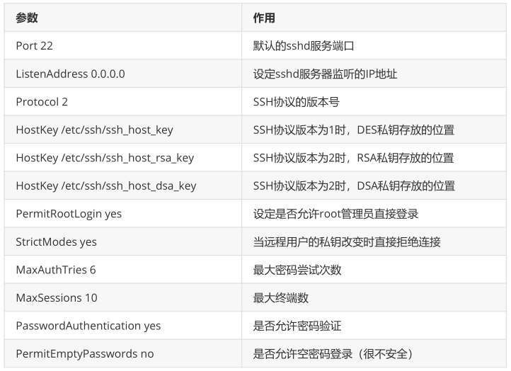
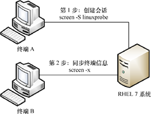

**远程控制服务**

# **一、配置sshd服务**

sshd服务配置文件中包含的参数以及作用



# 二、安全秘钥验证

### 1、在客户端主机中生成“密钥对”

```
[root@localhost ~]# ssh-keygen
Generating public/private rsa key pair.
Enter file in which to save the key (/root/.ssh/id_rsa):
Created directory '/root/.ssh'.
Enter passphrase (empty for no passphrase):
Enter same passphrase again:
Your identification has been saved in /root/.ssh/id_rsa.
Your public key has been saved in /root/.ssh/id_rsa.pub.
The key fingerprint is:
SHA256:9+KE/GYBG6wjbCQ4o9j139nD9kkrL29bdAYd49kTvLo
root@localhost.localdomain
The key's randomart image is:
+---[RSA 2048]----+
|               .+ |
|               .o*|
| .   .         .++|
|+ . o  +        o.|
|o+ = . .S+.  .   +|
|o . + +..o.. .  o.|
|  . . oo.o=.   o .|
|    .+=.BE.+      |
|     oo. OB.      |
+----[SHA256]-----+
```

### 2、把客户端主机中生成的公钥文件传送至远程主机

```
[root@localhost ~]# ssh-copy-id 192.168.91.128
/usr/bin/ssh-copy-id: INFO: Source of key(s) to be installed:
"/root/.ssh/id_rsa.pub"
The authenticity of host '192.168.91.128 (192.168.91.128)' can't be
established.
ECDSA key fingerprint is SHA256:PWPGI+gebAxdFtOfQe66cO/RnTBEV/Qw5AEoZv6w5lM.
ECDSA key fingerprint is
MD5:61:3d:ae:39:43:65:70:f4:9a:10:ff:48:67:6f:ef:54.
Are you sure you want to continue connecting (yes/no)? yes
/usr/bin/ssh-copy-id: INFO: attempting to log in with the new key(s), to
filter out any that are already installed
/usr/bin/ssh-copy-id: INFO: 1 key(s) remain to be installed -- if you are
prompted now it is to install the new keys
root@192.168.91.128's password:
Number of key(s) added: 1
Now try logging into the machine, with:  "ssh '192.168.91.128'"
and check to make sure that only the key(s) you wanted were added.
```

### 3、对服务器进行设置，使其只允许密钥验证，拒绝传统的口令验证方式。记得在修改配置文件后保存并重启sshd服务程序

```
[root@localhost ~]# vim /etc/ssh/sshd_config
..................
65 PasswordAuthentication no
...................
[root@localhost ~]# systemctl restart sshd
```

### 4、在客户端尝试登录到服务器，此时无须输入密码也可成功登录

```
[root@localhost ~]# ssh 192.168.91.128
Last login: Fri Apr 19 17:12:37 2019 from 192.168.91.1
```

# 三、不间断会话服务

## 1）管理远程会话

screen命令能做的事情

```

用 -S 参数创建会话窗口
用 -d 参数将指定会话进行离线处理
用 -x 参数一次性恢复所有的会话
用 -ls 参数显示当前已有的会话
用 -wipe 参数把目前无法使用的会话删除
```

[root@localhost ~]# screen -S window

虽然看起来与刚才没有不同，但实际上可以查看到当前的会话正在工作中

```
[root@localhost ~]# screen -ls
There is a screen on:
    7758.window   (Attached)
1 Socket in /var/run/screen/S-root.
```

要想退出一个会话也十分简单，只需在命令行中执行exit命令即可

## 2）会话共享功能



# 四、堡垒机

## 1）概述

当今的时代是一个信息化社会，信息系统已成为各企事业单位业务运营的基础,由于信息系统运维人员

掌握着信息系统的最高权限，一旦运维操作出现安全问题将会给[企业]或单位带来巨大的损失。因此,加

强对运维人员操作行为的监管与审计是[信息安全]发展的必然趋势。在此背景之下,针对运维操作管理与

审计的堡垒机应运而生。堡垒机提供了一套多维度的运维操作控管控与审计解决方案，使得管理人员可

以全面对各种资源(如[网络]设备、[服务器]、安全设备和[数据库]等)进行集中账号管理、细粒度的权限管

理和访问审计，帮助企业提升内部风险控制水平。

堡垒机，即在一个特定的网络环境下，为了保障网络和数据不受来自外部和内部用户的入侵和破坏，

而运用各种技术手段监控和记录运维人员对网络内的服务器、网络设备、安全设备、数据库等设备的操

作行为，以便集中报警、及时处理及审计定责。

## 2）核心功能

## 3）JumperServer

- JumpServer 是全球首款完全开源的堡垒机, 使用 GNU GPL v2.0 开源协议, 是符合 4A 的专业运维审计系统。

- JumpServer 使用 Python / Django 进行开发, 遵循 Web 2.0 规范, 配备了业界领先的 WebTerminal 解决方案, 

交互界面美观、用户体验好。

- JumpServer 采纳分布式架构, 支持多机房跨区域部署, 中心节点提供 API, 各机房部署登录节点, 可

横向扩展、无并发访问限制。

- 官方文档：