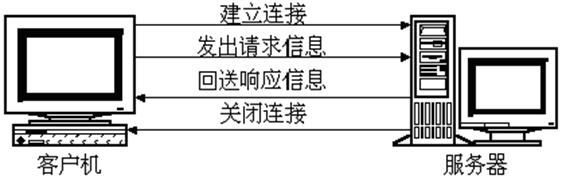
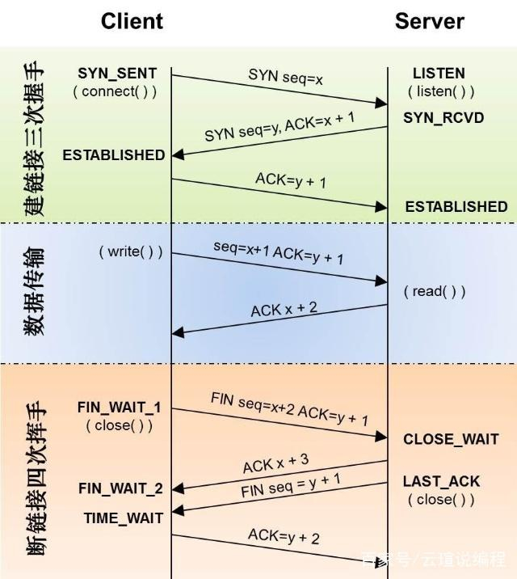
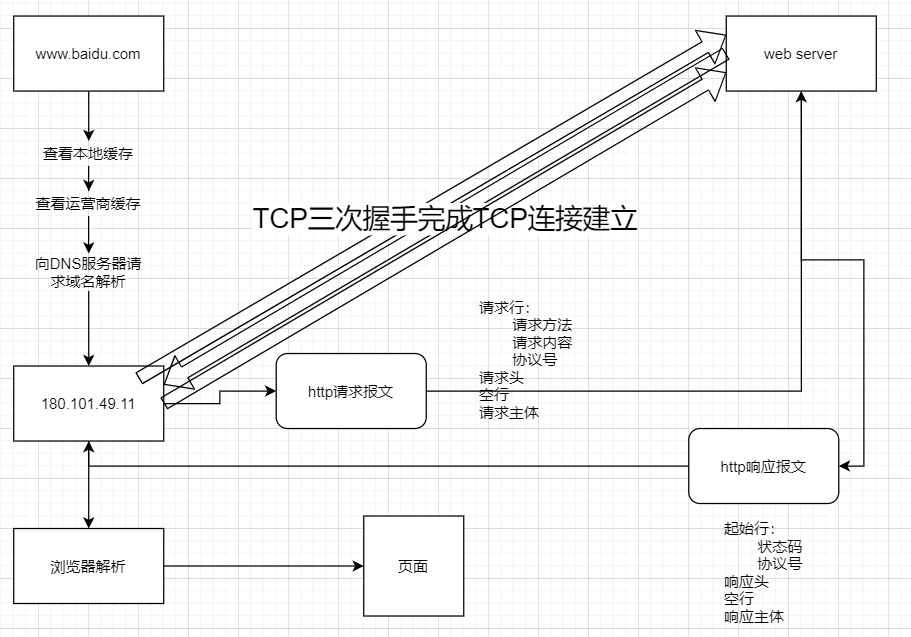
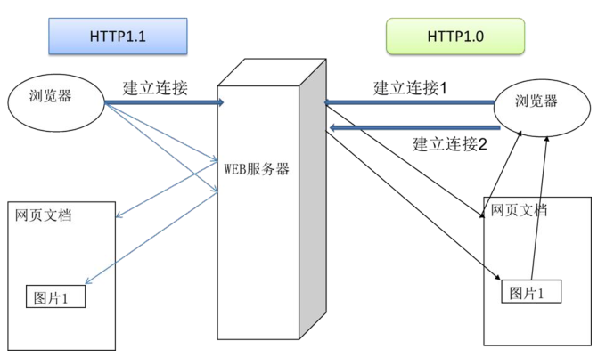
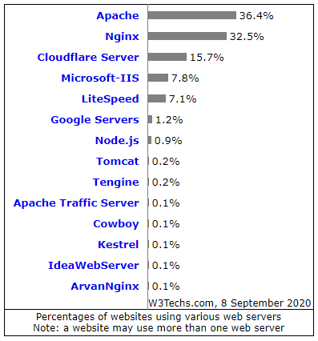

**HTTP协议**

# **1、简介**

- HTTP 超文本传输协议** (HTTP-Hypertext transfer protocol)**，是一个属于应用层的面向对象的协议，由于其简捷、快速的方式，适用于分布式超媒体信息系统。它于 1990年提出，经过几年的使用与发展，得到不断地完善和扩展。**它是一种详细规定了浏览器**

**和万维网服务器之间互相通信的规则，**

- 客户端与服务端通信时传输的内容我们称之为**报文**

- HTTP 就是一个通信规则，这个规则规定了客户端发送给服务器的报文格式，也规定了服务器发送给客户端的报文格式。实际我们要学习的就是这两种报文。客户端发送给服务器的称为”**请求报文“**，服务器发送给客户端的称为”**响应报文“。**

## 1）HTTP协议的发展历程

超文本传输协议的前身是世外桃源(Xanadu)项目，超文本的概念是泰德˙纳尔森(TedNelson)在 1960 年代提出的。进入哈佛大学后，纳尔森一直致力于超文本协议和该项目的研究，但他从未公开发表过资料。1989年

洲原子核研究委员会 = European Organization for Nuclear Research)担任软件咨询师的时候，开发了一套程序，

当时，Telnet 协议解决了一台计算机和另外一台计算机之间一对一的控制型通信的要求。邮件协议解决了一个发件人向少量人员发送信息的通信要求。文件传输协议解决一台计算机从另外一台计算机批量获取文件的通信要求，但是它不具备一边获取文件一

边显示文件或对文件进行某种处理的功能。新闻传输协议解决了一对多新闻广播的通信要求。而超文本要解决的通信要求是：在一台计算机上获取并显示存放在多台计算机里的文本、数据、图片和其他类型的文件；它包含两大部分：超文本转移协议和超文本标记语言(HTML)。HTTP、HTML 以及浏览器的诞生给互联网的普及带来了飞跃。

# 2、URI和URL

- 统一资源标志符URI就是在某一规则下能把一个资源独一无二地标识出来。

- URL是一种特殊类型的URI，全称是UniformResourceLocator(统一资源定位符),是互联网上用来标

识某一处资源的 地址。

- 比如，

# 3、HTTP协议请求响应过程

**浏览器与服务器之间的通信过程要经历四个步骤：**



- 浏览器与 WEB 服务器的连接过程是短暂的，每次连接只处理一个请求和响应。对每一

个页面的访问，浏览器与 WEB 服务器都要建立一次单独的连接。

- 浏览器到 WEB 服务器之间的所有通讯都是完全独立分开的请求和响应对。

- 



- 



## 1）HTTP1.0 和 HTTP1.1 的区别

在 HTTP1.0 版本中，浏览器请求一个带有图片的网页，会由于下载图片而与服务器

之间开启一个新的连接；但在 HTTP1.1 版本中，允许浏览器在拿到当前请求对应的全部

资源后再断开连接，提高了效率！



## HTTP 1.1 是目前使用最为广泛的一个版本，而最新的一个版本则是 HTTP 2.0，又

称 HTTP/2。在开放互联网上 HTTP 2.0 将只用于 https://网址。HTTPS,即 SSL（Secure

Socket Layer，安全套接字层）之上的 HTTP,实际上就是在 SSL/TLS 连接的上层进行 HTTP通信。

**备注**

互联网工程任务组）接手并将其改名为 TLS（Transport Layer Security，传输层安全协议）

# 4、HTTP请求报文

```
GET /hello.htm HTTP/1.1
User-Agent: Mozilla/4.0 (compatible; MSIE5.01; Windows NT)
Host: www.tutorialspoint.com
Accept-Language: en-us
Accept-Encoding: gzip, deflate
Connection: Keep-Alive
```

- 请求行

- 请求方法

- GET：请求指定的页面信息

- HEAD：类似get请求，但是返回仅仅是头部信息，一个使用场景是在下载一个大文件前

先获取其大小再决定是否要下载, 以此可以节约带宽资源.

- POST：向指定资源提交数据进行处理请求（例如提交表单或者上传文件）

- PUT：从客户端向服务器传送的数据取代指定的文档内容

- DELETE：请求服务器删除指定的页面

- CONNECT： 预留给能够将连接改为管道方式的代理服务器

- OPTIONS：允许客户端查看服务器的性能

- TRACE： 回显服务器收到的请求，主要用于测试或诊断!

- GET方法和POST方法的区别：1.GET提交的数据会放在URL之后，以?分割URL和传输数据，参数之间以&相连，如 EditPosts.aspx? name=test1&id=123456 . POST方法是把提交的数据放在HTTP包的Body中。 2.GET提交的数据大小有限制（因为浏览器对URL的长度有限制），而POST方法提交的数据没有限制。 3.GET方式需要使用Request.QueryString 来取得变量的值，而POST方式通过 Request.Form 来获取变量的值。 4.GET方式提交数据，会带来安全问题，比如一个登录页面，通过GET方式提交数据时，用户名和密码将出现在URL 上，如果页面可以被缓存或者其他人可以访问这台机器，就可以从历史记录获得该用户的账号和密码。

- 请求信息

- index.html(首页文件)

- 请求协议

- HTTP0.9：仅支持GET方法，仅能访问HTML格式的资源

- HTTP1.0：增加POST和HEAD方法，MIME支持多种数据格式，开始支持Cache，支持tcp短连接

- HTTP1.1：支持持久连接（长连接），一个TCP连接允许多个请求，新增PUT、PATCH、DELETE等

- HTTP2.0：性能大幅提升，新的二进制格式，多路复用，header压缩，服务端推送。

- 请求头

- 客户端有关信息介绍说明

- 空行

- 和请求主体分隔开

- 请求主体

- 使用get方法时，没有请求主体

- 使用post方法时，有请求主体信息

# 5、响应报文

```
HTTP/1.1 200 OK
Date: Mon, 27 Jul 2009 12:28:53 GMT
Server: Apache/2.2.14 (Win32)
Last-Modified: Wed, 22 Jul 2009 19:15:56 GMT
Content-Length: 88
Content-Type: text/html
Connection: Closed
```

- 起始行

- 协议版本

- 状态码

- 1xx：指示信息——表示请求已经接收，继续处理

- 2xx：成功——表示请求已经被成功接收、理解、接收

- 3xx：重定向——要完成请求必须进行更进一步的操作

- 4xx：客户端错误——请求的语法有错误或请求无法实现

- 5xx：服务端错误——服务器未能实现合法的请求!

- 200：OK请求已经正常处理完毕

- 301：请求永久重定向

- 302：请求临时重定向

- 304：请求被重定向到客户端本地缓存

- 400：客户端请求存在语法错误

- 401：客户端请求没有经过授权

- 403：客户端的请求被服务器拒绝，一般为客户端没有访问权限

- 404：客户端请求的URL在服务端不存在

- 500：服务端永久错误

- 503：服务端发生临时错误

- 响应头部

- 空行

- 响应主体

# 6、网站测评指标

- IP：根据用户访问的源IP信息进行统计

- 统计一天内访问网站最对的前十个地址

- PV：根据用户页面访问量进行统计

- 统计一个用户访问页面数量最对的前十个页面

- UV：根据用户访问的cookie信息，统计用户访问数量

- 网站并发：单位时间内同时处理的请求数

- 对网站进行压力测试

- yum install -y httpd-tools

- ab -n 100 -c 10 

# 7、常用的网站服务软件

- 



- 