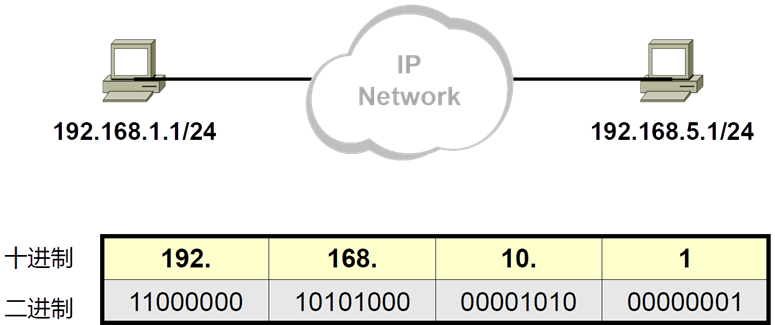
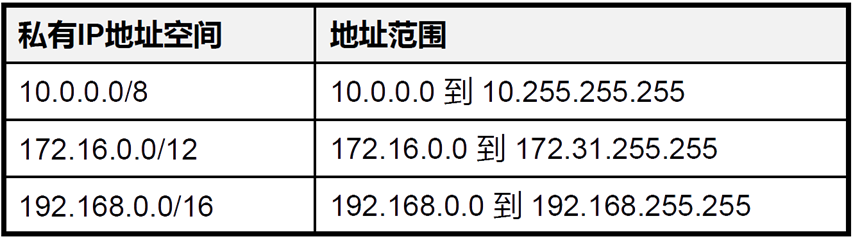
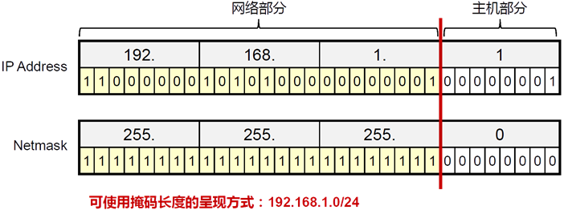
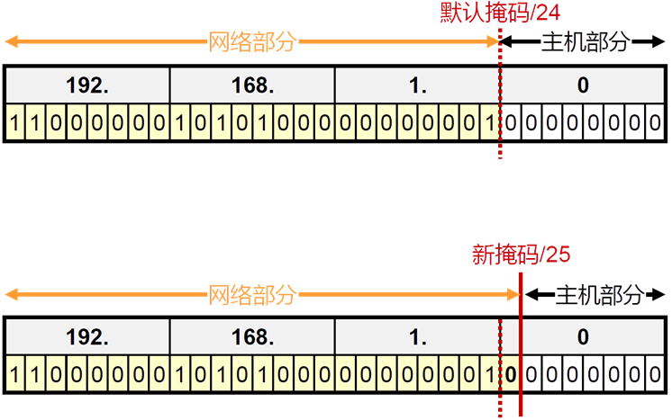
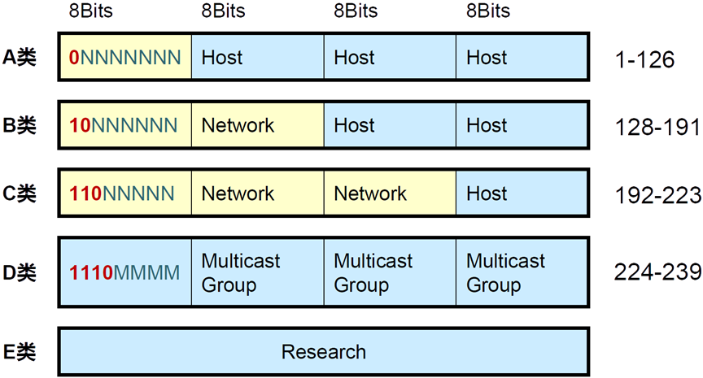
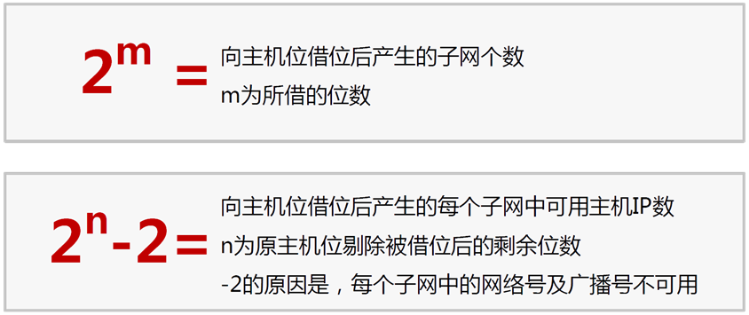

# 1、IP地址

- IP地址是32位二进制，类似手机号码有归属地和号码字段，归属地字段一样，说明在同一个运营商

同一个封你为

- 为了让人类能够记住，不眼花，使用点分十进制

- ip地址网络位

- IP地址网络位表示一样是同一个局域网的

- 局域网是多台设备组成，可以直接不受控制的访问

- 正常情况下，一家公司为了安全、财务、研发、it、业务等部门之间相互隔离或者受控

- ip地址主机位

- 在网络位相同的情况下（也就是一个局域网），主机位不能重复

- 主机位是为了帮助局域网内的设备相互之间进行更高层的通信封装使用

- 网络类型

- A：1.0.0.0~126.255.255.255/8

- 127开头的作为本地的测试地址

- A类地址的局域网可以存在2^24-2个主机

- B：128.0.0.0~191.255.255.255/16

- B类地址的局域网可以存在2^16-2个主机

- C：192.0.0.0~223.255.255.255/24

- C类地址的局域网可以存在2^8-2个主机

- D组播没有网络位概念

- E用不到

- 使用子网掩码来区分网络位和主机位，因为有类的方式使用ip地址空间太土豪

- 子网掩码可以让ip地址自由的划分网络位数，子网掩码也是32位二进制，所以可以和IP地址进

行一一对应，规定子网掩码为1，那么所对应的IP地址就是属于网络位

- 在IP网络中，通信节点需要有一个唯一的IP地址

- IP地址用于IP报文的寻址以及标识一个节点

- IPv4地址一共32bits，使用点分十进制的形式表示

- Pv4地址由网络位和主机位组成

- 网络位一致表示在同一个广播域中，可以直接通信

- 主机位用于在同一个局域网中标识唯一节点

- 例：192.168.0.1/24

IP地址：192.168.0.1

网络位是前面24位

主机位是后8位

# 2、私有IP地址

- 如果要取得互联网合法地址用于通信，必须要找iana.org组织分配

- 很多企业内部都有大量的网络设备，大多数时候这些设备只需要内部通信即可

- 企业的网络管理员可以从如下网段中自行分配地址

- 私有IP地址空间中的地址不需要申请，随意使用，但是不能在互联网上与合法地址通信(因为对方没

法回复你这个地址，因为世界上私有IP地址段无数个重复的，怎么知道回到谁那里呢)

- 而我们明明用的私有IP地址，也可以上网，因为我们需要先把自己的上网请求提交给网络中的网关

(就是你家的出口路由器)，再由网关代替我们去获取内容转交给我们的电脑手机，而网关往往能从

运营商那里得到一个合法的公有IP地址

# 3、子网掩码（Netmask）

- 网络掩码与IP地址搭配使用，用于描述一个IP地址中的网络部分及主机部分

- 网络掩码32bits，与32bits的IP地址一一对应，掩码中为1的位对应IP地址中的网络位，掩码中为0

的位对应IP地址中的主机位

- 减少一个局域网中的设备数量可以有效降低广播报文消耗资源

- 可变长子网掩码可以将一个局域网中的主机地址分配的更加小

# 4、IP地址的类别

- 早期参与互联网的设备不多，所以仅仅使用ABC类地址分配给用户即可

- 随着网络用户的增多，ABC类分配地址过于浪费，于是出现子网掩码方式划分网络位和主机位

## 1）A类IP地址

一个A类IP地址由1字节的网络地址和3字节主机地址组成，它主要为大型网络而设计的，网络地址的最

高位必须是“0”， 地址范围从1.0.0.0 到127.0.0.0）。可用的A类网络有126个，每个网络能容纳

16777214个主机。其中127.0.0.1是一个特殊的IP地址，表示主机本身，用于本地机器的测试。

**注**

A:0-127，其中0代表任何地址，127为回环测试地址，因此，A类ip地址的实际范围是1-126.

默认子网掩码为255.0.0.0

## 2）B类IP地址

一个B类IP地址由2个字节的网络地址和2个字节的主机地址组成，网络地址的最高位必须是“10”，地址

范围从128.0.0.0到191.255.255.255。可用的B类网络有16382个，每个网络能容纳6万多个主机 。

**注**

B:128-191，其中128.0.0.0和191.255.0.0为保留ip，实际范围是128.1.0.0--191.254.0.0。

## 3）C类IP地址

一个C类IP地址由3字节的网络地址和1字节的主机地址组成，网络地址的最高位必须是“110”。范围从

192.0.0.0到223.255.255.255。C类网络可达209万余个，每个网络能容纳254个主机。

**注：**

## 4）D类地址

用于多点广播（Multicast）。 D类IP地址第一个字节以“lll0”开始，它是一个专门保留的地址。它并不

指向特定的网络，目前这一类地址被用在多点广播（Multicast）中。多点广播地址用来一次寻址一组计

算机，它标识共享同一协议的一组计算机。224.0.0.0到239.255.255.255用于多点广播 。

## 5）E类IP地址

以“llll0”开始，为将来使用保留。240.0.0.0到255.255.255.254，255.255.255.255用于广播地址。

全零（“0．0．0．0”）地址对应于当前主机。全“1”的IP地址（“255．255．255．255”）是当前子网的

广播地址。

# 5、IP网络通信类型

- 单播(Unicast)

- 广播(Broadcast)

- 组播(Multicast)

# 6、广播地址与网络号

- 在局域网中经常会有广播的需要(比如，mac地址查询，地址冲突检测等等)，所以将主机位全为1的

地址做为本局域网的广播地址(注意！广播并不能跨越不同的局域网)

- 在网络中需要表示整个局域网，就像邮政编码表示一个大的区域一样，所以将主机位全为0的地址

作为本局域网的网络号，用来代指整个网段

- 综上所述，计算产生的子网及每个子网的主机数量公式如下：

- 