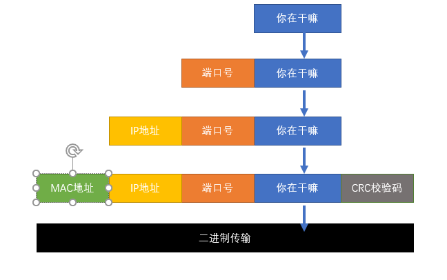

# 1、数据封装

- 数据从产生到传递到目的地的过程中会经历好几个过程，每个过程都负责加工自己这部分的内容，类似于工厂流水线

- 目前我们只需要有个最基本的概念：

- IP地址是用来标识网络中位置的，比如你在江苏省xxx市xxx路xxx号

- MAC地址是每个网络设备的唯一ID，比如你的身份证号码

- 如果想要发送数据，必须(暂且认为必须)同时拥有IP和MAC地址

- Linux的网络管理基础部分就是需要大家掌握IP地址的配置

**数据解封装的过程和数据封装过程正好相反，数据封装是由发送者执行，数据解封装是由接收者执行**

# 2、数据报文

