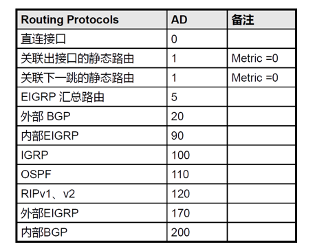
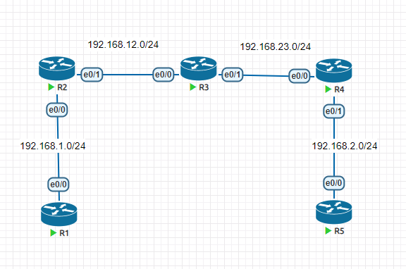
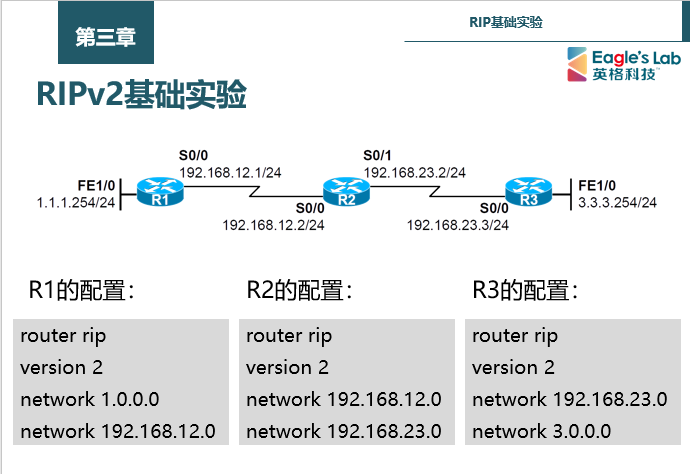
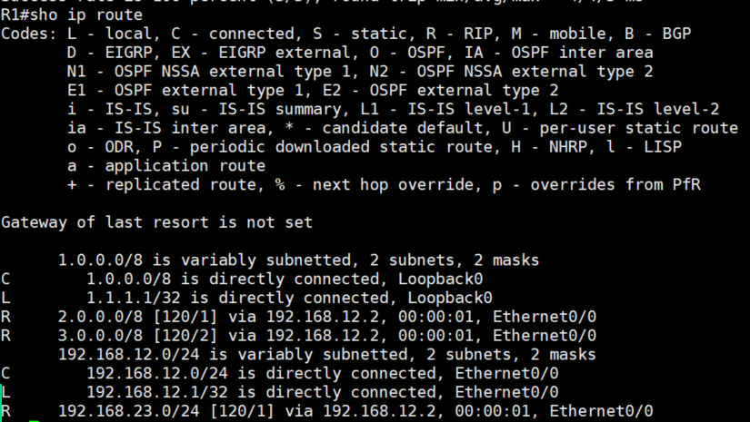

# 1、动态路由协议

- 通过在路由器上运行动态路由协议，使得路由器之间能够交互“用于路由计算的信息”，从而路由器

动态的“学习”到网络中的路由

# 2、管理距离

- 不同的路由协议会有不同的管理距离

- 值越小的管理距离优先级越高

- 当路由器从不同的协议里学习到相同的路由的时候，优先选择优先级高的路由

- 常见的管理距离



# 3、静态路由

- 特点

- 需要通过手工的方式进行添加及维护；

- 适用于组网规模较小的场景，如果网络规模较大，则配置及维护的成本就会很高；

- 无法根据拓扑的变化进行动态的响应（各厂商开发了扩展特性，以便弥补静态路由在这点上的不足）；

- 在大型的网络中，往往采用动、静态路由结合的方式进行部署。

- 配置方式

```
R1(config)# ip route network-address subnet-mask {ip-add | exit-interface} 
```

- 示例



# 4、环回接口

- Loopback接口，也叫环回口，是一个逻辑的、虚拟的接口；

- 使用全局配置命令interface loopback 加上接口编号可创建一个Loopback接口，创建完成后即可

为接口配置IP地址；

- Loopback接口在手工创建后，除非人为shutdown，否则不会DOWN掉；

- Loopback接口常用于：

- 模拟路由器的直连网段，可用于测试；

- 可用于设备管理（Loopback接口比较稳定）；

- 供其他协议使用，例如OSPF、BGP、MPLS等；

- SNMPTraps消息的源地址；

- 其他用途（Loopback接口的用途十分广泛）。

- 缺省路由（默认路由）

# 5、动态路由协议，RIP

- RIP是应用及开发较早的路由协议，是典型的距离矢量路由协议

- 适用于小型网络，最大跳数15跳（16跳视为不可达）

- RIP是基于UDP的，使用端口号520

- 在CISCO IOS平台上的管理距离为120

## 1）距离矢量路由协议

- 使用距离矢量路由协议的路由器并不了解网络的拓扑。该路由器只知道：

- 自身与目的网络之间的距离

- 应该往哪个方向或使用哪个接口转发数据包

- 路由器收敛完成

- 当所有路由表包含相同网络可达性信息

- 网络（路由）进入一个稳态

- 路由器继续交换路由信息

- 当无新路由信息被更新时收敛结束

- 网络在达到收敛前无法完全正常工作

## 2）RIP解决环路问题的机制

- 定义最大跳数

- 定义当跳数达到16时认为不可达

- 水平分割

- 从某个接口学习到的路由，不会再从这个接口更新出去

- 毒性路由

- 当路由器感知到某个网段发生故障，可以立即泛洪该网段的路由（将其跳数设置为16跳，也

就是不可达），以此来快速刷新网络中其他路由器的路由表。

- 毒性逆转

- 抑制计时器

- 触发更新

- 拓扑发生变更时，路由器立即发送更新消息，而不等更新计时器超时

## 3）RIP配置

```
Router(config)# router rip
Router(config-router)# version 1/2
Router(config-router)# network network-number
```

## 4）RIP案例1

### 需求：



### 结果：



## 6）RIPV2的路由汇总

- 默认情况，rip version2 会将自己的路由条目进行汇总然后更新给其他路由器

- 当路由汇总后出现同样的条目时，会进行等价的负载均衡

- 如果想要进行人工汇总，建议首先关闭自动汇总，然后再进行手动汇总

```
R1(config)#router rip
R1(config-router)#version 2
R1(config-router)#no auto-summary # 关闭rip的自动路由汇总
R1(config-router)#int e0/0
R1(config-if)#ip summary-address rip 172.16.0.0 255.255.255.0 # 手动
添加路由汇总
```