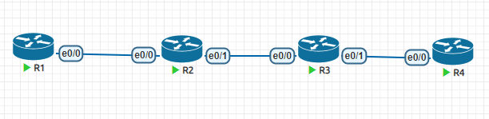

**OSPF实验拓扑**



# 1、基础配置

```
# 配置ip地址，必须配环回接口
略
#配置ospf
方式一
R1(config)#router ospf 1
R1(config-router)#network 1.0.0.0 0.0.0.255 area 0
方式二
R2(config)#int range e0/0-1,lo0
R2(config-if-range)#ip ospf 1 area 0
```

# 2、OSPF简介

- OSPF（Open Shortest Path First，开放最短路径优先）是一种链路状态路由协议，无路由循环

（全局拓扑），属于IGP。RFC 2328，“开放”意味着非私有的，对公众开放的。

- OSPF的报文封装

- OSPF协议包直接封装于IP，协议号89。

- OSPF协议使用的组播地址

- 所有OSPF路由器——224.0.0.5；DR BDR——224.0.0.6

- OSPF路由协议的管理距离：110