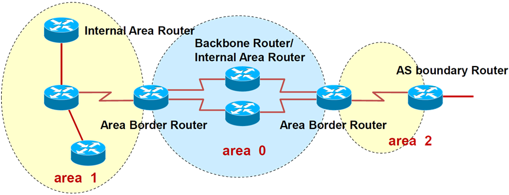

# 1、OSPF三张表


```
R2#show ip ospf nei
Neighbor ID   Pri  State      Dead Time  Address     Interface
3.3.3.3      1  FULL/DR     00:00:31  192.168.23.3  Ethernet0/1
1.1.1.1      1  FULL/BDR    00:00:39  192.168.12.1  Ethernet0/0
```

## 1）OSPF名词

- Neighbor ID：邻居的id，这个id通常是由环回接口选的，并且是优先选取地址大的作为id

- 在一个OSPF域中，唯一地标识一台OSPF路由器

- 32bits，表现为IPv4地址形式。在未有手工指定的情况下，如果本地有激活的Loopback接

口，则取Loopback接口IP最大值；如果没有LP接口，则取激活的物理接口IP中的最大值

- 为了提高路由器的RID的稳定性和网络的稳定性建议手动的设置路由器的Router-ID：在OSPF

的进程下修改:router-id <x.x.x.x>（建议id值以编号为准）

- 项目实施中，一般是建立loopback口，并且手工指定loopback口地址为router-id

- Pri：优先级

- Dead Time：死亡时间，每十秒钟会更新一次，如果40秒倒计时结束还没有收到邻居的hello包，认为邻居死亡

- State：邻居的状态

- DR

- DR的作用：多路访问中为了减少邻接关系（N平方的问题）和LSA的洪泛，采用DR机

制,BDR提供了备份

- MA网络上的所有路由器均与DR、BDR建立邻居关系

- BDR

- 选举规则

- 接口优先级数字越大越优先（优先级为0不能参与DR的选举）

- Router ID越大越好

- 稳定压倒一切（非抢占）

- 通过控制接口优先级是控制DR选举的好办法

- DR的选举是基于接口的，如果说某个路由器是DR，这种说法是错误的


- 在某些以太网中并不需要建立DR、BDR的过程，可以将模式修改为point-to-point来加速邻居

建立的过程

```
R2(config)#int e0/0
R2(config-if)#ip ospf network point-to-point
R1#sh ip ospf neighbor
Neighbor ID   Pri  State      Dead Time  Address     Interface
2.2.2.2      0  FULL/ -    00:00:32  192.168.12.2  Ethernet0/0
# 状态中是没有DR或者BDR的
```

### 2）OSPF COST

- OSPF接口COST＝参考带宽（10的8次方，单位为b）/ 接口带宽

- 接口带宽为接口逻辑带宽，可以使用bandwith命令调整（这里默认单位为kb），主要用于路

由计算，而不是接口物理带宽，但一般情况：接口逻辑带宽＝接口物理带宽。

- 手工修改接口Cost的方法

- Router(config)# int e0/0

- Router(config-if)# ip ospf cost 100 !! 该命令在接收路由的入口上配置，也就是数据流量的出口

- 可修改“参考带宽”,来保障OSPF在现如今的网络中正常运转

- 建议将参考带宽设置为整个网络中的最大带宽

- auto-cost reference-bandwidth <参考带宽以Mbits为单位>

10000

# 2、邻居建立过程

- Down

- 路由器未开始运行OSPF

- Init

- 路由器收到对方发过来的hello，但是却没有发现存在自己的Router-Id

- Two-way

- 路由器收到对方发过来的hello中，是包含有自己的Router-ID

- 表示双方已经正常通信

- 如果是广播网络类型，在这个阶段会等待40s种，等所有路由器的Hello都充分交换，然后选

择Router-id最大的作为DR，过时不候。

- Ex-Start

- 路由器发送空的DBD数据报文，用来选举由谁来主导整个过程，最终是选择Router-id较大的

- L置位表示是否完成选举过程，M置位表示是否是最后一条消息，MS置位表示的是否是MASTER

- Exchange

- 路由器交换互相的DBD，可以理解为目录，从的节点率先发送给主节点

- 比对哪些LSA是自己没有的

- Loading

- 向对方发送请求的LSA，接受对方的LSA，可以理解为书的内容

- 并且回复ACK

- Full

- 完成j建立过程

# 3、OSPF消息类型

- hello包

- 用来建立以及维护邻居关系的数据包

- DBD

- 链路状态数据库描述信息

- LSR

- 链路状态请求，向邻居请求自己没有的信息

- LSU

- 链路状态更新的信息，可以包含一条或者多条

- ACK

- 确认消息，表示收到了

# 4、OSPF多区域

## 1）单区域的问题

- 收到的LSA通告太多了，OSPF路由器的负担很大

- 内部动荡会引起全网路由器的完全SPF计算

- 资源消耗过多，LSDB庞大，设备性能下降，影响数据转发

- 每台路由器都需要维护的路由表越来越大，单区域内路由无法汇总

## 2）多区域的特点

- 减少了LSA洪泛的范围，有效地把拓扑变化控制在区域内，达到网络优化的目的

- 在区域边界可以做路由汇总，减小了路由表

- 充分利用OSPF特殊区域的特性，进一步减少LSA泛洪，从而优化路由

- 多区域提高了网络的扩展性，有利于组建大规模的网络

## 3）区域

- 骨干区域，编号为0的区域

- 非骨干区域，编号非0的区域

- 所有非骨干区域必须和骨干区域相连

## 4）OSPF路由器角色



- ABR

- 区域边界路由器，负责各个区域的路由条目传递

- 必须至少有一个接口和骨干区域相连

- 必须至少有一个接口和非骨干区域相连

- ASBR

- AS边界路由器，负责将ospf以外的路由引入

## 5）多区域基本拓扑


### 相关命令

```
show ip ospf
显示OSPF路由器ID，OSPF定时器以及LSA信息
show ip ospf interface type
显示各种定时器和邻接关系
show ip route ospf
显示路由器学习到的OSPF路由
show ip protocols
显示IP路由协议参数
debug ip ospf events
显示OSPF相关事件
debug ip ospf adj
跟踪邻接关系的建立和终止
debug ip ospf packet
查看正在传输的OSPF分组
```

### 当非骨干区域没有和骨干区域直接相连，无法学习到其他区域的路由，如何解决这个问题


#### 第一种方式是使用虚链路

```
R3(config)#router ospf 1
R3(config-router)#area 2 virtual-link 4.4.4.4
R4(config)#router ospf 1
R4(config-router)#area 2 virtual-link 3.3.3.3
```

#### 第二种方式是使用隧道

```
# 第一种方式，R3和R4上同时都需要配置以下相同的配置，以完成虚链路
R3(config)#router ospf 1
R3(config-router)#area 2 virtual-link 4.4.4.4
# 第二种方式
R3#sh run
interface Tunnel0
ip address 192.168.100.3 255.255.255.0
ip ospf 1 area 0
tunnel source Ethernet0/1
tunnel mode ipip
tunnel destination 192.168.34.4
```