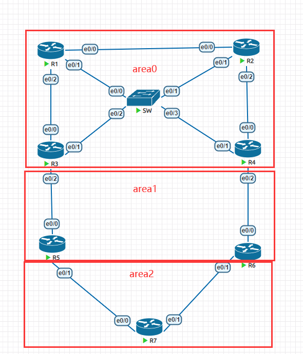

**综合实验**

# 1、拓扑图



# 2、解答

```
# 1，按照如图所示配置好路由器的接口地址。在每台路由器上必须建立loopback0接口。
配置地址省略
 分别在R3和R5之间，R4，R6之间做虚链路，完成区域2和骨干区域相连
 R6(config)#router ospf 1
R6(config-router)#area 1 virtual-link 4.4.4.4
# 2，配置好OSPF，区域划分如图所示，并且ospf的router-id必须为loopback0的地址。最终实现
全网互联。
略
# 3，在R1、R2、R3、R4之间的多路访问网络里面，必须是的R1成为DR，R2成为BDR。在其余的链路
里面必须保障OSPF邻居的快速建立，而不需要经过wait timer。
 第一步是将多路访问接口之外的接口配置成点对点的模式
 ip ospf net point-to-point
 第二步是修改优先级，保证R1为DR，R2为BDR
 R1(config)#int e0/1
 R1(config-if)#ip ospf priority 10
   R2(config-if-range)#int e0/1
 R2(config-if)#ip ospf priority 5
  # 依次释放DR和BDR的进程，让R1 R2顺利竞选
 R3#clear ip ospf process
 Reset ALL OSPF processes? [no]: yes
 R4#clear ip ospf process
 Reset ALL OSPF processes? [no]: yes
# 4，在R1和R2上建立loopback10，接口的地址为同样的100.1.1.1/32来模拟外网的接入。要求R1
和R2都向内网通告一条缺省路由，正常的时候所有的路由器通过R1的缺省路由来访问外网，当R1无法正
常工作的时候，通过R2来访问外网。（需要在R7上使用traceroute来测试路线。）
第一步是配置环回接口地址
 R1(config-if)#int lo10
 R1(config-if)#ip add 100.1.1.1 255.255.255.255
 R2(config-if)#int lo10
 R2(config-if)#ip add 100.1.1.1 255.255.255.255
第二步下发默认路由
 R1(config-if)#router ospf 1
 R1(config-router)#default-information originate always
 R2(config-if)#router ospf 1
 R2(config-router)#default-information originate always metric 100
尝试使用traceroute命令去跟踪100.1.1.1，观察是否是从R1出发
 然后down掉R1的所有物理接口，再次使用traceroute跟踪，观察路线是否切换
# 5，area 2为特殊区域，该区域无法学习到ospf其他区域的路由。R7的loopback0的地址通过
redistribute connected subnets命令进入ospf。(观察R5和R6上的7.7.7.0路由的来源，思考
原因。)
将area2里的所有路由器配置成totally nssa
R5(config)#router ospf 1
R5(config-router)#area 2 nssa no-summary
R6(config)#router ospf 1
R6(config-router)#area 2 nssa no-summary
R7(config)#router ospf 1
R7(config-router)#area 2 nssa no-summary
 在R7上将环回接口的地址重分发进入ospf
 R7(config)#router ospf 1
 R7(config-router)#redistribute connected subnets
# 6，在R3上创建loopback1-3，地址为172.16.x.1/24(x为1-3)。并且宣告进OSPF区域1，要求
在area 0只能看到一条汇总的路由172.16.0.0
第一步，配置三个地址并且宣告进ospf区域1种
 第二步，需要在R3和R5上共同进行汇总路由
 R3(config-router)#router ospf 1
 R3(config-router)#area 1 range 172.16.0.0 255.255.0.0
# 7，area 0需要启用明文区域认证，R3和R5之间明文链路认证，R4和R6之间密文链路认证
略
# 8，禁止area 2内的192.168.57.0/24和192.168.67.0/24被其他区域学习到。此刻思考区域0
里面关于7.7.7.0的路由消失的原因，并且需要解决7.7.7.0消失的问题。
 R5(config)#router ospf 1
 R5(config-router)#are 2 range 192.168.57.0 255.255.255.0 not-advertise
 R5(config-router)#are 2 range 192.168.67.0 255.255.255.0 not-advertise
 R6(config)#router ospf 1
 R6(config-router)#are 2 range 192.168.67.0 255.255.255.0 not-advertise
 R6(config-router)#are 2 range 192.168.57.0 255.255.255.0 not-advertise
解决7.7.7.7消失的办法是在R5，R6中一起配置以下命令
 router ospf 1
 area 2 nssa translate type7 suppress-fa
```